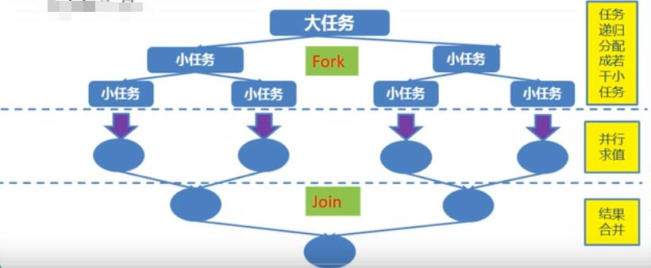

# JUC简介

在Java 5.0提供了java.util.concurrent（简称JUC）包，在此包中增加了在并发编程中很常用的使用工具类，用于定义类似于线程的自定义子系统，包括线程池、异步IO和轻量级任务框架。提供可调用的、灵活的线程池。还提供了设计用于多线程上下文的Collection实现等。

# 一、volatile 关键字与内存可见性

volatile关键字：当多个线程进程操作共享数据时，可以保证内存中的数据可见。

​			    相较于synchronized是一种较为轻量级的同步策略。

注意：

 * 				   1.volatile 不具备“互斥性”，即能同时被多个线程共同访问。
    * 			   2.volatile 不能保证变量的“原子性”。

```java
package com.pdsu.juc;
/*
 * 一、volatile关键字:当多个线程进程操作共享数据时，可以保证内存中的数据可见。
 * 				   相较于synchronized是一种较为轻量级的同步策略。
 * 注意：
 * 1.volatile 不具备“互斥性”，即能同时被多个线程共同访问。
 * 2.volatile 不能保证变量的“原子性”
 */
public class TestVolatile {
	public static void main(String[] args) {
		ThreadDemo td = new ThreadDemo();
		new Thread(td).start();
		while(true) {
			if(td.isFlag()) {
				System.out.println("--------------");
				break;
			}
		}
	}
}
class ThreadDemo implements Runnable{

	private volatile boolean flag=false;
	
	public boolean isFlag() {
		return flag;
	}

	public void setFlag(boolean flag) {
		this.flag = flag;
	}

	@Override
	public void run() {
		try {
			Thread.sleep(200);
		} catch (InterruptedException e) {
			e.printStackTrace();
		}
		flag=true;
		System.out.println("flag="+isFlag());
	}
	
}
```

在Java底层中，声明的变量时存在于主存中的，各个线程如果需要使用到某个变量，就从主存中读取该变量的值到各自的缓存中，这也就导致了如果多线程操控共享变量时，会出现内存可见性问题。

若不加volatile关键字，会出现内存可见性问题，导致线程陷入死循环，无法跳出。


被声明为volatile关键字的变量，会被JVM实时监控，一旦变量值发生了修改，就会立即通知各个线程，让其从主存中重新读取该变量的值，从而防止了内存可见性问题。但是，被volatile关键字声明的变量，无法重排序。

# 二、原子变量与CAS算法

由于使用volatile关键字修饰的变量无法保证原子性，因此出现了原子变量。

在java.util.concurrent.atomic包下，存在很多原子变量相关的类，类中所有的变量都使用了volatile关键字修饰，并且该类还使用了CAS算法来保证原子性。在一般加锁情况下，多线程访问共享变量时，若该线程本次访问没有成功，将释放当前的CPU，只能等到下一次在被分配CPU时，才能继续之前的操作。但是，CAS算法不同，若当前线程的操作没有成功，它不会释放当前的CPU资源，而是在下一次继续访问共享变量，直至访问成功，才释放CPU资源。因此，CAS算法的效率是很高的。

```java
package com.pdsu.juc;

import java.util.concurrent.atomic.AtomicInteger;

/*
 *   一、i++的原子性问题：i++的操作实际上分为三个步骤“读-改-写”
 *   int i=10;
 *   i=i++; //10
 *   
 *   i++的底层操作如下：
 *   int temp=i;
 *   i=i+1;
 *   temp=i;
 *  二、 原子变量：JDK1.5 后java.util.concurrent.atomic 包下提供了常用的原子变量：
 *  	两种特性：1、该包下的所有类中的变量都使用volatile关键字修饰，保证了内存可见性
 *  		   2、采用了CAS(Compare-And-Swap)算法 ，保证了数据的原子性。
 *  				CAS算法是硬件对于并发操作共享数据的支持
 *  				CAS包含了三个操作数：
 *  				内存值 V
 *  				预估值 A
 *  				更新值 B
 *  				当且仅当 V==A 时，V=B，否则，将不做任何操作
 */
public class TestAtomicDemo {
	public static void main(String[] args) {
		AtomicDemo ad = new AtomicDemo();
		
		for (int i = 0; i < 10; i++) {
			new Thread(ad).start();
		}
	}
}
class AtomicDemo implements Runnable{
//	private volatile int serialNumber=0;
	private AtomicInteger serialNumber=new AtomicInteger();
	
	@Override
	public void run() {
		try {
			Thread.sleep(200);
		} catch (InterruptedException e) {
			e.printStackTrace();
		}
		System.out.println(Thread.currentThread().getName()+":"+getSerialNumber());
	}
	
	public int getSerialNumber() {
//		return serialNumber++;
		return serialNumber.getAndIncrement();
	}
}

```

# 三、模拟CAS算法

## 1、CAS算法

CAS（Compare-And-Swap）是一种硬件对并发的支持，针对多处理器操作而设计的处理器中的一种特殊指令，用于管理对共享数据的并发访问。

CAS是一种无锁的非阻塞算法的实现。

CAS包含了3个操作数：

* 需要读写的内存值V
* 进行比较的值A
* 拟写入的新值B

当且仅当V的值等于A时，CAS通过原子方式用新值B来更新V的值，否则不会执行任何操作。

## 2、模拟CAS算法

```java
package com.pdsu.juc;
/*
 * 	模拟CAS算法
 */
public class TestCompareAndSwap {
	public static void main(String[] args) {
		final CompareAndSwap cas=new CompareAndSwap();
		for (int i = 0; i < 10; i++) {
			new Thread(new Runnable() {
				
				@Override
				public void run() {
					int expectedValue=cas.get();
					boolean b=cas.compareAndSet(expectedValue, (int)(Math.random()*101));
					System.out.println(b);
				}
			}).start();
		}
	}
}
class CompareAndSwap{
	private int value;
	
	//获取内存值
	public synchronized int get() {
		return value;
	}
	
	//比较
	public synchronized int compareAndSwap(int expectedValue,int newValue) {
		int oldValue=value;
		if(oldValue==expectedValue) {
			this.value=newValue;
		}
		return oldValue;
	}
	
	//设置
	public synchronized boolean compareAndSet(int expectedValue,int newValue) {
		return expectedValue == compareAndSwap(expectedValue, newValue);
	}
}
```

# 四、同步容器类ConcurrentHashMap

Java 5在java.util.concurrent包中提供了多种并发容器类来改进同步容器的性能。

ConcurrentHashMap同步容器类是Java 5 增加的一个线程安全的哈希表。对于多线程的操作，介于HashMap和Hashtable之间。内部采用“锁分段”机制替代HashMap的独占锁。进而提高性能。

此包还提供了设计用于多线程上下文中的Collection实现：ConcurrentHashMap、ConcurrentSkipListMap、ConcurrentSkipListSet、CopyOnWriteArrayList和CopyOnWriteArraySet。当期望许多线程访问一个给定Collection时，ConcurrentHashMap通常优于同步的HashMap，ConcurrentSkipListMap通常优于同步的TreeMap。当期望的读数和遍历远远大于列表的更新数时，CopyOnWriteArrayList优于同步的ArrayList。

* ConcurrentHashMap采用了锁分段机制，每个ConcurrentHashMap默认有16个段（Segment），每个段（Segment）又有一个哈希表，表中的每个位置有链接这一个链表。当多线程并发访问ConcurrentHashMap时，第一个线程进入第一个Segment，然后，该段上锁。其他的线程在访问这个ConcurrentHashMap时，就访问其他的Segment，这样就可以做到多线程并发安全的访问同一个ConcurrentHashMap。

```java
package com.pdsu.juc;

import java.util.ArrayList;
import java.util.Collections;
import java.util.Iterator;
import java.util.List;
import java.util.concurrent.CopyOnWriteArrayList;

/*
 * CopyOnWriteArrayList/CopyOnWriteArraySet:"写入并复制"
 * 每次添加一个元素时，会复制一份，若此时还有读操作，那么读和写操作互不干扰。
 * 
 * 注意:添加操作多时，效率低，因为每次添加时都会进行复制，开销非常大。在并发迭代操作多时可以选择。
 */
public class TestCopyOnWriteArrayList {
	public static void main(String[] args) {
		HelloThread ht = new HelloThread();
		for (int i = 0; i < 10; i++) {
			new Thread(ht).start();
		}
	}
}
class HelloThread implements Runnable{
//	使用如下数据结构进行遍历并修改，会产生java.util.ConcurrentModificationException异常。
//	private static List<String> list=Collections.synchronizedList(new ArrayList<String>());
	
	private static CopyOnWriteArrayList<String> list=new CopyOnWriteArrayList<String>();
	
	static {
		list.add("AA");
		list.add("BB");
		list.add("CC");
	}
	
	@Override
	public void run() {
		Iterator<String> it = list.iterator();
		while(it.hasNext()) {
			System.out.println(it.next());
			list.add("AA");
		}
	}
	
}
```

# 五、CountDownLatch闭锁

Java 5 在java.util.concurrent包中提供了多种并发容器类来改进同步容器的性能。

CountDownLatch一个同步辅助类，在完成一组正在其他线程中执行的操作之前，它允许一个或多个线程一直等待。

闭锁可以延迟线程的进度直到其到达终止状态，闭锁可以用来确保某些活动直到其他活动都完成才继续执行：

* 确保某个计算在其需要的所有资源都被初始化之后才继续执行；
* 确保某个服务在其依赖的所有其他服务都已经启动之后才启动；
* 等待直到某个操作所有参与者都准备就绪再继续执行。

```java
package com.pdsu.juc;

import java.util.concurrent.CountDownLatch;

/*
 * CountDownLatch(闭锁):在完成某些运算时，只有其他所有线程的运算全部完成，当前运算才继续执行。
 */
public class TestCountDownLatch {
	public static void main(String[] args) {
		final CountDownLatch latch=new CountDownLatch(5);
		LatchDemo ld = new LatchDemo(latch);
		
		long start=System.currentTimeMillis();
		
		for (int i = 0; i < 5; i++) {
			new Thread(ld).start();
		}
		
		try {
			latch.await();//只要计数器不为0，则该线程一直等待。
		} catch (InterruptedException e) {
		}
		
		long end=System.currentTimeMillis();
		
		System.out.println("耗费时间为:"+(end-start));
	}
}
class LatchDemo implements Runnable{
	private CountDownLatch latch;
	
	public LatchDemo(CountDownLatch latch) {
		this.latch=latch;
	}
	
	@Override
	public void run() {
		//预防可能出现的线程安全问题
		synchronized(this) {
			try {
				for (int i = 0; i < 50000; i++) {
					if(i%2==0) {
						System.out.println(i);
					}
				}
			} finally{
				latch.countDown();//每执行完一次，计数器减一;当计数器未减到0，则主线程一直等待。
			}
		}
	}
	
}

```

# 六、创建线程的方式三：实现Callable

```java
package com.pdsu.juc02;

import java.util.concurrent.Callable;
import java.util.concurrent.ExecutionException;
import java.util.concurrent.FutureTask;

/*
 * 一、创建执行线程的方式三:实现Callable接口。相较于实现Runnable接口的方式，区别是:方法可以有返回值，并且可以抛出异常。
 * 
 * 二、执行Callable方式，需要FutureTask实现类的支持，用于接收运算结果。FutureTask是Future接口的实现类。
 */
public class TestCallable {
	public static void main(String[] args) {
		ThreadDemo td = new ThreadDemo();
		//1.执行Callable方式，需要FutureTask实现类的支持，用于接收运算结果
		FutureTask<Integer> result=new FutureTask<>(td);
		
		new Thread(result).start();
		//2.接收线程运算后的结果
		try {
			Integer sum = result.get(); //FutureTask也可用于闭锁的操作。
			//上面的线程不执行完，该语句就不会输出。
			System.out.println("sum="+sum);
		} catch (InterruptedException | ExecutionException e) {
			e.printStackTrace();
		}
	}
}
class ThreadDemo implements Callable<Integer>{

	@Override
	public Integer call() throws Exception {
		int sum=0;
		for (int i = 0; i <= 100; i++) {
			System.out.println(i);
			sum+=i;
		}
		return sum;
	}
	
}

```

# 七、同步锁Lock

```java
package com.pdsu.juc02;

import java.util.concurrent.locks.Lock;
import java.util.concurrent.locks.ReentrantLock;

/*
 * 一、用于解决多线程安全问题的方式：
 * synchronized:隐式锁
 * 1.同步代码块
 * 2.同步方法
 * 
 * jdk1.5后：
 * 3.同步锁 Lock
 * 注意:是一个显式锁，需要通过lock()方法上锁，必须通过unlock()方法进行释放锁。
 */
public class TestLock {
	public static void main(String[] args) {
		Ticket ticket = new Ticket();
		
		new Thread(ticket,"1号窗口").start();
		new Thread(ticket,"2号窗口").start();
		new Thread(ticket,"3号窗口").start();
	}
}
class Ticket implements Runnable{
	private int tick=100;
	
	private Lock lock=new ReentrantLock();
	
	@Override
	public void run() {
		while(true) {
			lock.lock();//上锁
			try {
				if(tick>0) {
					try {
						Thread.sleep(200);
					} catch (InterruptedException e) {
					}
					System.out.println(Thread.currentThread().getName()+"完成售票,余票为:"+ --tick);
				}
			}finally {
				lock.unlock();//释放锁
			}
		}
	}
	
}

```

# 八、生产者消费者案例

在多个生产者消费者的情况下，有可能会出现虚假唤醒情况，此时可以将wait()放置在while中得以解决。

```java
package com.pdsu.juc02;
/*
 *      生产者和消费者案例
 */
public class TestProductorAndConsumer {
	public static void main(String[] args) {
		Clerk clerk=new Clerk();
		
		Productor pro=new Productor(clerk);
		Consumer con=new Consumer(clerk);
		
		new Thread(pro, "生产者 A").start();
		new Thread(con, "消费者 B").start();
		
		new Thread(pro, "生产者 C").start();
		new Thread(con, "消费者 D").start();
	}
}
//店员
class Clerk{
	private int product=0;
	
	//进货
	public synchronized void get() {
		/*
		 * 若该处使用if(product>=1)，则在多个生产者消费者的情况下，
		 * 会出现，在product数量为0的情况下，被唤醒多个消费者，导致产生负数的错误情况，即虚假唤醒
		 * 
		 * 	在API中，已经考虑到了这种情况，只需将if修改成while即可。在被唤醒后，重新判断一次，若不满足，则继续等待
		 */
		while(product >= 1) {//为了避免虚假唤醒问题，应用总是使用在循环中
			System.out.println("产品已满!");
			//产品已满，将生产者线程挂起
			try {
				this.wait();
			} catch (InterruptedException e) {
			}
		}
		System.out.println(Thread.currentThread().getName()+" : "+ ++product);
		//已经开始可以生产了，唤醒消费者线程消费
		this.notifyAll();
		
	}
	
	//卖货
	public synchronized void sale() {
		while(product <= 0) {
			System.out.println("缺货!");
			//现在缺货，让消费者线程挂起
			try {
				this.wait();
			} catch (InterruptedException e) {
			}
		}
		System.out.println(Thread.currentThread().getName()+" : "+ --product);
		//已经开始消费了，唤醒生产者线程开始生产产品
		this.notifyAll();
		
	}
}
//生产者
class Productor implements Runnable{
	private Clerk clerk;
	
	public Productor(Clerk clerk) {
		super();
		this.clerk = clerk;
	}

	@Override
	public void run() {
		for (int i = 0; i < 20; i++) {
			//在现实应用中，通常会出现网络延迟
			try {
				Thread.sleep(200);
			} catch (InterruptedException e) {
			}
			clerk.get();
		}
	}
	
}
class Consumer implements Runnable{
	private Clerk clerk;
	
	public Consumer(Clerk clerk) {
		super();
		this.clerk = clerk;
	}

	@Override
	public void run() {
		for (int i = 0; i < 20; i++) {
			clerk.sale();
		}
	}
	
}
```

# 九、Condition 控制线程通信

Condition接口描述了可能会与锁有关联的条件变量。这些变量在用法上与使用Object.wait访问隐式监视器类似，但提供了更强大的功能。需要特别指出的是，单个Lock可能与多个Condition对象关联。为了避免兼容性问题，Condition方法的名称与对应的Object版本中的不同。

在Condition对象中，与wait、notify和notifyAll方法对应的分别是await、signal和signalAll。

Condition实例实质上被绑定到一个锁上。要为特定的Lock实例获得Condition实例，请使用其newCondition()方法。

```java
package com.pdsu.juc03;

import java.util.concurrent.locks.Condition;
import java.util.concurrent.locks.Lock;
import java.util.concurrent.locks.ReentrantLock;

/*
 *      生产者和消费者案例 ---使用同步锁Lock
 */
public class TestProductorAndConsumerForLock {
	public static void main(String[] args) {
		Clerk clerk=new Clerk();
		
		Productor pro=new Productor(clerk);
		Consumer con=new Consumer(clerk);
		
		new Thread(pro, "生产者 A").start();
		new Thread(con, "消费者 B").start();
		
		new Thread(pro, "生产者 C").start();
		new Thread(con, "消费者 D").start();
	}
}
//店员
class Clerk{
	private int product=0;
	
	private Lock lock=new ReentrantLock();
	private Condition condition=lock.newCondition();
	
	//进货
	public void get() {
		lock.lock();
		try {
			/*
			 * 若该处使用if(product>=1)，则在多个生产者消费者的情况下，
			 * 会出现，在product数量为0的情况下，被唤醒多个消费者，导致产生负数的错误情况，即虚假唤醒
			 * 
			 * 	在API中，已经考虑到了这种情况，只需将if修改成while即可。在被唤醒后，重新判断一次，若不满足，则继续等待
			 */
			while(product >= 1) {//为了避免虚假唤醒问题，应用总是使用在循环中
				System.out.println("产品已满!");
				//产品已满，将生产者线程挂起
				try {
//					this.wait();
					condition.await();
				} catch (InterruptedException e) {
				}
			}
			System.out.println(Thread.currentThread().getName()+" : "+ ++product);
			//已经开始可以生产了，唤醒消费者线程消费
//			this.notifyAll();
			condition.signalAll();
		}finally {
			lock.unlock();
		}
	}
	
	//卖货
	public void sale() {
		lock.lock();
		try {
			while(product <= 0) {
				System.out.println("缺货!");
				//现在缺货，让消费者线程挂起
				try {
//					this.wait();
					condition.await();
				} catch (InterruptedException e) {
				}
			}
			System.out.println(Thread.currentThread().getName()+" : "+ --product);
			//已经开始消费了，唤醒生产者线程开始生产产品
//			this.notifyAll();
			condition.signalAll();
		}finally {
			lock.unlock();
		}
	}
}
//生产者
class Productor implements Runnable{
	private Clerk clerk;
	
	public Productor(Clerk clerk) {
		super();
		this.clerk = clerk;
	}

	@Override
	public void run() {
		for (int i = 0; i < 20; i++) {
			//在现实应用中，通常会出现网络延迟
			try {
				Thread.sleep(200);
			} catch (InterruptedException e) {
			}
			clerk.get();
		}
	}
	
}
class Consumer implements Runnable{
	private Clerk clerk;
	
	public Consumer(Clerk clerk) {
		super();
		this.clerk = clerk;
	}

	@Override
	public void run() {
		for (int i = 0; i < 20; i++) {
			clerk.sale();
		}
	}
	
}
```

# 十、线程按序交替

* 编写一个程序，开启三个线程，这三个线程的ID分别为A、B、C，每个线程将自己的ID在屏幕上打印十遍，要求输出的结果必须按顺序显示。如：ABCABCABC...... 依次递归。

```java
package com.pdsu.juc03;

import java.util.concurrent.locks.Condition;
import java.util.concurrent.locks.Lock;
import java.util.concurrent.locks.ReentrantLock;

/*
 * 编写一个程序，开启三个线程，这三个线程的ID分别为A、B、C，每个线程将自己的ID在屏幕上打印十遍，
 * 要求输出的结果必须按顺序显示。
 * 如：ABCABCABC...... 依次递归。
 */
public class TestABCAlternate {
	public static void main(String[] args) {
		AlternateDemo ad = new AlternateDemo();
		new Thread(new Runnable() {
			
			@Override
			public void run() {
				for(int i=1;i<=10;i++) {
					ad.loopA(i);
				}
			}
		},"A").start();
		
		new Thread(new Runnable() {
			
			@Override
			public void run() {
				for(int i=1;i<=10;i++) {
					ad.loopB(i);
				}
			}
		},"B").start();
		
		new Thread(new Runnable() {
			
			@Override
			public void run() {
				for(int i=1;i<=10;i++) {
					ad.loopC(i);
					System.out.println("--------------------------");
				}
			}
		},"C").start();
	}
}
class AlternateDemo{
	private int number=1; //当前正在执行线程的标记
	
	private Lock lock=new ReentrantLock();
	private Condition condition1=lock.newCondition();
	private Condition condition2=lock.newCondition();
	private Condition condition3=lock.newCondition();
	
	/**
	 * 
	 * @param totalLoop:循环第几轮
	 */
	public void loopA(int totalLoop) {
		lock.lock();
		try {
			//1.判断
			if(number !=1) {
				condition1.await();
			}
			//2.打印
			for (int i = 1; i < 2; i++) {
				System.out.println(Thread.currentThread().getName() + "\t" + i + "\t" + totalLoop);
			}
			//3.唤醒
			number=2;
			condition2.signal();
		}catch(Exception e) {
			e.printStackTrace();
		}finally {
			lock.unlock();
		}
	}
	
	public void loopB(int totalLoop) {
		lock.lock();
		try {
			//1.判断
			if(number !=2) {
				condition2.await();
			}
			//2.打印
			for (int i = 1; i < 2; i++) {
				System.out.println(Thread.currentThread().getName() + "\t" + i + "\t" + totalLoop);
			}
			//3.唤醒
			number=3;
			condition3.signal();
		}catch(Exception e) {
			e.printStackTrace();
		}finally {
			lock.unlock();
		}
	}
	
	public void loopC(int totalLoop) {
		lock.lock();
		try {
			//1.判断
			if(number !=3) {
				condition3.await();
			}
			//2.打印
			for (int i = 1; i < 2; i++) {
				System.out.println(Thread.currentThread().getName() + "\t" + i + "\t" + totalLoop);
			}
			//3.唤醒
			number=1;
			condition1.signal();
		}catch(Exception e) {
			e.printStackTrace();
		}finally {
			lock.unlock();
		}
	}
}

```

# 十一、ReadWriteLock 读写锁

```java
package com.pdsu.juc03;

import java.util.concurrent.locks.ReadWriteLock;
import java.util.concurrent.locks.ReentrantReadWriteLock;

/*
 * 1.ReadWriteLock:读写锁
 * 
 * 写写/读写 需要互斥
 * 读读 不需要互斥
 */
public class TestReadWriteLock {
	public static void main(String[] args) {
		ReadWriteLockDemo rw = new ReadWriteLockDemo();
		new Thread(new Runnable() {
			
			@Override
			public void run() {
				rw.set((int)(Math.random()*101));
			}
		},"Write").start();
		
		for (int i = 0; i < 100; i++) {
			new Thread(new Runnable() {
				
				@Override
				public void run() {
					rw.get();
				}
			}).start();
			
		}
	}
}
class ReadWriteLockDemo{
	private int number=0;
	
	private ReadWriteLock lock=new ReentrantReadWriteLock();
	
	//读
	public void get() {
		lock.readLock().lock();//上锁
		try {
			System.out.println(Thread.currentThread().getName()+":"+number);
		}finally {
			lock.readLock().unlock();//释放锁
		}
	}
	
	//写
	public void set(int number) {
		lock.writeLock().lock();
		try {
			System.out.println(Thread.currentThread().getName());
			this.number=number;
		}finally {
			lock.writeLock().unlock();
		}
	}
}
```

# 十二、线程八锁

```java
package com.pdsu.juc03;
/*
 * 题目:判断打印的是“one”还是“two”?
 * 
 * 1.两个普通同步方法，两个线程，标准打印，打印出什么？//one two
 * 2.新增Thread.sleep(3000) 给 getOne()，打印什么？//one two
 * 3.新增普通方法 getThree()，打印什么？//three one two
 * 4.两个普通同步方法，两个Number对象，打印什么？ //two one
 * 5.修改getOne()为静态同步方法，用同一个Number对象调用，打印什么？//two one
 * 6.修改两个方法均为静态同步方法，一个Number对象调用，打印什么？//one two
 * 7.一个静态同步方法，一个非静态同步方法，两个Number对象分别调用，打印什么？//two one
 * 8.两个静态同步方法，两个Number对象，打印什么？// one two
 * 
 * 线程八锁的关键：
 * ①非静态方法的锁默认为this,静态方法的锁为 对应的Class实例
 * ②某一个时刻内，只能有一个线程持有锁，无论几个方法
 */
public class TestThread8Monitor {
	public static void main(String[] args) {
		Number number = new Number();
		Number number2 = new Number();
		
		new Thread(new Runnable() {
			
			@Override
			public void run() {
				number.getOne();
			}
		}).start();
		
		new Thread(new Runnable() {
			
			@Override
			public void run() {
//				number.getTwo();
				number2.getTwo();
			}
		}).start();
		
//		new Thread(new Runnable() {
//			
//			@Override
//			public void run() {
//				number.getThree();
//			}
//		}).start();
	}
}
class Number{
	public static synchronized void getOne() {//Number.class
		try {
			Thread.sleep(3000);
		} catch (InterruptedException e) {
		}
		System.out.println("one");
	}
	
	public synchronized void getTwo() {//this
		System.out.println("two");
	}
	
	public void getThree() {
		System.out.println("three");
	}
}
```

# 十三、线程池

```java
package com.pdsu.juc03;

import java.util.ArrayList;
import java.util.Iterator;
import java.util.List;
import java.util.concurrent.Callable;
import java.util.concurrent.ExecutorService;
import java.util.concurrent.Executors;
import java.util.concurrent.Future;

/*
 * 一、线程池:提供了一个线程队列，队列中保存着所有等待状态的线程。避免了创建与销毁线程的额外开销，提高了响应的速度。
 * 
 * 二、线程池的体系结构
 *  java.util.concurrent.Executor:负责线程的使用与调度的根接口
 *  	|--**ExecutorService 子接口:线程池的主要接口
 *  		|--ThreadPoolExecutor 线程池的实现类
 *  		|--ScheduledExecutorService 子接口:负责线程的调度
 *  			|--ScheduledThreadPoolExecutor:继承ThreadPoolExecutor,实现ScheduledExecutorService接口
 * 
 * 三、工具类  Executors
 * ExecutorService newFixedThreadPool():创建固定大小的线程池
 * ExecutorService newCachedThreadPool():缓存线程池，线程池的数量不固定，可以根据需求自动的更改数量
 * ExecutorService newSingleThreadExecutor():创建单个线程池，线程池中只有一个线程
 * 
 * ScheduledExecutorService newScheduledThreadPool():创建固定大小的线程，可以延迟或定时的执行任务
 * 
 */
public class TestThreadPool {
	public static void main(String[] args) throws Exception {
		//1.创建线程池
		ExecutorService pool = Executors.newFixedThreadPool(5);
		
		List<Future<Integer>> list=new ArrayList<>();
		
		for(int i=0;i<10;i++) {
			Future<Integer> future = pool.submit(new Callable<Integer>() {

				@Override
				public Integer call() throws Exception {
					int sum=0;
					for(int i=0;i<=100;i++) {
						sum+=i;
					}
					return sum;
				}
			});
			
			list.add(future);
		}
		
		pool.shutdown();
		
		for (Future<Integer> future : list) {
			System.out.println(future.get());
		}
		
		/*
		ThreadPoolDemo tpd = new ThreadPoolDemo();
		//2.为线程池中的线程分配任务
		for (int i = 0; i < 10; i++) {
			pool.submit(tpd);	
		}
		//3.关闭线程池
		pool.shutdown();
		*/
	}
}
class ThreadPoolDemo implements Runnable{
	private int i=0;
	
	@Override
	public void run() {
		while(i<=100) {
			System.out.println(Thread.currentThread().getName()+":"+ i++);
		}
	}
	
}

```

# 十四、线程调度

```java
package com.pdsu.juc03;

import java.util.Random;
import java.util.concurrent.Callable;
import java.util.concurrent.Executors;
import java.util.concurrent.Future;
import java.util.concurrent.ScheduledExecutorService;
import java.util.concurrent.TimeUnit;

/*
 * 一、线程池:提供了一个线程队列，队列中保存着所有等待状态的线程。避免了创建与销毁线程的额外开销，提高了响应的速度。
 * 
 * 二、线程池的体系结构
 *  java.util.concurrent.Executor:负责线程的使用与调度的根接口
 *  	|--**ExecutorService 子接口:线程池的主要接口
 *  		|--ThreadPoolExecutor 线程池的实现类
 *  		|--ScheduledExecutorService 子接口:负责线程的调度
 *  			|--ScheduledThreadPoolExecutor:继承ThreadPoolExecutor,实现ScheduledExecutorService接口
 * 
 * 三、工具类  Executors
 * ExecutorService newFixedThreadPool():创建固定大小的线程池
 * ExecutorService newCachedThreadPool():缓存线程池，线程池的数量不固定，可以根据需求自动的更改数量
 * ExecutorService newSingleThreadExecutor():创建单个线程池，线程池中只有一个线程
 * 
 * ScheduledExecutorService newScheduledThreadPool():创建固定大小的线程，可以延迟或定时的执行任务
 * 
 */
public class TestScheduledThreadPool {
	public static void main(String[] args) throws Exception {
		ScheduledExecutorService pool = Executors.newScheduledThreadPool(5);
		
		for (int i = 0; i < 10; i++) {
			Future<Integer> future = pool.schedule(new Callable<Integer>() {

				@Override
				public Integer call() throws Exception {
					int num=new Random().nextInt(100);
					System.out.println(Thread.currentThread().getName()+":"+num);
					return num;
				}
			}, 1, TimeUnit.SECONDS);
			
			System.out.println(future.get());
			
		}
		pool.shutdown();
	}
}

```

# 十五、ForkJoinPool 分支/合并框架 工作窃取

## 1、Fork/Join 框架

* Fork/Join框架：就是在必要的情况下，将一个大任务，进行拆分（fork）成若干个小任务（拆到不可再拆时），在将一个个的小任务运算的结果进行join汇总。

  

## 2、Fork/Join 框架与线程池的区别

* 采用“工作窃取”模式（work-stealing）

  当执行新的任务时它可以将其拆分成，分成更小的任务执行，并将小任务加到线程队列中，然后再从一个随机线程的队列中偷一个并把它放在自己的队列中。

* 相对于一般的线程池实现，fork/join框架的优势体现在对其中包含的任务的处理方式上。在一般的线程池中，如果一个线程正在执行的任务由于某些原因无法继续执行，那么该线程会处于等待状态。而在fork/join框架实现中，如果某个子问题由于等待另一个子问题的完成而无法继续执行。那么处理该子问题的线程会主动寻找其他尚未运行的子问题来执行。这种方式减少了线程的等待时间，提高了性能。

```java
package com.pdsu.juc03;

import java.time.Duration;
import java.time.Instant;
import java.util.concurrent.ForkJoinPool;
import java.util.concurrent.ForkJoinTask;
import java.util.concurrent.RecursiveTask;
import java.util.stream.LongStream;

import org.junit.Test;

public class TestForkJoinPool {
	public static void main(String[] args) {
		Instant start = Instant.now();
		ForkJoinPool pool = new ForkJoinPool();
		
		ForkJoinTask<Long> task = new ForkJoinSumCalculate(0L, 100000000L);
		
		Long sum = pool.invoke(task);
		
		System.out.println(sum);
		
		Instant end = Instant.now();
		System.out.println("耗费时间为:"+Duration.between(start, end).toMillis());

	}
	
	@Test
	public void test1() {
		Instant start = Instant.now();
		long sum=0L;
		for(long i=0L;i<=100000000L;i++) {
			sum+=i;
		}
		System.out.println(sum);
		Instant end = Instant.now();
		System.out.println("耗费时间为:"+Duration.between(start, end).toMillis());
	}
	
	//Java8新特性
	@Test
	public void test2() {
		Instant start = Instant.now();
		long sum = LongStream.rangeClosed(0L, 100000000L)
				  .parallel()
				  .reduce(0L, Long::sum);
		System.out.println(sum);
		Instant end = Instant.now();
		System.out.println("耗费时间为:"+Duration.between(start, end).toMillis());
	}
}
class ForkJoinSumCalculate extends RecursiveTask<Long>{

	/**
	 * 
	 */
	private static final long serialVersionUID = 5571932984820049883L;
	
	private long start;
	private long end;
	
	private static final long THURSHOLD=10000L;//临界值
	
	public ForkJoinSumCalculate(long start, long end) {
		super();
		this.start = start;
		this.end = end;
	}

	@Override
	protected Long compute() {
		long length=end-start;
		if(length<=THURSHOLD) {
			long sum=0L;
			for(long i=start;i<=end;i++) {
				sum+=i;
			}
			return sum;
		}else {
			long middle =(start+end)/2;
			ForkJoinSumCalculate left = new ForkJoinSumCalculate(start, middle);
			left.fork();//进行拆分，同时压入线程队列
			
			ForkJoinSumCalculate right = new ForkJoinSumCalculate(middle+1, end);
			right.fork();
			
			return left.join()+right.join();
		}
	}
	
}

```

