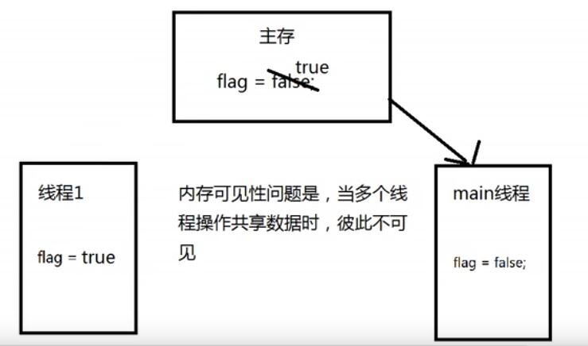

# JUC简介

在Java 5.0提供了java.util.concurrent（简称JUC）包，在此包中增加了在并发编程中很常用的使用工具类，用于定义类似于线程的自定义子系统，包括线程池、异步IO和轻量级任务框架。提供可调用的、灵活的线程池。还提供了设计用于多线程上下文的Collection实现等。

# 一、volatile 关键字与内存可见性

volatile关键字：当多个线程进程操作共享数据时，可以保证内存中的数据可见。

​			    相较于synchronized是一种较为轻量级的同步策略。

注意：

 * 				   1.volatile 不具备“互斥性”，即能同时被多个线程共同访问。
 * 				   2.volatile 不能保证变量的“原子性”。

```java
package com.pdsu.juc;
/*
 * 一、volatile关键字:当多个线程进程操作共享数据时，可以保证内存中的数据可见。
 * 				   相较于synchronized是一种较为轻量级的同步策略。
 * 注意：
 * 1.volatile 不具备“互斥性”，即能同时被多个线程共同访问。
 * 2.volatile 不能保证变量的“原子性”
 */
public class TestVolatile {
	public static void main(String[] args) {
		ThreadDemo td = new ThreadDemo();
		new Thread(td).start();
		while(true) {
			if(td.isFlag()) {
				System.out.println("--------------");
				break;
			}
		}
	}
}
class ThreadDemo implements Runnable{

	private volatile boolean flag=false;
	
	public boolean isFlag() {
		return flag;
	}

	public void setFlag(boolean flag) {
		this.flag = flag;
	}

	@Override
	public void run() {
		try {
			Thread.sleep(200);
		} catch (InterruptedException e) {
			e.printStackTrace();
		}
		flag=true;
		System.out.println("flag="+isFlag());
	}
	
}
```

在Java底层中，声明的变量时存在于主存中的，各个线程如果需要使用到某个变量，就从主存中读取该变量的值到各自的缓存中，这也就导致了如果多线程操控共享变量时，会出现内存可见性问题。

若不加volatile关键字，会出现内存可见性问题，导致线程陷入死循环，无法跳出。



被声明为volatile关键字的变量，会被JVM实时监控，一旦变量值发生了修改，就会立即通知各个线程，让其从主存中重新读取该变量的值，从而防止了内存可见性问题。但是，被volatile关键字声明的变量，无法重排序。

# 二、原子变量与CAS算法

由于使用volatile关键字修饰的变量无法保证原子性，因此出现了原子变量。

在java.util.concurrent.atomic包下，存在很多原子变量相关的类，类中所有的变量都使用了volatile关键字修饰，并且该类还使用了CAS算法来保证原子性。在一般加锁情况下，多线程访问共享变量时，若该线程本次访问没有成功，将释放当前的CPU，只能等到下一次在被分配CPU时，才能继续之前的操作。但是，CAS算法不同，若当前线程的操作没有成功，它不会释放当前的CPU资源，而是在下一次继续访问共享变量，直至访问成功，才释放CPU资源。因此，CAS算法的效率是很高的。

```java
package com.pdsu.juc;

import java.util.concurrent.atomic.AtomicInteger;

/*
 *   一、i++的原子性问题：i++的操作实际上分为三个步骤“读-改-写”
 *   int i=10;
 *   i=i++; //10
 *   
 *   i++的底层操作如下：
 *   int temp=i;
 *   i=i+1;
 *   temp=i;
 *  二、 原子变量：JDK1.5 后java.util.concurrent.atomic 包下提供了常用的原子变量：
 *  	两种特性：1、该包下的所有类中的变量都使用volatile关键字修饰，保证了内存可见性
 *  		   2、采用了CAS(Compare-And-Swap)算法 ，保证了数据的原子性。
 *  				CAS算法是硬件对于并发操作共享数据的支持
 *  				CAS包含了三个操作数：
 *  				内存值 V
 *  				预估值 A
 *  				更新值 B
 *  				当且仅当 V==A 时，V=B，否则，将不做任何操作
 */
public class TestAtomicDemo {
	public static void main(String[] args) {
		AtomicDemo ad = new AtomicDemo();
		
		for (int i = 0; i < 10; i++) {
			new Thread(ad).start();
		}
	}
}
class AtomicDemo implements Runnable{
//	private volatile int serialNumber=0;
	private AtomicInteger serialNumber=new AtomicInteger();
	
	@Override
	public void run() {
		try {
			Thread.sleep(200);
		} catch (InterruptedException e) {
			e.printStackTrace();
		}
		System.out.println(Thread.currentThread().getName()+":"+getSerialNumber());
	}
	
	public int getSerialNumber() {
//		return serialNumber++;
		return serialNumber.getAndIncrement();
	}
}

```

# 三、模拟CAS算法

## 1、CAS算法

CAS（Compare-And-Swap）是一种硬件对并发的支持，针对多处理器操作而设计的处理器中的一种特殊指令，用于管理对共享数据的并发访问。

CAS是一种无锁的非阻塞算法的实现。

CAS包含了3个操作数：

* 需要读写的内存值V
* 进行比较的值A
* 拟写入的新值B

当且仅当V的值等于A时，CAS通过原子方式用新值B来更新V的值，否则不会执行任何操作。

## 2、模拟CAS算法

```java
package com.pdsu.juc;
/*
 * 	模拟CAS算法
 */
public class TestCompareAndSwap {
	public static void main(String[] args) {
		final CompareAndSwap cas=new CompareAndSwap();
		for (int i = 0; i < 10; i++) {
			new Thread(new Runnable() {
				
				@Override
				public void run() {
					int expectedValue=cas.get();
					boolean b=cas.compareAndSet(expectedValue, (int)(Math.random()*101));
					System.out.println(b);
				}
			}).start();
		}
	}
}
class CompareAndSwap{
	private int value;
	
	//获取内存值
	public synchronized int get() {
		return value;
	}
	
	//比较
	public synchronized int compareAndSwap(int expectedValue,int newValue) {
		int oldValue=value;
		if(oldValue==expectedValue) {
			this.value=newValue;
		}
		return oldValue;
	}
	
	//设置
	public synchronized boolean compareAndSet(int expectedValue,int newValue) {
		return expectedValue == compareAndSwap(expectedValue, newValue);
	}
}
```

