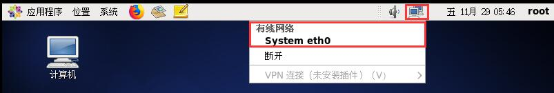
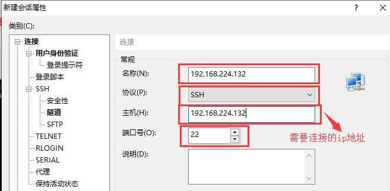
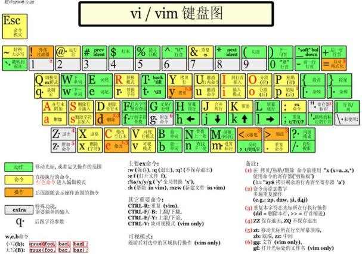
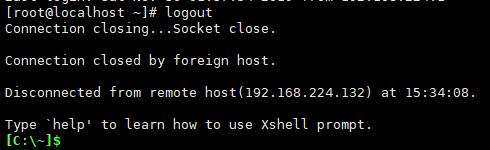
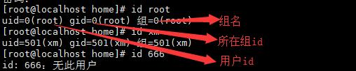
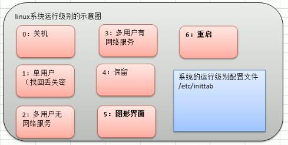

一、Linux基础

## 1、安装VMWare12

点击VM12压缩包中的安装包即可安装。

* VM安装步骤
  * 去BIOS里修改设置开启虚拟化设备支持
    * 将Virtualization Technology选项设置为Enabled
  * 安装虚拟机软件VMWare12

## 2、安装CentOS

* CentOS下载地址：
  * 网易镜像：http://mirrors.163.com/centos/6/isos/
  * 搜狐镜像：http://mirrors.sohu.com/centos/6/isos/
* 创建虚拟机空间
* 编辑虚拟机设置
  * 通常将内存设置为2G
  * 处理器按照自己机器的实际情况配置，在这里我分配了CPU总数的一半
  * 网络适配器有以下几种模式，通常选择NAT模式。
    * 桥接模式：处于同一局域网的两台Windows主机，若在其中一台主机上创建了一个Linux虚拟机，则这个虚拟机也和两个主机处于同一互联网，可以互相通信。但是，由于在这一网段的IP地址有限，有可能会造成IP冲突。
    * NAT模式：网络地址转换方式；处于同一局域网的两台Windows主机，若其中有一台主机上有一个LInux虚拟机，则该主机存在两个IP地址，一个IP地址与另一台主机所处的网段一致，另一个IP地址则是与虚拟机的网段一致。Linux虚拟机可以访问外网，但是其他主机不能访问虚拟机。由于虚拟机的IP地址并不与另一主机所处同一网段，因此不会造成IP冲突。
    * 主机模式：此时你的虚拟机是一个独立的主机，不能访问外网。
* 安装CentOS
* 中英文的切换步骤请访问该链接：https://blog.csdn.net/Hanani_Jia/article/details/78556456

## 3、终端的使用和联网

### 1）、终端的使用，点击鼠标右键，即可选择打开终端。

* 在终端界面选择“编辑”-->"侧写首选项"--->"颜色"-->"内置方案"--->选择"黑底白字"。如下：

  

### 2）、配置网络，可以联网。

* 点击右上角电脑图标，选择System eth0，然后等待一段时间，网络就可连接成功。

  

* 访问：www.baidu.com，测试网络连接是否成功。

##  4、VMware Tools的安装和使用

### 1）、介绍

vmtools安装后，可以让我们在Windows下更好的管理vm虚拟机。

* 可以直接粘贴命令在Windows和CentOS系统之间

* 可以设置Windows和CentOS的共享文件夹

  

### 2）、安装和使用

* 安装vmtools的步骤：

  * 进入CentOS

  * 点击vm菜单的"虚拟机"选项->install vmware tools

  * CentOS会出现一个vm的安装包

  * 将其复制到/opt目录下，点击右键解压(也可以使用命令解压，命令如下)，得到一个安装文件

    ```shell
    tar -zxvf VMwareTools-10.0.5-3228253.tar.gz
    ```

  * 进入该vm解压的目录，该文件在 /root/opt/vmware-tools-distrib/ 下 

    ```shell
    [root@localhost opt]# ll
    总用量 70588
    drwxr-xr-x. 2 root root     4096 10月  3 2017 rh
    -rw-r--r--. 1 root root 72270857 11月 10 2015 VMwareTools-10.0.5-3228253.tar.gz
    drwxr-xr-x. 9 root root     4096 11月 10 2015 vmware-tools-distrib
    [root@localhost opt]# pwd
    /opt
    [root@localhost opt]# cd vmware-tools-distrib/
    [root@localhost vmware-tools-distrib]# ls
    bin  doc  FILES    installer  vgauth             vmware-install.real.pl
    caf  etc  INSTALL  lib        vmware-install.pl
    ```

  * 安装 ./vmware-install.pl

    ```shell
    [root@localhost vmware-tools-distrib]# ./vmware-install.pl
    ```

  * 全部使用默认配置即可(遇见选项直接回车)

  * 需要reboot重新启动即可生效

    ```shell
    [root@localhost vmware-tools-distrib]# reboot
    ```

  * 安装完成后，即可完成：可以直接粘贴命令在Windows和CentOS系统之间。

* 设置共享文件夹

  * 基本介绍

    * 为了方便，可以设置一个共享文件夹，比如d:/share
    * Windows和CentOS就可以共享问价了，**但是在实际公司开发中，文件的上传下载是需要使用远程方式完成的**

  * 具体步骤

    * 菜单->vm->设置->选项，如图设置即可

      

    * 注意：设置选项为“总是启动”，这样就可以读写了

    * Windows和CentOS可共享d:/share目录，可以读写文件了

    * 在CentOS的/mnt/hgfs/下，可以找到Windows系统中共享的文件夹。

## 5、文件系统目录结构

### 1）、基本介绍

Linux的文件系统是采用级层式的树状目录结构，在此结构中的最上层是根目录“/”，然后在此目录下在创建其他目录。

**在Linux的世界里，一切皆文件。**


### 2）、具体的目录结构

* /bin【重点】：是Binary的缩写，这个目录存放着最经常使用的命令。
* /sbin：s就是Super User的意思，这里存放的是系统管理员使用的系统管理程序。
* /home【重点】：存放普通用户的主目录，在Linux中每个用户都有一个自己的目录，一般该目录是以用户的账号命名的。
* /root【重点】：该目录为系统管理员，也称作超级权限者的用户主目录。
* /lib：系统开机所需要最基本的动态连接共享库，其作用类似于Windows里的DLL文件。几乎所有的应用程序都需要用到这些共享库。
* /lost+found：这个目录一般情况下是空的，当系统非法关机后，这里就存放了一些文件。
* /etc【重点】：所有的系统管理所需要的配置文件和子目录。
* /usr【重点】：这是一个非常重要的目录，用户的很多应用程序和文件都放在这个目录下，类似于Windows下的program files目录。
* /boot【重点】：存放的是启动Linux时使用的一些核心文件，包括一些连接文件以及镜像文件。
* /proc：这个目录是一个虚拟的目录，它是系统内存的映射，访问这个目录来获取系统信息。
* /srv：service缩写，该目录存放一些服务启动之后需要提取的数据。
* /sys：这是Linux2.6内核的一个很大的变化。该目录下安装了2.6内核中新出现的一个文件系统sysfs。
* /tmp：这个目录是用来存放一些临时文件的。
* /dev：类似于Windows的设备管理器，把所有的硬件用文件的形式存储。
* /media【重点】：Linux系统会自动识别一些设备，例如U盘、光驱等，当识别之后，Linux会把识别的设备挂载到这个目录下。
* /mnt【重点】：系统提供该目录是为了让用户临时挂载别的文件系统的，我们可以将外部的存储挂载在/mnt/上，然后进入该目录就可以查看里的内容了。
* /opt：这是给主机额外**安装软件**所摆放的目录，如安装Oracle数据库就可以放到该目录下。默认为空。
* /usr/local【重点】：这是另一个给主机额外安装软件所**安装的目录**。一般是通过编译源码方式安装的程序。
* /var【重点】：这个目录中存放着在不断扩充着的东西，习惯将经常被修改的目录放在这个目录下。包括各种日志文件。
* /selinux(security-enhanced linux)：SELinux是一种安全子系统，它能控制程序只能访问特定文件。

### 3）、总结

- Linux的目录中有且只有一个根目录 /
- Linux的各个目录存放的内容是规划好的，不要乱放文件。
- Linux是以文件的形式管理我们的设备，因此Linux系统中一切皆文件。

# 二、Linux实际操作

## 1、使用XShell远程登录到Linux服务器

### 1）、为什么需要远程登录Linux

说明：公司开发的时候，具体的情况是这样的

* Linux服务器是开发小组共享的

* 正式上线的项目是运行在公网上的

* 因此程序员需要远程登录到CentOS进行项目管理或者开发

* 网络拓扑图如下：

  

* 远程登录客户端有Xshell、Xftp等，其他的远程工具大同小异。

### 2）、Xshell介绍

说明：Xshell是目前最好的远程登录到Linux操作的软件，流畅的速度并且完美解决了**中文乱码**的问题，是目前程序员的首选。

Xshell是一个强大的安全终端模拟软件，它支持SSH1，SSH2，以及Microsoft Windows平台的TELNET协议。

Xshell可以在Windows界面下用来访问远端不同系统下的服务器，从而比较好的达到远程控制终端的目的。

**特别说明：**如果希望安装好XShell 5就可以远程访问Linux系统的话，需要Linux预先开启sshd服务，该服务会监听22号端口。

* 查看方法：输入setup命令，选择系统服务，即可查看sshd服务是否开启（标志为*号的为已经开启的服务）

  

### 3）、安装Xshell并使用

直接点击解压文件，然后使用管理员身份运行"绿化.bat"，就会自动在桌面创建一个XShell的快捷方式。

1. 关键配置

   在连接之前先使用以下命令获取Linux系统的ip地址：

   ```shell
   [root@localhost 桌面]# ifconfig
   ```

   进入XShell后，选择打开-->新建会话-->输入名称和主机

   

   点击确定，然后点击连接，输入用户名密码即可连接成功。

2. 当远程登录Linux系统成功后，就可以使用指令来进行使用。

   

## 2、使用Xftp远程上传下载文件

### 1）、介绍

Xftp是一个基于Windows平台的功能强大的SFTP、FTP文件传输软件。使用了Xftp以后，Windows用户能安全地在UNIX/Linux和Windows PC之间传输文件。

### 2）、Xftp的安装配置和使用

①安装

双击安装包进行安装即可，其中一个选项选择免费版。

②配置和使用


连接成功后的界面如下：


③如何解决Xftp中文乱码问题？


确定后在Linux页面刷新即可显示正常：


## 3、vi和vim编辑器

### 1）、介绍

所有的Linux系统都会内建 vi 文本编辑器。

Vim具有程序编辑的能力，可以看作是Vi的增强版本，可以主动的以字体颜色辨别语法的正确性，方便程序设计。代码补充、编译及错误跳转等方便编程的功能特别丰富，在程序员中被广泛使用。

### 2）、vi 和 vim 常用的三种模式

* 正常模式：

  * 以vim打开一个档案就直接进入一般模式了（这是默认的模式）。在这个模式中，你可以使用“上下左右”按键来移动光标，你可以使用“删除字符”或“删除整行”来处理档案的内容，也可以使用“复制、粘上”来处理你的文件数据。

* 插入模式：

  * 按下 i , I , o , O , a , A , r , R 等任意一个字母之后才会进入编辑模式，一般来说按 i 即可。

* 命令行模式：

  * 在这个模式中，可以提供你相关指令，完成读取、存盘、替换、离开vim、显示行号等的动作则是在此模式中达成的。

* vi 和 vim 模式的相互切换

  

### 3）、vi 和 vim基本使用

①使用vim开发一个Hello.java程序。

```shell
[root@localhost ~]# vim Hello.java 
按下i，进入插入模式
public class Hello{
        public static void main(String[] args){
                System.out.println("hello,world!");
        }
}
内容输入完毕按ESC进入命令行模式
输入:wq命令，保存并退出
	若做了修改，则使用:wq命令，保存并退出
	若没有修改，则使用:q命令，退出
	若做了修改，但是不想保存，则使用:q!命令，不保存退出
```
### 4）、vi和vim快捷键（没有特殊说明都是在正常模式下使用）

* 拷贝当前行【yy】，拷贝当前行向下的5行【5yy】，并粘贴【p】。
* 删除当前行【dd】，删除当前行向下的5行【5dd】。
* 在文件中查找某个单词【命令行下 /关键字，回车 查找，输入n就是查找下一个】【查找完若需要将文件恢复原来的颜色，则在命令行下 :noh 】
* 设置文件的行号，取消文件的行号。【命令行下 :set nu和 :set nonu】
* 编辑/etc/profile文件，使用快捷键到达文档的最末行【G】和最首行【gg】
* 在一个文件中输入“hello”，又撤销这个动作。 【u】
* 编辑/etc/profile文件，并将光标移动到20行 【20 Shift+g】



## 4、关机重启注销

### 1）、关机和重启

* 基本介绍

|       命令        |     介绍      |
| :-------------: | :---------: |
| shutdown -h now |   立刻进行关机    |
|  shutdown -h 1  |   1分钟后会关机   |
| shutdown -r now |   现在重启计算机   |
|      halt       |     关机      |
|     reboot      |  现在重新启动计算机  |
|      sync       | 把内存的数据同步到磁盘 |

* 注意细节：不管是重启系统还是关闭系统，首先要运行sync命令，把内存中的数据写到磁盘中。

### 2）、用户登录和注销

* 基本介绍

  * 登录时尽量少用root账号登录，因为它是系统管理员，最大的权限，避免操作失误。可以利用普通用户登录，登录后再用“su 用户名”命令来切换成系统管理员身份。

  * 在提示符下输入logout即可注销用户。

    

* 使用细节

  * logout注销指令在图形运行级别无效，在运行级别3(远程登录)下有效。

## 5、用户管理

### 1）、简单示意图


### 2）、基本介绍

Linux系统是一个多用户多任务的操作系统，任何一个要使用系统资源的用户，都必须首先向系统管理员申请一个账号，然后以这个账号的身份进入系统。

Linux的用户需要至少属于一个组。

### 3）、添加用户

* 基本语法

  ```shell
  useradd [选项] 用户名
  ```

* 应用案例

  添加一个用户xiaoming

* 细节说明

  * 当创建用户成功后，会自动创建和用户同名的家目录
  * 也可以通过 【useradd -d 指定目录 新的用户名】，给新创建的用户指定家目录（指定的目录必须是原来不存在的）

### 4）、指定/修改密码

* 基本语法

  ```shell
  passwd 用户名
  ```

* 应用案例

  给xiaoming指定密码

### 5）、删除用户

* 基本语法

  ```shell
  userdel 用户名
  ```

* 应用案例

  * 删除用户xiaoming，但是要保留家目录

    ```shell
    userdel xiaoming 
    ```

  * 删除用户以及用户主目录

    ```shell
    userdel -r xiaoming 
    ```

* 在删除用户时，我们一般不会将家目录删除。

### 6）、查询用户信息指令

* 基本语法

  ```shell
  id 用户名
  ```

* 应用实例

  请查询root信息

* 细节说明

  当用户不存在时，返回无此用户。

  

### 7）、切换用户

* 介绍

  在操作Linux中，如果当前用户的权限不够，可以通过su -指令，切换到高权限用户，比如root。

* 基本语法

  ```shell
  su - 切换用户名
  ```

* 应用实例

  创建一个用户zf，指定密码，然后切换到zf。

* 细节说明

  * 从权限高的用户切换到权限低的用户，不需要输入密码，反之需要。
  * 当需要返回到原来用户时，使用exit命令。

### 8）、查看当前用户/登录用户

* 基本语法

  ```shell
  whoami   或  who am i	
  ```

### 9）、用户组

#### ①、介绍

类似于角色，系统可以对有共性的多个用户进行统一的管理。

#### ②、新增组

* 指令

  ```shell
  groupadd 组名
  ```

* 应用案例

  创建一个用户组wudang

#### ③、删除组

* 指令

  ```shell
  groupdel 组名
  ```

* 应用案例

  删除一个用户组wudang

#### ④、增加用户时，直接加上组

* 指令

  ```shell
  useradd -g 用户组 用户名
  ```

* 应用案例

  增加一个用户zwj，直接将它指定到wudang

  

#### ⑤、修改用户的组

* 指令

  ```shell
  usermod -g 用户组 用户名
  ```

* 应用案例

  创建一个shaolin组，让将zwj用户修改到shaolin

  

### 10）、用户和组的相关文件

* /etc/passwd 文件
  * 用户（user）的配置文件，记录用户的各种信息。
  * 每行的含义：【用户名:口令:用户标识号:组标识号:注释性描述:主目录:登录shell】
* /etc/shadow文件
  * 口令的配置文件
  * 每行的含义：【登录名:加密口令:最后一次修改时间:最小时间间隔:最大时间间隔:警告时间:不活动时间:失效时间:标志】
* /etc/group文件
  * 组（group）的配置文件，记录Linux包含的组的信息。
  * 每行含义：【组名:口令:组标识号:组内用户列表】

## 6、实用指令

### 1）、指定运行级别

* 基本介绍

  运行级别说明：

  | 运行级别 |     说明      |
  | :--: | :---------: |
  |  0   |     关机      |
  |  1   | 单用户【找回丢失密码】 |
  |  2   | 多用户状态没有网络服务 |
  |  3   | 多用户状态有网络服务  |
  |  4   | 系统未使用保留给用户  |
  |  5   |    图形界面     |
  |  6   |    系统重启     |

  常用的运行级别是3和5，要修改默认的运行级别可改文件/etc/inittab的id:5:initdefault:这一行中的数字。

* 命令：init [0 1 2 3 5 6]

* 示意图

  

* 应用案例

  ①通过init来切换不同的运行级别，比如从5->3，然后关机。

  ```shell
  init 3
  shutdown -h now 
  ```

  ②设置运行级别，Linux运行后，直接进入到命令行界面，即进入到3运行级别

  ```shell
  vim /etc/inittab
  然后将其修改成id:3:initdefault:，保存退出，然后重启即可
  ```

#### 面试题

  如何找回root密码？

* 思路：（必须使用实体机才能操作，远程方式无法修改）进入到单用户模式，然后修改root密码。因为进入单用户模式，root不需要密码就可以登录。

* 步骤：

  在启动虚拟机时，在其还未完全启动时，使用Enter键，进入如下界面：

  

  然后再按e键，进入如下界面，选择第二个选项：

  

  然后再按e键，进入如下界面，然后输入“空格 1”回车：

  

  输入完毕后，就回到了该界面，此时在输入b键，此时就会进入到单用户模式：

  

  此时就成功使用root用户进入系统：

  

  此时，使用passwd root命令修改root密码。

### 2）、帮助指令

#### ①、man获得帮助信息

* 基本语法

  ```shell
  man [命令或配置文件]
  ```

* 应用案例
  查看ls命令的帮助信息

#### ②、help指令获得Shell内置指令的帮助信息

* 基本语法

  ```shell
  help 命令
  ```

* 应用案例

  查看cd命令的帮助信息

### 3）、文件目录类

#### ①、pwd指令显示当前工作目录的绝对路径

* 基本语法

  ```shell
  pwd
  ```

* 应用案例

  显示当前工作目录的绝对路径

#### ②、ls指令

* 基本语法

  ```shell
  ls [选项] [目录或是文件]
  ```

* 常用选项

  * -a：显示当前目录所有的文件和目录，包括隐藏的。
  * -l：以列表的方式显示信息

* 应用案例

  查看当前目录的所有内容信息

#### ③、cd指令切换到指定目录

* 基本语法

  ```shell
  cd [参数]
  ```

* 常用参数

  * **绝对路径**和**相对路径**
    * 绝对路径：从根目录开始定位
    * 相对路径：从当前工作目录开始定位到需要的目录去
  * cd ~ 或者cd ： 回到自己的家目录
  * cd .. ：回到当前目录的上一级目录

* 应用案例

  * 使用绝对路径切换回root目录
  * 使用相对路径切换回root目录
  * 回到当前目录的上一级目录
  * 回到家目录

#### ④、mkdir指令创建目录

* 基本语法

  ```shell
  mkdir [选项] 要创建的目录
  ```

* 常用选项

  -p：创建多级目录

* 应用案例

  * 创建一个目录/home/dog

    ```shell
    mkdir /home/dog
    ```

  * 创建多级目录/home/animal/tiger

    ```shell
    mkdir -p /home/animal/tiger
    ```

#### ⑤、rmdir指令删除空目录

* 基本语法

  ```shell
  rmdir [选项] 要删除的空目录
  ```

* 应用实例

  删除一个目录/home/dog

  ```shell
  rmdir /home/dog
  ```

* 使用细节

  rmdir删除的是空目录，如果目录下有内容是无法删除的。

  提示：如果需要删除非空目录，需要使用【rm -rf 要删除的目录】

#### ⑥、touch指令创建空文件

* 基本语法

  创建一个文件

  ```shell
  touch 文件名称
  ```

  创建多个文件

  ```shell
  touch 文件1 文件2
  ```

* 应用案例

  创建一个空文件hello.txt

  ```shell
  touch hello.txt
  ```

#### ⑦、cp指令拷贝文件到指定目录

* 基本语法

  ```shell
  cp [选项] source dest
  ```

* 常用选项

  -r：递归复制整个文件夹

* 应用案例

  * 将/home/aaa.txt拷贝到/home/bbb目录下

    ```shell
    [当前在home目录下]cp aaa.txt bbb/ 
    ```

  * 递归复制整个文件夹，例如：将/home/test整个目录拷贝到/home/zwj目录

    ```shell
    [当前在home目录下]cp -r test/ zwj/
    ```

* 使用细节

  若复制的文件在目标位置已经存在，则Linux会提示是否覆盖，需要一个个确认。若文件过多，则可以使用强制覆盖不提示的方法。

  强制覆盖不提示的方法：\cp  [选项] source dest

#### ⑧、rm指令移除文件或目录

* 基本语法

  ```shell
  rm [选项] 要删除的文件或目录
  ```

* 常用选项

  * -r：递归删除整个文件夹
  * -f：强制删除不提示

* 应用案例

  * 将/home/aaa.txt文件删除

    ```shell
    [当前在home目录下]rm aaa.txt
    ```

  * 递归删除整个文件夹/home/bbb

    ```shell
    [当前在home目录下]rm -rf bbb/
    ```

* 使用细节

  强制删除不提示的方法：带上-f参数即可。

#### ⑨、mv指令移动文件与目录或重命名

* 基本语法

  |               命令                | 功能描述 |
  | :-----------------------------: | :--: |
  |   mv oldNameFIle newNameFile    | 重命名  |
  | mv /temp/movefile /targetFolder | 移动文件 |

* 应用案例

  * 将/home/aaa.txt文件重新命名为pig.txt

    ```shell
    [当前在home目录下]mv aaa.txt pig.txt
    ```

  * 将/home/pig.txt 文件移动到/root目录下

    ```shell
    [当前在home目录下]mv pig.txt /root/
    ```

#### ⑩、cat指令查看文件内容，以只读的方式打开 

* 基本语法

  ```shell
  cat [选项] 要查看的文件
  ```

* 常用选项

  -n：显示行号

* 应用实例

  查看/etc/profile文件内容，并显示行号

  ```shell
  cat -n /etc/profile
  ```

  为了浏览方便，可以带上管道指令分页显示内容，查看下一页请按空格

  ```shell
  cat -n /etc/profile | more
  ```

* 使用细节

  cat只能浏览文件，而不能修改文件，为了浏览方便，一般会带上管道命令【 | more】

#### ⑪、more指令

more指令是一个基于vi编辑器的文本过滤器，它以全屏幕的方式按页显示文本文件的内容。more指令中内置了若干快捷键，详见操作说明。

* 基本语法

  ```shell
  more 要查看的文件
  ```

* 操作说明

  |     操作     |         功能说明         |
  | :--------: | :------------------: |
  | 空格键（Space） |       代表向下翻一页        |
  |   Enter    |       代表向下翻一行        |
  |     q      | 代表立刻离开more，不在显示该文件内容 |
  |   Ctrl+F   |        向下滚动一屏        |
  |   Ctrl+B   |        返回上一屏         |
  |     =      |       输出当前行的行号       |
  |     f      |     输出文件名和当前行的行号     |

* 应用案例

  采用more查看文件/etc/profile

  ```shell
  more /etc/profile
  ```

#### ⑫、less指令

less指令用来分屏查看文件内容，它的功能与more指令类似，但是比more指令更加强大，支持各种显示终端。less指令在显示文件内容时，**并不是一次将整个文件加载后才显示**，而是根据显示需要加载内容，**对于显示大型文件具有较高的效率。**

* 基本语法

  ```shell
  less 要查看的文件
  ```

* 操作说明

  |     操作     |          功能说明           |
  | :--------: | :---------------------: |
  |    空格键     |         向下翻动一页          |
  | [pagedown] |         向下翻动一页          |
  |  [pageup]  |         向上翻动一页          |
  |    /字串     | 向下搜寻[字串]的功能：n向下查找；N向上查找 |
  |    ?字串     | 向上搜寻[字串]的功能：n向上查找；N向下查找 |
  |     q      |       离开less这个程序        |

* 应用案例

  采用less查看一个大文件 金庸-射雕英雄传txt精校版.txt

  ```shell
  less 金庸-射雕英雄传txt精校版.txt
  ```

#### ⑬、> 指令输出重定向 和 >> 指令追加

* **> 指令**：会将原来的文件内容覆盖。
* **>>指令**：不会覆盖原来文件的内容，而是追加到文件的尾部。

* 基本语法

  |        命令        |         功能描述         |
  | :--------------: | :------------------: |
  |    ls -l > 文件    | 列表的内容写入文件a.txt中（覆盖写） |
  |   ls -la >> 文件   | 列表的内容追加到文件aa.txt的末尾  |
  |  cat 文件1 > 文件2   |    将文件1的内容覆盖到文件2     |
  | echo "内容"  >> 文件 |      把内容追加到文件中       |

* 应用案例

  * 将/home目录下的文件列表写入到/home/info.txt中

    ```shell
    ll /home/ > /home/info.txt
    ```

  * 将当前日历信息追加到/home/mycal文件中（cal指令：显示日历信息）

    ```shell
    cal >> /home/mycal
    ```

#### ⑭、echo指令输出内容到控制台

* 基本语法

  ```shell
  echo [选项] [输出内容]
  ```

* 应用案例

  * 使用echo指令输出环境变量，输出当前的环境路径。

    ```shell
    echo $PATH
    ```

  * 使用echo指令输出hello,world!

    ```shell
    echo hello,world!
    ```

#### ⑮、head指令

head指令用于显示文件的开头部分内容，默认情况下head指令显示文件的前10行内容。

* 基本语法

  |      命令      |        功能描述        |
  | :----------: | :----------------: |
  |   head 文件    |     查看文件头10行内容     |
  | head -n 5 文件 | 查看文件头5行内容，5可以是任意行数 |

* 应用案例

  查看/etc/profile的前面5行代码

  ```shell
  head -n 5 /etc/profile
  ```

#### ⑯、tail指令

tail用于输出文件中尾部的内容，默认情况下tail指令显示文件的后10行内容。

* 基本语法

  |      命令      |        功能描述         |
  | :----------: | :-----------------: |
  |   tail 文件    |     查看文件的后10行内容     |
  | tail -n 5 文件 | 查看文件的后5行内容，5可以是任意行数 |
  |  tail -f 文件  |    实时追踪该文档的所有更新     |

* 应用实例

  * 查看/etc/profile最后5行的代码

    ```shell
    tail -n 5 /etc/profile
    ```

    实时监控mydate.txt，看到文件有变化时，是否看到，实时的追加日期

    ```shell
    tail -f mydate.txt
    ```

    

#### ⑰、ln指令

软链接也叫符号链接，**类似于Windows里的快捷方式**，主要存放了链接其他文件的路径。

* 基本语法

  ```shell
  ln -s [原文件或目录] [软链接名]
  ```

  功能描述：给原文件创建一个软链接。

* 应用实例

  * 在/home目录下创建一个软链接linkToRoot，链接到/root目录

    ```shell
    ln -s /root linkToRoot
    ```

  * 删除软链接linkToRoot

    ```shell
    rm -rf linkToRoot(注意不能写linkToRoot/)
    ```

  

* 细节说明 

  当我们使用pwd指令查看目录时，仍然看到的是软链接所在目录。

  

#### ⑱、history指令

查看已经执行过的历史命令，也可以执行历史指令。

* 基础语法

  ```shell
  history
  ```

  功能描述：查看已经执行过的历史命令。

* 应用案例

  * 显示所有的历史命令

    ```shell
    history
    ```

  * 显示最近使用过的10个指令

    ```shell
    history 10
    ```

  * 执行历史编号为176的指令

    ```shell
    !176
    ```

    

### 4）、时间日期类

#### ①、date指令显示当前日期

* 基本语法

  |            命令             |   功能描述   |
  | :-----------------------: | :------: |
  |           date            |  显示当前时间  |
  |         date +%Y          |  显示当前年份  |
  |         date +%m          |  显示当前月份  |
  |         date +%d          | 显示当前是哪一天 |
  | date "+%Y-%m-%d %H:%M:%S" | 显示年月日时分秒 |

* 应用案例

  * 显示当前时间信息

    ```shell
    date
    ```

  * 显示当前时间年月日

    ```shell
    date "+%Y-%m-%d"
    ```

  * 显示当前时间年月日时分秒

    ```shell
    date "+%Y-%m-%d %H:%M:%S"
    ```

#### ②、date指令设置日期

* 基本语法

  ```shell
  date -s 字符串时间
  ```

* 应用案例

  设置系统当前时间，比如设置成2020-11-11 11:22:22

  ```shell
  date -s "2020-11-11 11:22:22"
  ```

#### ③、cal指令查看日历

* 基本语法

  ```shell
  cal [选项]
  ```

  功能描述：不加选项，显示本月日历。

* 应用案例

  * 显示当前日历

    ```shell
    cal
    ```

  * 显示2020年日历

    ```shell
    cal 2020
    ```

### 5）、搜索查找类

#### ①、find指令

find指令将从指定目录向下递归地遍历其各个子目录，将满足条件的**文件或目录**显示在终端。

* 基本语法

  ```shell
  find [搜索范围] [选项]
  ```

* 选项说明

  |     选项      |        功能        |
  | :---------: | :--------------: |
  | -name<查询方式> | 按照指定的文件名查找模式查找文件 |
  | -user<用户名>  |  查找属于指定用户名所有文件   |
  | -size<文件大小> |  按照指定的文件大小查找文件   |

* 应用案例

  * 按文件名：根据名称查找/home目录下的hello.txt文件

    ```shell
    find /home -name hello.txt
    ```

    

  * 按拥有者：查找/opt目录下，用户名称为nobody的文件

    ```shell
    find /opt -user nobody
    ```

  * 查找整个Linux系统下大于20M的文件（+n 大于；-n 小于；n等于）【注意单位大小写】

    ```shell
    [root@localhost ~]# find / -size +20M
    /opt/金庸-射雕英雄传txt精校版.txt
    [root@localhost ~]# ls -lh /opt/金庸-射雕英雄传txt精校版.txt # -h选项，用人能看懂的方式显示
    -rw-r--r--. 1 root root 28M 12月  1 01:18 /opt/金庸-射雕英雄传txt精校版.txt
    ```

  * 查找根目录下，后缀名为.txt的文件（*前面必须使用转义符，否则会报错）

    ```shell
    find / -name \*.txt
    ```

#### ②、locate指令

locate指令可以**快速定位文件路径**。locate指令利用事先建立的系统中所有文件名称及路径的locate数据库实现快速定位给定的文件。locate指令无需遍历整个文件系统，查询速度较快。为了保证查询结果的准确度，管理员必须定期更新locate时刻。

* 基础语法

  ```shell
  locate 搜索文件
  ```

* 特别说明

  由于locate指令基于数据库进行查询，所以第一次运行前，必须使用updatedb指令创建locate数据库。

* 应用案例

  请使用locate指令快速定位hello.txt文件所在目录。

  ```shell
  updatedb
  locate hello.txt
  ```

  

#### 【重点】③、grep指令和管道符号 |

grep过滤查找，管道符“|”，表示将前一个命令的处理结果输出传递给后面的命令处理。

* 基本语法

  ```shell
  grep [选项] 查找内容 源文件
  ```

* 常用选项

  |  选项  |    功能    |
  | :--: | :------: |
  |  -n  | 显示匹配行及行号 |
  |  -i  | 忽略字母大小写  |

* 应用案例

  请在hello.txt文件中，查找“yes”所在行，并且显示行号。

  ```shell
  cat hello.txt | grep -n yes # 区分大小写
  cat hello.txt | grep -ni yes # 不区分大小写
  ```

  

### 6）、压缩和解压类

#### ①、gzip/gunzip指令

gzip用于压缩文件，gunzip用于解压文件。

* 基本语法

  |      命令      |        功能描述         |
  | :----------: | :-----------------: |
  |   gzip 文件    | 压缩文件，只能将文件压缩为*.gz文件 |
  | gunzip 文件.gz |       解压缩文件命令       |

* 应用案例

  * gzip压缩：将/home下的hello.txt文件进行压缩

    ```shell
    gzip hello.txt
    ```

  * gunzip解压缩：将/home下的hello.txt.gz文件进行解压缩

    ```shell
    gunzip hello.txt.gz
    ```

* 细节说明

  当我们使用gzip对文件进行压缩后，不会保留原来的文件。

  当我们使用gunzip对文件进行解压缩后，不会保留原来的压缩包。

#### ②、zip/unzip指令

zip用于压缩文件，unzip用于解压文件。这个在项目打包发布时很有用。

* 基本语法

  |            命令            |    功能描述    |
  | :----------------------: | :--------: |
  | zip [选项] xxx.zip 将要压缩的内容 | 压缩文件和目录的命令 |
  |    unzip [选项] xxx.zip    |   解压缩文件    |

* zip常用选项

  -r：递归压缩，即压缩目录

* unzip常用选项

  -d <目录>：指定解压缩后文件的存放目录。

* 应用案例

  * 将/home下的所有文件进行压缩成mypackage.zip

    ```shell
    zip -r mypackage.zip /home/
    ```

  * 将mypackage.zip解压到/opt/tmp目录下

    ```shell
    unzip -d /opt/tmp/ mypackage.zip
    ```

* 细节说明

  当使用zip和unzip时，会保留原文件。

#### ③、tar指令

tar指令是打包指令，最后打包的文件是.tar.gz的文件。

* 基本语法

  ```shell
  tar [选项] xxx.tar.gz 打包的内容
  ```

  功能描述：打包目录，压缩后的文件格式.tar.gz

* 选项说明

  |  选项  |     功能     |
  | :--: | :--------: |
  |  -c  | 产生.tar打包文件 |
  |  -v  |   显示详细信息   |
  |  -f  | 指定压缩后的文件名  |
  |  -z  |   打包同时压缩   |
  |  -x  |  解包.tar文件  |

* 应用案例

  * 压缩多个文件，将/home/a1.txt和/home/a2.txt压缩成a.tar.gz

    ```shell
    tar -zcvf a.tar.gz a1.txt a2.txt 
    ```

    

  * 将/home的文件夹压缩成myhome.tar.gz

    ```shell
    tar -zcvf myhome.tar.gz /home/
    ```

  * 将a.tar.gz解压到当前目录

    ```shell
    tar -zxvf a.tar.gz
    ```

  * 将myhome.tar.gz解压到/opt/tmp2目录下

    ```shell
    tar -zxvf myhome.tar.gz -C /opt/tmp2/
    ```

    解压到指定目录的前提是：该目录必须已经存在。

## 7、组管理和权限管理

### 1）、Linux组基本介绍

在Linux中的每个用户必须属于一个组，不能独立于组外。在Linux中每个文件有所有者、所在组、其他组的概念。

* 所有者
* 所在组
* 其他组
* 改变用户所在的组

### 2）、文件/目录所有者

一般为文件的创建者，谁创建了该文件，就自然的成为该文件的所有者。

#### ①、查看文件的所有者

* 指令：ls -ahl

* 应用实例：创建一个组police，在创建一个用户tom，将tom放到police组，然后使用tom来创建一个ok.txt文件，看看情况如何。

  ```shell
  [root@localhost ~]# groupadd police
  [root@localhost ~]# useradd -g police tom
  [root@localhost ~]# passwd tom
  更改用户 tom 的密码 。
  新的 密码：
  无效的密码： WAY 过短
  无效的密码： 过于简单
  重新输入新的 密码：
  passwd： 所有的身份验证令牌已经成功更新。
  [root@localhost ~]# su tom
  [tom@localhost root]$ pwd
  /root
  [tom@localhost root]$ cd ~
  [tom@localhost ~]$ pwd
  /home/tom
  [tom@localhost ~]$ touch ok.txt
  [tom@localhost ~]$ ls -ahl
  总用量 28K
  -rw-r--r--. 1 tom  police    0 12月  2 16:29 ok.txt

  ```

#### ②、修改文件所有者

* 指令：chown 用户名 文件名

* 应用案例：使用root创建一个文件apple.txt，然后将其所有者修改成tom。

  ```shell
  [root@localhost ~]# touch apple.txt
  [root@localhost ~]# ll
  总用量 368
  -rw-r--r--. 1 root root      0 12月  2 16:34 apple.txt
  [root@localhost ~]# chown tom apple.txt 
  [root@localhost ~]# ll
  总用量 368
  -rw-r--r--. 1 tom  root      0 12月  2 16:34 apple.txt
  ```


#### ③、组的创建

* 基本指令

  ```shell
  groupadd 组名
  ```

* 应用案例

  * 创建一个组monster

    ```shell
    groupadd monster
    ```

  * 创建一个用户fox，并放入到monster组中

    ```shell
    useradd -g monster fox
    ```

### 3）、文件/目录所在组

当某个用户创建了一个文件后，默认这个文件的所在组就是该用户所在的组。

#### ①、查看文件/目录所在组

* 基本指令

  ```shell
  ls -ahl
  ```

#### ②、修改文件所在的组

* 基本指令

  ```shell
  chgrp 组名 文件名
  ```

* 应用案例

  使用root用户创建文件orange.txt，看看当前这个文件属于哪个组，然后将这个文件所在组，修改到police组。

  ```shell
  [root@localhost ~]# touch orange.txt
  [root@localhost ~]# ll
  总用量 368
  -rw-r--r--. 1 root root      0 12月  2 16:48 orange.txt
  [root@localhost ~]# chgrp police orange.txt 
  [root@localhost ~]# ll
  总用量 368
  -rw-r--r--. 1 root police      0 12月  2 16:48 orange.txt
  ```

### 4）、其他组

除文件的所有者和所在组的用户外，系统的其他用户都是文件的其他组。

### 5）、改变用户所在组

在添加用户时，可以指定将该用户添加到哪个组中，同样的用root的管理权限可以改变某个用户所在的组。

* 基本语法
  * usermod -g 组名 用户名
  * usermod -d 目录名 用户名：改变该用户登录的初始目录。


* 应用实例

  创建一个土匪组（bandit）将tom这个用户从原来的police组，修改到bandit（土匪）组。

  ```shell
  [root@localhost ~]# groupadd bandit
  [root@localhost ~]# id tom
  uid=504(tom) gid=505(police) 组=505(police)
  [root@localhost ~]# usermod -g bandit tom
  [root@localhost ~]# id tom
  uid=504(tom) gid=506(bandit) 组=506(bandit)
  ```

### 6）、权限管理

#### ①、基本介绍

ls -l 中显示的内容如下：

-rwx**rw**-r--1 root root 1213 Feb 2 09:39 abc

* 0-9位说明

  * 第0位确定**文件类型**（d，-，l，c，b）

    * -：普通文件
    * d：目录
    * l：软链接文件
    * c：字符设备，如键盘、鼠标等
    * b：块文件，如硬盘等

  * 第1-3位确定**所有者**（该文件的所有者）拥有该文件**的权限**。——User（所有者）

    * r：读权限

    * w：写权限

    * x：执行权限

      注意：- 代表没有权限

  * 第4-6位确定**所属组**（同用户组的）拥有该文件**的权限**。——Group（所在组）

    * r：读权限

    * w：写权限

    * x：执行权限

      注意：- 代表没有权限

  * 第7-9位确定**其他用户**拥有该文件**的权限**。——Other（其他组）

    * r：读权限

    * w：写权限

    * x：执行权限

      注意：- 代表没有权限

* 第10位：如果是文件，表示硬链接的数目；如果是目录，则表示该目录的子目录的个数（子目录中包括 . 当前目录， .. 上一级目录）。

* 第11位：文件所有者

* 第12位：文件所在組

* 第13位：文件大小；若是目录则显示4096。

* 第14位：文件最后的修改时间

  


#### ②、rwx权限详解 

* rwx作用到文件
  * r 代表可读（read）：可以读取、查看。
  * w 代表可写（write）：可以修改，但是不代表可以删除该文件，删除一个文件的前提条件是对该文件所在的目录有写权限，才能删除该文件。
  * x 代表可执行（execute）：可以被执行。
* rwx作用到目录
  * r 代表可读（read）：可以读取，ls查看目录内容。
  * w 代表可写（write）：可以修改，目录内创建+删除+重命名目录。
  * x 代表可执行（execute）：可以进入该目录。
* rwx还可以用数字来表示：r=4，w=2，x=1，因此rwx=4+2+1=7

#### ③、应用案例

* ls -l 中显示的内容如下：

  -rwxrw-r-- 1 root root 1213 Feb 2 09:39 abc

  10个字符确定不同用户能对文件干什么

  第一个字符代表文件类型：文件 (-),目录(d),链接(l)

  其余字符每3个一组(rwx) 读(r) 写(w) 执行(x)

  第一组rwx : 文件拥有者的权限是读、写和执行

  第二组rw-: 与文件拥有者同一组的用户的权限是读、写但不能执行

  第三组r-- : 不与文件拥有者同组的其他用户的权限是读不能写和执行

  |     字符      |           含义            |
  | :---------: | :---------------------: |
  |      1      |     文件：硬连接数；目录：子目录数     |
  |    root     |           所有者           |
  |    root     |           所在组           |
  |    1213     | 文件大小（字节）；若是文件夹，显示4096字节 |
  | Feb 2 09:39 |         最后修改日期          |
  |     abc     |           文件名           |

#### ④、修改权限-chmod

* 基本说明

  通过chmod指令，可以修改文件或者目录的权限。

  

* 第一种方式：+ 、- 、= 变更权限

  u：所有者	g：所在组	o：其他人	a：所有人（u，g，o的总和）

  * chmod u=rwx,g=rx,o=x  文件目录名
  * chmod o+w 文件目录名
  * chmod a-x  文件目录名

* 案例演示

  * 给abc文件的所有者读写执行的权限，给所在组读执行权限，给其他组读执行权限。

    ```shell
    chmod u=rwx,g=rx,o=rx abc
    ```

  * 给abc文件的所有者除去执行的权限，增加组写的权限。

    ```shell
    chmod u-x,g+w abc
    ```

  * 给abc文件的所有用户添加读的权限。

    ```shell
    chmod a+r abc
    ```

* 第二种方式：通过数字变更权限

  r=4，w=2，x=1	rwx=4+2+1=7

  chmod u=rwx,g=rx,o=x  文件目录名

  相当于  chmod 751 文件目录名

* 案例演示

  将/home/abc.txt 文件的权限修改成rwxr-xr-x，使用给数字的方式实现。

  ```shell
  chmod 755 /home/abc.txt
  ```

#### ⑤、修改文件所有者-chown

* 基本介绍

  |              命令              |     功能介绍     |
  | :--------------------------: | :----------: |
  |     chown newowner file      |   改变文件所有者    |
  | chown newowner:newgroup file | 改变用户的所有者和所在组 |

  -R 如果是目录，则使其下所有子文件或者目录**递归**生效。

* 案例演示

  * 请将/home/abc.txt 文件的所有者修改成tom。

    ```shell
    chown tom /home/abc.txt
    ```

  * 请将/home/kkk目录下所有的文件和目录的所有者都修改成tom

    ```shell
    chown -R tom /home/kkk/
    ```

#### ⑥、修改文件所在组-chgrp

* 基本介绍

  ```shell
  chgrp newgroup file 
  ```

  功能介绍：改变文件的所在组

* 案例演示

  * 请将/home/abc.txt文件的所在组修改成shaolin

    ```shell
    chgrp shaolin /home/abc.txt
    ```

  * 请将/home/kkk 目录下的所有的文件和目录的所在组都修改成shaolin

    ```shell
    chgrp -R shaolin /home/kkk
    ```

#### ⑦、最佳实践——警察和土匪游戏

police ， bandit

jack, jerry: 警察

xh, xq: 土匪

(1) 创建组

(2) 创建用户

(3) jack 创建一个文件，自己可以读写，本组人可以读，其它组没人任何权限

(4) jack 修改该文件，让其它组人可以读, 本组人可以读写

(5) xh 投靠 警察，看看是否可以读写.


