# 一、面试题

1. 什么是微服务？
2. 微服务之间是如何独立通讯的？
3. SpringCloud与Dubbo有哪些区别？
4. SpringBoot与SpringCloud，请你谈谈对他们的理解？
5. 什么是服务熔断？什么是服务降级？
6. 微服务的优缺点分别是什么？说下你在项目开发中遇到的坑。
7. 你所知道的微服务技术栈有哪些？请例举一二。
8. eureka和zookeeper都可以提供服务注册与发现的功能，请说说两个的区别？

# 二、微服务概述

## 1、是什么？

* 官方解释：通常而言，微服务架构是一种架构模式或者说是一种架构风格，**它提倡将单一应用程序划分成一组小的服务**，每个服务运行在其独立的进程中，服务之间互相协调、互相配合，为用户提供最终价值。服务之间采用轻量级的通信机制互相沟通（通常是基于HTTP的RESTful API）。每个服务都围绕着具体业务进行构建，并且能够被独立地部署到生产环境、类生产环境等。另外，应尽量避免统一的、集中式的服务管理机制，对具体的一个服务而言，应根据业务上下文，选择合适的语言、工具对其进行构建，可以有一个非常轻量级的集中式管理来协调这些服务，可以使用不同的语言来编写服务，也可以使用不同的数据存储。
* 技术维度理解：微服务化的核心就是将传统的一站式应用，根据业务拆分成一个个的服务，彻底地去耦合，每一个微服务提供单个业务功能的服务，一个服务做一件事，从技术角度看就是一种小而独立的处理过程，类似于进程概念，能够自行单独启动或销毁，甚至拥有自己独立的数据库。

## 2、微服务与微服务架构

* 微服务

  强调的是服务的大小，它关注的是某一个点，是具体解决某一个问题/提供落地对应服务的一个服务应用。狭义的看，可以看作Eclipse里面的一个个微服务工程/或者Module。

* 微服务架构

  微服务架构是一种架构模式，它提倡将单一应用程序划分成一组小的服务，服务之间互相协调、互相配合，为用户提供最终价值。每个服务运行在其独立的进程中，服务与服务间采用轻量级的通信机制互相协作（通常是基于HTTP的RESTful API）。每个服务都围绕着具体业务进行构建，并且能够被独立的部署到生产环境、类生产环境等。另外，**应尽量避免统一的、集中式的服务管理机制**，对具体的一个服务而言，应根据上下文，选择合适的语言、工具对其进行构建。

## 3、微服务优缺点

* 优点

  每个服务租购内聚，足够小，代码容易理解这样能聚焦一个指定的业务功能或业务需求。

  开发简单、开发效率提高，一个服务可能就是专一的只干一件事。

  微服务能够被小团队单独开发，这个小团队是2到5个人的开发人员组成。

  微服务是松耦合的，是由功能意义的服务，无论是在开发阶段或部署阶段都是独立的。

  微服务能使用不同的语言开发。

  易于和第三方集成，微服务允许容易且灵活的方式集成自动部署，通过持续集成工具，如Jenkins,Hudson,bamboo。

  微服务易于被一个开发人员理解，修改和维护，这样小团队能够更关注自己的工作成果。无需通过合作才能体现价值。

  微服务允许你融合最新技术。

  微服务只是业务逻辑的代码，不会和HTML、CSS或其他界面组件混合。

  每个微服务都有自己的存储能力，可以有自己的数据库，也可以有统一的数据库。

* 缺点

  开发人员要处理分布式系统的复杂性

  多服务运维难度，随着服务的增加，运维的压力也在增大

  系统部署依赖

  服务间通信成本

  数据一致性

  系统集成测试

  性能监控.....

## 4、微服务技术栈有哪些？

|        微服务条目         |                   落地技术                   |
| :------------------: | :--------------------------------------: |
|         服务开发         |       SpringBoot、Spring、SpringMVC        |
|       服务配置与管理        |            Archaius、Diamond等             |
|       服务注册与发现        |            Eureka、Zookeeper等             |
|         服务调用         |              Rest、RPC、gRPC               |
|        服务熔断器         |              Hystrix、Envoy等              |
|         负载均衡         |              Ribbon、Nginx等               |
| 服务接口调用(客户端调用服务的简化工具) |                  Feign等                  |
|         消息队列         |         Kafka、RabbitMQ、ActiveMQ等         |
|       服务配置中心管理       |         SpringCloudConfig、Chef等          |
|     服务路由（API网关）      |                  Zuul等                   |
|         服务监控         |     Zabbix、Nagios、Metrics、Spectator等     |
|        全链路追踪         |           Zipkin、Brave、Dapper等           |
|         服务部署         |       Docker、OpenStack、Kubernetes等       |
|       数据流操作开发包       | SpringCloud Stream（封装与Redis、Rabbit、Kafka等发送接收消息） |
|        事件消息总线        |             SpringCloud Bus              |

## 5、为什么选择SpringCloud作为微服务架构？

1. 选型依据
   * 整体解决方案和框架成熟度
   * 社区热度
   * 可维护性
   * 学习曲线
2. 当前各大IT公司用的微服务架构有哪些？
   * 阿里Dubbo/HSF
   * 京东JSF
   * 新浪微博Motan
   * 当当网DubboX
3. 各微服务框架对比

# 三、SpringCloud入门概述

## 1、是什么？

1. 官网说明

   - SpringCloud，基于SpringBoot提供了一套微服务解决方案，包括服务注册与发现、配置中心、全链路监控、服务网关、负载均衡、熔断器等组件，除了基于NetFlix的开源组件做高度抽象封装之外，还有一些选型中立的开源组件。
   - SpringCloud利用SpringBoot的开发便利性巧妙地简化了分布式系统基础设施的开发，SpringCloud为开发人员提供了快速构建分布式系统的一些工具，**包括配置管理、服务发现、断路器、路由、微代理、事件总线、全局锁、决策竞选、分布式会话**等等，它们都可以用SpringBoot的开发风格做到一键启动和部署。
   - SpringCloud并没有重复制造轮子，它只是将目前各家公司开发的比较成熟、经得起实际考验的服务框架组合起来，通过SpringBoot风格进行封装屏蔽掉了复杂的配置和实现原理，最终给开发者留下了一套简单易懂、易部署和易维护的分布式系统开发工具包。

2. SpringCloud=分布式微服务架构下的一站式解决方案，是各个微服务架构落地技术的集合体，俗称微服务全家桶。

3. SpringCloud和SpringBoot是什么关系？

   * SpringBoot专注于快速方便的开发单个个体微服务。
   * SpringCloud是关注全局的微服务协调整理治理框架，它将SpringBoot开发的一个个单体微服务整合并管理起来，为各个微服务之间提供，配置管理、服务发现、断路器、路由、微代理、事件总线、全局锁、决策竞选、分布式会话等等集成服务。
   * SpringBoot可以离开SpringCloud独立使用开发项目，但是SpringCloud离不开SpringBoot，属于依赖的关系。
   * SpringBoot专注于快速、方便的开发单个微服务个体，SpringCloud关注全局的服务治理框架。

4. Dubbo是怎么到SpringCloud的？哪些优缺点让你去技术选型？

   * 目前成熟的互联网架构（分布式+服务治理Dubbo）

   * SpringCloud VS Dubbo

     * 活跃度

       * https://github.com/dubbo
       * https://github.com/spring-cloud

     * 对比结果

       |        | Dubbo         | Spring Cloud                 |
       | ------ | ------------- | ---------------------------- |
       | 服务注册中心 | Zookeeper     | Spring Cloud Netflix Eureka  |
       | 服务调用方式 | RPC           | REST API                     |
       | 服务监控   | Dubbo-monitor | Spring Boot Admin            |
       | 断路器    | 不完善           | Spring Cloud Netflix Hystrix |
       | 服务网关   | 无             | Sprinig Cloud Netflix Zuul   |
       | 分布式配置  | 无             | Spring Cloud Config          |
       | 服务跟踪   | 无             | Spring Cloud Sleuth          |
       | 消息总线   | 无             | Spring Cloud Bus             |
       | 数据流    | 无             | Spring Cloud Stream          |
       | 批量任务   | 无             | Spring Cloud Task            |

       **最大区别：SpringCloud抛弃了Dubbo的RPC通信，采用的是基于HTTP的REST方式。**

       严格来说，这两种方式各有优劣。虽然一定程度上来说，后者牺牲了服务调用的性能，但也避免了上面提到的原生RPC带来的问题。而且REST相比RPC更加灵活，服务提供方和调用方的依赖只依靠一纸契约，不存在代码级别的强依赖，这在强调快速演化的微服务环境下，显得更加合适。

   * 总结SpringCloud与Dubbo

## 2、能干嘛？

1. Distributed/versioned configuration（分布式/版本控制配置）
2. Service registration and discovery（服务注册与发现）
3. Routing（路由）
4. Service-to-service calls（服务到服务的调用）
5. Load balancing（负载均衡配置）
6. Circuit Breakers（断路器）
7. Distributed messaging（分布式消息管理）

## 3、去哪下

1. 官网：https://spring.io/projects/spring-cloud
2. 参考书
   * https://www.springcloud.cc/spring-cloud-netflix.html
   * 本次开发API说明
     * https://www.springcloud.cc/spring-cloud-dalston.html
   * SpringCloud中国社区：http://springcloud.cn/
   * SpringCloud中文网：https://www.springcloud.cc/

## 4、怎么玩

1. 服务的注册与发现（Eureka）
2. 服务消费者（rest+Ribbon）
3. 服务消费者（Feign）
4. 断路器（Hystrix）
5. 断路器监控（Hystrix Dashboard）
6. 路由网关（Zuul）
7. 分布式配置中心（SpringCloud Config）
8. 消息总线（SpringCloud Bus）
9. 服务链路追踪（SpringCloud Sleuth）

# 四、Rest微服务构建案例工程

## 1、创建microservicecloud父工程（maven项目，打包方式pom）

项目架构：


①pom.xml：

```xml
<project xmlns="http://maven.apache.org/POM/4.0.0"
	xmlns:xsi="http://www.w3.org/2001/XMLSchema-instance"
	xsi:schemaLocation="http://maven.apache.org/POM/4.0.0 http://maven.apache.org/xsd/maven-4.0.0.xsd">
	<modelVersion>4.0.0</modelVersion>
	<groupId>com.lyl.springcloud</groupId>
	<artifactId>microservicecloud</artifactId>
	<version>0.0.1-SNAPSHOT</version>
	<packaging>pom</packaging>

	<properties>
		<project.build.sourceEncoding>UTF-8</project.build.sourceEncoding>
		<maven.compiler.source>1.8</maven.compiler.source>
		<maven.compiler.target>1.8</maven.compiler.target>
		<junit.version>4.12</junit.version>
		<log4j.version>1.2.17</log4j.version>
		<lombok.version>1.16.18</lombok.version>
	</properties>

	<dependencyManagement>
		<dependencies>
			<dependency>
				<groupId>org.springframework.cloud</groupId>
				<artifactId>spring-cloud-dependencies</artifactId>
				<version>Dalston.SR1</version>
				<type>pom</type>
				<scope>import</scope>
			</dependency>
			<dependency>
				<groupId>org.springframework.boot</groupId>
				<artifactId>spring-boot-dependencies</artifactId>
				<version>1.5.9.RELEASE</version>
				<type>pom</type>
				<scope>import</scope>
			</dependency>
			<!-- 必须为该版本的jar包，否则会导致jar包和数据库版本不匹配 -->
			<dependency>
				<groupId>mysql</groupId>
				<artifactId>mysql-connector-java</artifactId>
				<version>5.1.46</version>
			</dependency>
			<dependency>
				<groupId>com.alibaba</groupId>
				<artifactId>druid</artifactId>
				<version>1.0.31</version>
			</dependency>
			<dependency>
				<groupId>org.mybatis.spring.boot</groupId>
				<artifactId>mybatis-spring-boot-starter</artifactId>
				<version>1.3.0</version>
			</dependency>
			<dependency>
				<groupId>ch.qos.logback</groupId>
				<artifactId>logback-core</artifactId>
				<version>1.2.3</version>
			</dependency>
			<dependency>
				<groupId>junit</groupId>
				<artifactId>junit</artifactId>
				<version>${junit.version}</version>
				<scope>test</scope>
			</dependency>
			<dependency>
				<groupId>log4j</groupId>
				<artifactId>log4j</artifactId>
				<version>${log4j.version}</version>
			</dependency>
		</dependencies>
	</dependencyManagement>

  	<!--
	<build>
		<finalName>microservicecloud</finalName>
		<resources>
			<resource>
				<directory>src/main/resources</directory>
				<filtering>true</filtering>
			</resource>
		</resources>
		<plugins>
			<plugin>
				<groupId>org.apache.maven.plugins</groupId>
				<artifactId>maven-resources-plugin</artifactId>
				<configuration>
					<delimiters>
						<delimit>$</delimit>
					</delimiters>
				</configuration>
			</plugin>
		</plugins>
	</build>
	-->
	<modules>
		<module>microservicecloud-api</module>
		<module>microservicecloud-provider-dept-8001</module>
	</modules>
</project>
```

## 2、在父工程下创建一个maven module-->microservicecloud-api（打包方式jar）

项目架构：

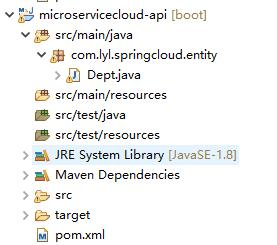

①创建entity

```java
package com.lyl.springcloud.entity;

import java.io.Serializable;

import lombok.Data;
import lombok.NoArgsConstructor;
import lombok.experimental.Accessors;

@NoArgsConstructor  //无参构造函数
@Data				//getter、setter方法
@Accessors(chain=true)//链式风格访问
public class Dept implements Serializable{
	private Long deptno;//主键
	private String dname;//部门名称
	private String db_source;//来自哪个数据库，因为微服务架构可以一个服务对应一个数据库，同一个信息被存储到不同的数据库
	public Dept(String dname) {
		super();
		this.dname = dname;
	}
	
}
```

②pom.xml

```xml
<project xmlns="http://maven.apache.org/POM/4.0.0"
	xmlns:xsi="http://www.w3.org/2001/XMLSchema-instance"
	xsi:schemaLocation="http://maven.apache.org/POM/4.0.0 http://maven.apache.org/xsd/maven-4.0.0.xsd">
	<modelVersion>4.0.0</modelVersion>
	<parent>
		<groupId>com.lyl.springcloud</groupId>
		<artifactId>microservicecloud</artifactId>
		<version>0.0.1-SNAPSHOT</version>
	</parent>
	<artifactId>microservicecloud-api</artifactId>

	<dependencies><!-- 当前Module需要用到的jar包，按自己需求添加，如果父类已经包含了，可以不用写版本号 -->
		<dependency>
			<groupId>org.projectlombok</groupId>
			<artifactId>lombok</artifactId>
		</dependency>
      	<!--
		<dependency>
			<groupId>org.springframework.cloud</groupId>
			<artifactId>spring-cloud-starter-feign</artifactId>
		</dependency>
		-->
	</dependencies>
</project>
```

③在microservicecloud-api模块下，点击run as-->maven install

##  3、在microservicecloud父工程中创建名称为mircoservicecloud-provider-dept-8001的module(打包方式jar)

项目架构：

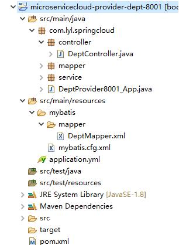

①pom.xml

```xml
<project xmlns="http://maven.apache.org/POM/4.0.0"
	xmlns:xsi="http://www.w3.org/2001/XMLSchema-instance"
	xsi:schemaLocation="http://maven.apache.org/POM/4.0.0 http://maven.apache.org/xsd/maven-4.0.0.xsd">
	<modelVersion>4.0.0</modelVersion>
	<parent>
		<groupId>com.lyl.springcloud</groupId>
		<artifactId>microservicecloud</artifactId>
		<version>0.0.1-SNAPSHOT</version>
	</parent>
	<artifactId>microservicecloud-provider-dept-8001</artifactId>

	<dependencies>
		<!-- 引入自己定义的api通用包，可以使用Dept部门Entity -->
		<dependency>
            <groupId>com.lyl.springcloud</groupId>
            <artifactId>microservicecloud-api</artifactId>
            <version>${project.version}</version>
        </dependency>
		<!-- actuator监控信息完善 -->
      	<!--
		<dependency>
			<groupId>org.springframework.boot</groupId>
			<artifactId>spring-boot-starter-actuator</artifactId>
		</dependency>
		-->
		<!-- 将微服务provider侧注册进eureka -->
		<!--
		<dependency>
			<groupId>org.springframework.cloud</groupId>
			<artifactId>spring-cloud-starter-eureka</artifactId>
		</dependency>
		<dependency>
			<groupId>org.springframework.cloud</groupId>
			<artifactId>spring-cloud-starter-config</artifactId>
		</dependency>
		-->
		<dependency>
			<groupId>junit</groupId>
			<artifactId>junit</artifactId>
		</dependency>
		<dependency>
			<groupId>mysql</groupId>
			<artifactId>mysql-connector-java</artifactId>
		</dependency>
		<dependency>
			<groupId>com.alibaba</groupId>
			<artifactId>druid</artifactId>
		</dependency>
		<dependency>
			<groupId>ch.qos.logback</groupId>
			<artifactId>logback-core</artifactId>
		</dependency>
		<dependency>
			<groupId>org.mybatis.spring.boot</groupId>
			<artifactId>mybatis-spring-boot-starter</artifactId>
		</dependency>
		<dependency>
			<groupId>org.springframework.boot</groupId>
			<artifactId>spring-boot-starter-jetty</artifactId>
		</dependency>
		<dependency>
			<groupId>org.springframework.boot</groupId>
			<artifactId>spring-boot-starter-web</artifactId>
		</dependency>
		<dependency>
			<groupId>org.springframework.boot</groupId>
			<artifactId>spring-boot-starter-test</artifactId>
		</dependency>
		<!-- 修改后立即生效，热部署 -->
		<dependency>
			<groupId>org.springframework</groupId>
			<artifactId>springloaded</artifactId>
		</dependency>
		<dependency>
			<groupId>org.springframework.boot</groupId>
			<artifactId>spring-boot-devtools</artifactId>
		</dependency>
	</dependencies>
</project>
```

②application.yml

```yml
server:
  port: 8001
  
mybatis:
  config-location: classpath:mybatis/mybatis.cfg.xml  # mybatis配置文件所在路径
  type-aliases-package: com.lyl.springcloud.entity    # 所有entity别名类所在包
  mapper-locations:
  - classpath:mybatis/mapper/**/*.xml                 # mapper映射文件
  
spring:
  application:
    name: microservicecloud-dept
  datasource:
    type: com.alibaba.druid.pool.DruidDataSource      # 当前数据源操作类型
    driver-class-name: org.gjt.mm.mysql.Driver        # mysql驱动包
    url: jdbc:mysql://localhost:3306/cloudDB01?characterEncoding=UTF-8&&useSSL=false        # 数据库名称
    username: root
    password: root
    dbcp2:
      min-idle: 5                                     # 数据库连接池的最小维持连接数
      initial-size: 5                                 # 初始化连接数
      max-total: 5                                    # 最大连接数
      max-wait-millis: 200                            # 等待连接获取的最大超时时间    
```

③创建cloudDB01数据库

```sql
DROP DATABASE IF EXISTS cloudDB01;
CREATE DATABASE cloudDB01 CHARACTER SET UTF8;
USE cloudDB01;
CREATE TABLE dept
(
	deptno BIGINT NOT NULL PRIMARY KEY AUTO_INCREMENT,
	dname VARCHAR(60),
	db_source VARCHAR(60)
);

INSERT INTO dept(dname,db_source) VALUES('开发部',DATABASE());
INSERT INTO dept(dname,db_source) VALUES('人事部',DATABASE());
INSERT INTO dept(dname,db_source) VALUES('财务部',DATABASE());
INSERT INTO dept(dname,db_source) VALUES('市场部',DATABASE());
INSERT INTO dept(dname,db_source) VALUES('运维部',DATABASE());

```

④创建mybatis.cfg.xml

```xml
<?xml version="1.0" encoding="UTF-8" ?>
<!DOCTYPE configuration
  PUBLIC "-//mybatis.org//DTD Config 3.0//EN"
  "http://mybatis.org/dtd/mybatis-3-config.dtd">

<configuration>

    <settings>
        <setting name="cacheEnabled" value="true" /><!-- 二级缓存开启 -->
    </settings>

</configuration>
```

⑤创建mapper接口

DeptMapper.java

```java
package com.lyl.springcloud.mapper;

import java.util.List;

import org.apache.ibatis.annotations.Mapper;

import com.lyl.springcloud.entity.Dept;

@Mapper
public interface DeptMapper {
	public boolean addDept(Dept dept);
	
	public Dept findById(Long id);
	
	public List<Dept> findAll();
}

```

⑥创建mapper映射文件

DeptMapper.xml

```xml
<?xml version="1.0" encoding="UTF-8" ?>
<!DOCTYPE mapper PUBLIC "-//mybatis.org//DTD Mapper 3.0//EN"
"http://mybatis.org/dtd/mybatis-3-mapper.dtd">

<mapper namespace="com.lyl.springcloud.mapper.DeptMapper">
    <select id="findById" resultType="com.lyl.springcloud.entity.Dept" parameterType="Long">
        select deptno,dname,db_source from dept where deptno=#{deptno};
    </select>
    <select id="findAll" resultType="com.lyl.springcloud.entity.Dept">
        select deptno,dname,db_source from dept;
    </select>
    <insert id="addDept" parameterType="com.lyl.springcloud.entity.Dept">
        insert into dept(dname,db_source) values(#{dname},DATABASE());
    </insert>
</mapper>
```

⑦创建service接口

DeptService.java

```java
package com.lyl.springcloud.service;

import java.util.List;

import com.lyl.springcloud.entity.Dept;

public interface DeptService {
	public boolean add(Dept dept);
	
	public Dept get(Long id);
	
	public List<Dept> list();
}

```

⑧创建service实现类

DeptServiceImpl.java

```java
package com.lyl.springcloud.service.impl;

import java.util.List;

import org.springframework.beans.factory.annotation.Autowired;
import org.springframework.stereotype.Service;

import com.lyl.springcloud.entity.Dept;
import com.lyl.springcloud.mapper.DeptMapper;
import com.lyl.springcloud.service.DeptService;

@Service
public class DeptServiceImpl implements DeptService {
	@Autowired
	private DeptMapper deptMapper;

	@Override
	public boolean add(Dept dept) {
		return deptMapper.addDept(dept);
	}

	@Override
	public Dept get(Long id) {
		return deptMapper.findById(id);
	}

	@Override
	public List<Dept> list() {
		return deptMapper.findAll();
	}

}
```

⑨创建Controller类

DeptController.java

```java
package com.lyl.springcloud.controller;

import java.util.List;

import org.springframework.beans.factory.annotation.Autowired;
import org.springframework.web.bind.annotation.GetMapping;
import org.springframework.web.bind.annotation.PathVariable;
import org.springframework.web.bind.annotation.PostMapping;
import org.springframework.web.bind.annotation.RequestBody;
import org.springframework.web.bind.annotation.RestController;

import com.lyl.springcloud.entity.Dept;
import com.lyl.springcloud.service.DeptService;

@RestController
public class DeptController {
	@Autowired
	private DeptService deptService;
	
	@PostMapping(value="/dept/add")
	public boolean add(@RequestBody Dept dept) {
		return deptService.add(dept);
	}
	
	@GetMapping(value="/dept/get/{id}")
	public Dept get(@PathVariable("id") Long id) {
		return deptService.get(id);
	}
	
	@GetMapping(value="/dept/list")
	public List<Dept> list(){
		return deptService.list();
	}
}

```

⑩创建SpringBoot主类

DeptProvider8001_App.java

```java
package com.lyl.springcloud;

import org.springframework.boot.SpringApplication;
import org.springframework.boot.autoconfigure.SpringBootApplication;

@SpringBootApplication
public class DeptProvider8001_App {
	public static void main(String[] args) {
		SpringApplication.run(DeptProvider8001_App.class, args);
	}
}

```

⑪运行SpringBoot项目

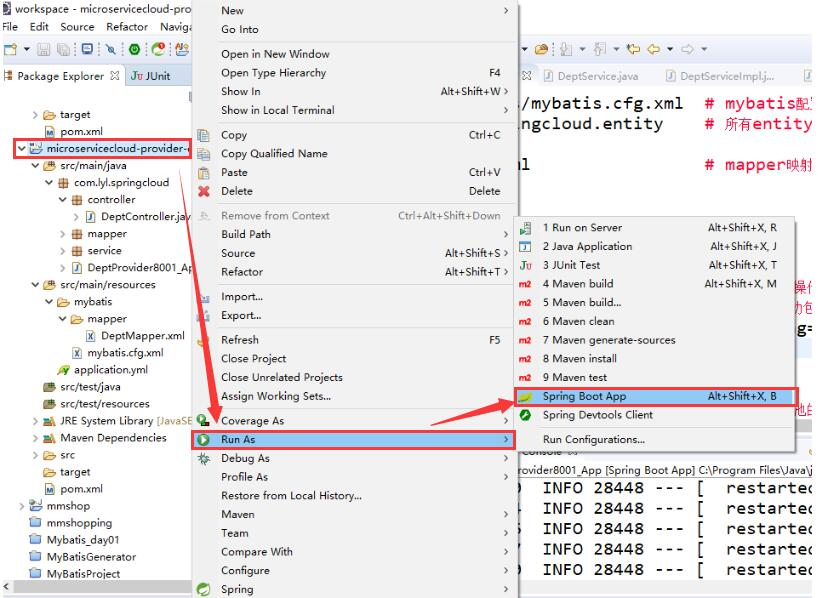

使用浏览器访问：http://localhost:8001/dept/get/1

## 4、在父工程下创建名称为microservicecloud-consumer-dept-80的module(打包方式jar)

项目架构：

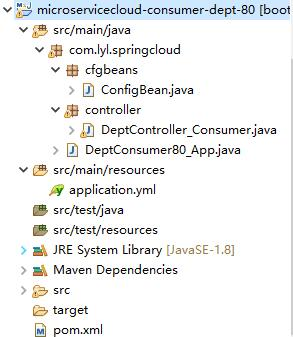

①pom.xml

```xml
<project xmlns="http://maven.apache.org/POM/4.0.0"
	xmlns:xsi="http://www.w3.org/2001/XMLSchema-instance"
	xsi:schemaLocation="http://maven.apache.org/POM/4.0.0 http://maven.apache.org/xsd/maven-4.0.0.xsd">
	<modelVersion>4.0.0</modelVersion>
	<parent>
		<groupId>com.lyl.springcloud</groupId>
		<artifactId>microservicecloud</artifactId>
		<version>0.0.1-SNAPSHOT</version>
	</parent>
	<artifactId>microservicecloud-consumer-dept-80</artifactId>
	<description>部门微服务消费者</description>

	<dependencies>
		<dependency><!-- 自己定义的api -->
			<groupId>com.lyl.springcloud</groupId>
			<artifactId>microservicecloud-api</artifactId>
			<version>${project.version}</version>
		</dependency>
		<!-- Ribbon相关 -->
      	<!--
		<dependency>
			<groupId>org.springframework.cloud</groupId>
			<artifactId>spring-cloud-starter-eureka</artifactId>
		</dependency>
		<dependency>
			<groupId>org.springframework.cloud</groupId>
			<artifactId>spring-cloud-starter-ribbon</artifactId>
		</dependency>
		<dependency>
			<groupId>org.springframework.cloud</groupId>
			<artifactId>spring-cloud-starter-config</artifactId>
		</dependency>
		-->
		<dependency>
			<groupId>org.springframework.boot</groupId>
			<artifactId>spring-boot-starter-web</artifactId>
		</dependency>
		<!-- 修改后立即生效，热部署 -->
		<dependency>
			<groupId>org.springframework</groupId>
			<artifactId>springloaded</artifactId>
		</dependency>
		<dependency>
			<groupId>org.springframework.boot</groupId>
			<artifactId>spring-boot-devtools</artifactId>
		</dependency>
	</dependencies>

</project>
```

②application.yml

```yml
server:
  port: 80
```

③书写Spring配置类

ConfigBean.java

```java
package com.lyl.springcloud.cfgbeans;

import org.springframework.context.annotation.Bean;
import org.springframework.context.annotation.Configuration;
import org.springframework.web.client.RestTemplate;

@Configuration
public class ConfigBean {//Spring配置类
	@Bean
	public RestTemplate getRestTemplate() {
		return new RestTemplate();
	}
}

```

* RestTemplate：提供了多种便捷访问远程http服务的方法，是一种简单便捷的访问Restful服务模板类，是Spring提供的用于访问Rest服务的客户端模板工具集。
* 使用RestTemplate访问Restful接口非常的简单，（url,resultMap,ResponseBean.class）这三个参数分别代表Rest请求地址、请求参数、HTTP响应转换成被转换成的对象类型。

④书写Controller

DeptController_Consumer.java

```java
package com.lyl.springcloud.controller;

import java.util.List;

import org.springframework.beans.factory.annotation.Autowired;
import org.springframework.web.bind.annotation.GetMapping;
import org.springframework.web.bind.annotation.PathVariable;
import org.springframework.web.bind.annotation.RestController;
import org.springframework.web.client.RestTemplate;

import com.lyl.springcloud.entity.Dept;

@RestController
public class DeptController_Consumer {
	private static final String REST_URL_PREFIX="http://localhost:8001";
	
	@Autowired
	private RestTemplate restTemplate;
	
	@GetMapping(value="/consumer/dept/add")
	public boolean add(Dept dept) {
		return restTemplate.postForObject(REST_URL_PREFIX+"/dept/add", dept, Boolean.class);
	}
	
	@GetMapping(value="/consumer/dept/get/{id}")
	public Dept get(@PathVariable("id") Long id) {
		return restTemplate.getForObject(REST_URL_PREFIX+"/dept/get/"+id, Dept.class);
	}
	
	@GetMapping(value="/consumer/dept/list")
	public List<Dept> list(){
		return restTemplate.getForObject(REST_URL_PREFIX+"/dept/list", List.class);
	}
}

```

⑤书写SpringBoot主类

DeptConsumer80_App.java

```java
package com.lyl.springcloud;

import org.springframework.boot.SpringApplication;
import org.springframework.boot.autoconfigure.SpringBootApplication;

@SpringBootApplication
public class DeptConsumer80_App {
	public static void main(String[] args) {
		SpringApplication.run(DeptConsumer80_App.class, args);
	}
}

```

⑥先启动microservicecloud-provider-dept-8001模块，在启动microservicecloud-consumer-dept-80模块。

访问以下链接：

* http://localhost/consumer/dept/get/1
* http://localhost/consumer/dept/add?dname=bigData2019
* http://localhost/consumer/dept/list

# 五、Eureka服务注册与发现

## 1、是什么？

Eureka是NetFlix的一个子模块，也是核心模块之一。Eureka是一个基于REST的服务，用于定位服务，以实现云端中间层服务发现和故障转移。服务注册与发现对于微服务架构来说是非常重要的，有了服务发现与注册，**只需要使用服务的标识符，就可以访问到服务**，而不需要修改服务调用的配置文件了。**功能类似于dubbo的注册中心，比如Zookeeper。**

* Netflix在设计Eureka时遵守AP原则
  * RDBMS（MySQL、Oracle、SQLServer）---->ACID（原子性、一致性、独立性、持久性）
  * NOSQL（Redis、MongDB）--->CAP（强一致性、可用性、分区容错性）
    * eureka--->AP
    * zookeeper--->CP

## 2、原理

1. Eureka的基本架构

   SpringCloud封装了Netflix公司开发的Eureka模块来**实现服务注册和发现**。

   Eureka采用了C-S的设计模式。Eureka Server作为服务注册功能的服务器，它是服务注册中心。

   而系统中的其他微服务，使用Eureka的客户端连接到Eureka Server并维持心跳连接。这样系统的维护人员就可以通过Eureka Server来监控系统中各个微服务是否正常执行。SpringCloud的一些其他模块（比如Zuul）就可以通过Eureka Server来发现系统中的其他微服务，并执行相关的逻辑。

   ​							**SpringCloud与Dubbo对比**

   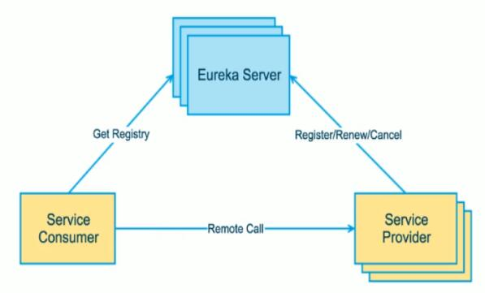

   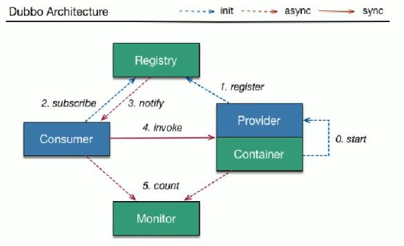

   **Eureka包含两个组件：Eureka Server和Eureka Client**

   * Eureka Server提供服务注册服务：各个节点启动后，会在Eureka Server中进行注册，这样Eureka Server中的服务注册表中将会存储所有可用服务节点的信息，服务节点的信息可以在界面中直观的看到。
   * Eureka Client是一个Java客户端，用于简化Eureka Server的交互，客户端同时也具备一个内置的、使用轮询（round-robin）负载算法的负载均衡器。在应用启动后，将会向Eureka Server发送心跳（默认周期为30秒）。如果Eureka Server在多个心跳周期内没有接收到某个节点的心跳，Eureka Server将会从服务注册表中把这个服务节点移除（默认90秒）。

2. 三大角色

   * Eureka Server提供服务注册和发现
   * Service Provider服务提供方将自身服务注册到Eureka，从而使服务消费方能够找到
   * Service Consumer服务消费方从Eureka获取注册服务列表，从而能够消费服务

## 3、构建步骤

### 1、创建Eureka Server服务注册中心模块microservicecloud-eureka-7001(在父工程下创建，打包方式jar)

1. 在pom.xml文件中引入Eureka Server的依赖

   ```xml
   <project xmlns="http://maven.apache.org/POM/4.0.0"
   	xmlns:xsi="http://www.w3.org/2001/XMLSchema-instance"
   	xsi:schemaLocation="http://maven.apache.org/POM/4.0.0 http://maven.apache.org/xsd/maven-4.0.0.xsd">
   	<modelVersion>4.0.0</modelVersion>
   	<parent>
   		<groupId>com.lyl.springcloud</groupId>
   		<artifactId>microservicecloud</artifactId>
   		<version>0.0.1-SNAPSHOT</version>
   	</parent>
   	<artifactId>microservicecloud-eureka-7001</artifactId>

   	<dependencies>
   		<!--eureka-server服务端 -->
   		<dependency>
   			<groupId>org.springframework.cloud</groupId>
   			<artifactId>spring-cloud-starter-eureka-server</artifactId>
   		</dependency>
   		<!-- 修改后立即生效，热部署 -->
   		<dependency>
   			<groupId>org.springframework</groupId>
   			<artifactId>springloaded</artifactId>
   		</dependency>
   		<dependency>
   			<groupId>org.springframework.boot</groupId>
   			<artifactId>spring-boot-devtools</artifactId>
   		</dependency>
   	</dependencies>
   </project>
   ```

2. 在application.yml中进行相关配置

   ```yml
   server:
     port: 7001
     
   eureka:
     instance:
       hostname: localhost   # Eureka服务端的实例名称
     client:
       register-with-eureka: false   # false表示不向注册中心注册自己
       fetch-registry: false         # false表示自己就是注册中心，职责就是维护服务实例，并不需要去检索服务
       service-url:
         defaultZone: http://${eureka.instance.hostname}:${server.port}/eureka/ # 设置与Eureka Server交互的地址查询服务和注册服务都需要依赖这个地址    
         
   ```

3. 书写EurekaServer主启动类

   EurekaServer7001_App.java

   ```java
   package com.lyl.springcloud;

   import org.springframework.boot.SpringApplication;
   import org.springframework.boot.autoconfigure.SpringBootApplication;
   import org.springframework.cloud.netflix.eureka.server.EnableEurekaServer;

   @SpringBootApplication
   @EnableEurekaServer	//EurekaServer服务器端启动类，接受其他微服务注册进来
   public class EurekaServer7001_App {
   	public static void main(String[] args) {
   		SpringApplication.run(EurekaServer7001_App.class, args);
   	}
   }

   ```

4. 测试

   访问http://localhost:7001，若出现相应的画面代表配置成功。

### 2、将已有的部门微服务microservicecloud-provider-dept-8001注册到Eureka服务中心

1. 修改模块的pom文件，增加下面的依赖

   ```xml
   <!-- 将微服务provider侧注册进eureka -->
   <dependency>
     <groupId>org.springframework.cloud</groupId>
     <artifactId>spring-cloud-starter-eureka</artifactId>
   </dependency>
   <dependency>
     <groupId>org.springframework.cloud</groupId>
     <artifactId>spring-cloud-starter-config</artifactId>
   </dependency>
   ```

2. 修改模块的application.yml文件，增加下列配置

   ```yml
   eureka:
     client: # 客户端注册进Eureka服务列表内
       service-url:
         defaultZone: http://localhost:7001/eureka      
   ```

3. 修改模块的主启动类DeptProvider8001_App.java，增加@EnableEurekaClient注解

   ```java
   package com.lyl.springcloud;

   import org.springframework.boot.SpringApplication;
   import org.springframework.boot.autoconfigure.SpringBootApplication;
   import org.springframework.cloud.netflix.eureka.EnableEurekaClient;

   @SpringBootApplication
   @EnableEurekaClient //本服务启动后会自动注册进Eureka服务中
   public class DeptProvider8001_App {
   	public static void main(String[] args) {
   		SpringApplication.run(DeptProvider8001_App.class, args);
   	}
   }

   ```

4. 测试

   先启动EurekaServer，在启动EurekaClient。最后访问http://locahost:7001

   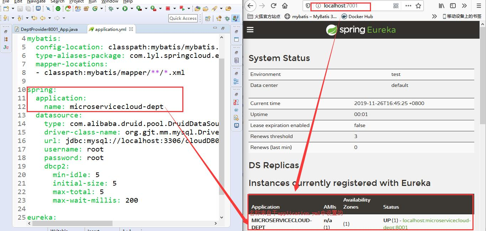

### 3、actuator与注册信息完善

1. 主机名称:服务名称修改

   * 修改microservicecloud-provider-dept-8001模块的application.yml文件，添加内容如下：

     ```yml
     eureka:
       client: # 客户端注册进Eureka服务列表内
         service-url:
           defaultZone: http://localhost:7001/eureka     
       instance: 
         instance-id: microservicecloud-dept8001 # 自定义服务名称信息
     ```

     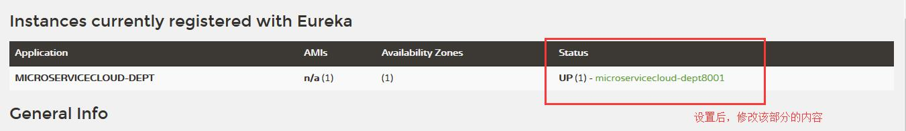

2. 访问信息有IP信息提示

   * 修改microservicecloud-provider-dept-8001模块的application.yml文件，添加内容如下：

     ```yml
     eureka:
       client: # 客户端注册进Eureka服务列表内
         service-url:
           defaultZone: http://localhost:7001/eureka     
       instance: 
         instance-id: microservicecloud-dept8001 # 自定义服务名称信息
         prefer-ip-address: true    # 访问路径可以显示IP地址
     ```

     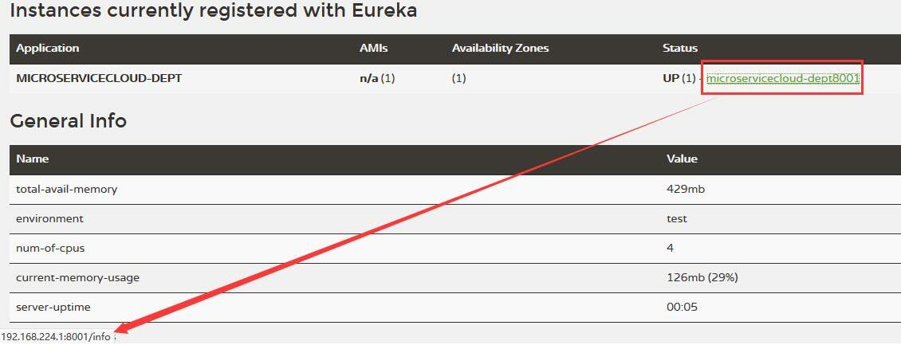

3. 微服务info内容详细信息

   ①修改microservicecloud-provider-dept-8001模块的pom.xml文件，添加的内容如下：

   ```xml
   <!-- actuator监控信息完善 -->
   <dependency>
     <groupId>org.springframework.boot</groupId>
     <artifactId>spring-boot-starter-actuator</artifactId>
   </dependency>
   ```

   ②修改父工程的pom.xml，添加的内容如下：

   ```xml
   <build>
     <finalName>microservicecloud</finalName>
     <resources>
       <resource>
         <directory>src/main/resources</directory>
         <filtering>true</filtering>
       </resource>
     </resources>
     <plugins>
       <plugin>
         <groupId>org.apache.maven.plugins</groupId>
         <artifactId>maven-resources-plugin</artifactId>
         <configuration>
           <delimiters>
             <delimit>$</delimit>
           </delimiters>
         </configuration>
       </plugin>
     </plugins>
   </build>
   ```

   ③修改microservicecloud-provider-dept-8001模块的application.yml文件，添加的内容如下：

   ```yml
   info:
     app.name: lyl-microservicecloud
     company.name: www.baidu.com
     build.artifactId: $project.artifactId$
     build.version: $project.version$ 
   ```

   ④点击status中的链接访问 IP:端口号/info ，显示的就是上一步设置的JSON串。

   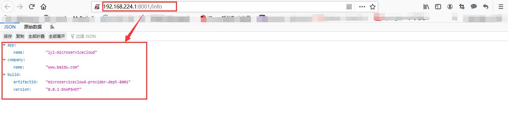

### 4、Eureka自我保护

1. 故障现象

   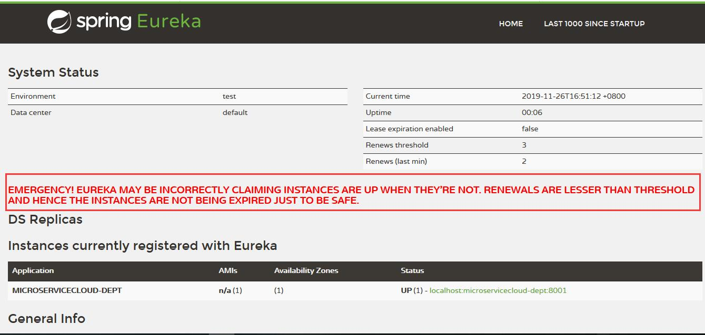

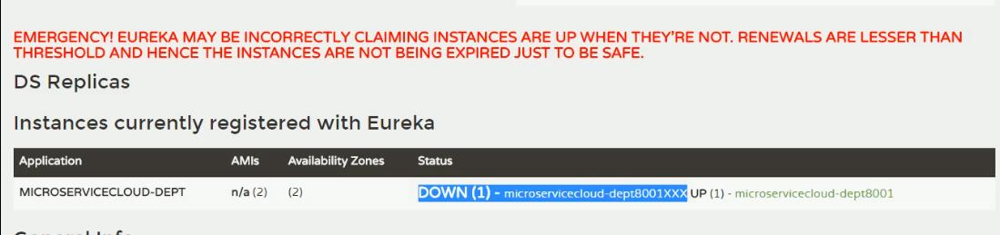

2. 导致这个现象的原因：某时刻某一个微服务不可用了，Eureka不会立刻清理，依旧会对该微服务的信息进行保存。

3. 什么是自我保护模式？

   默认情况下，如果Eureka Server在一定时间内没有接收到某个微服务实例的心跳，Eureka Server将会注销该实例（默认90秒）。但是当网络分区故障发生时，微服务与Eureka Server之间无法正常通信，以上行为可能变得非常危险了——因为微服务本身其实是健康的，**此时不应该注销这个微服务**。Eureka通过“自我保护模式”来解决这个问题——当Eureka Server节点在短时间内丢失过多客户端时（可能发生了网络分区故障），那么这个节点就会进入自我保护模式。一旦进入该模式，Eureka Server就会保护服务注册表中的信息，不再删除服务注册表中的数据（也就是不会注销任何微服务）。当网络故障恢复后，该Eureka Server节点会自动退出自我保护模式。

   **在自我保护模式中，Eureka Server会保护服务注册表中的信息，不在注销任务服务实例。当它收到的心跳数重新恢复到阀值以上时，该Eureka Server节点就会自动退出自我保护模式。它的设计哲学就是宁可保留错误的服务注册信息，也不盲目注销任何可能健康的服务实例。一句话讲解：好死不如赖活着。**

   综上，自我保护模式是一种应对网络异常的安全保护措施。它的架构哲学是宁可同时保留所有微服务（健康的微服务和不健康的微服务都会保留），也不盲目注销任何健康的微服务。使用自我保护模式，可以让Eureka集群更加的健壮、稳定。

   在SpringCloud中，可以使用eureka.server.enable-self-preservation=false禁用自我保护模式。

### 5、服务发现Discovery

对于注册进Eureka里面的微服务，可以通过服务发现来获得该服务的信息

#### 1、microservicecloud-provider-dept-8001

1. 修改microservicecloud-provider-dept-8001模块的DeptController.java

   ```java
   package com.lyl.springcloud.controller;

   import java.util.List;

   import org.springframework.beans.factory.annotation.Autowired;
   import org.springframework.cloud.client.ServiceInstance;
   import org.springframework.cloud.client.discovery.DiscoveryClient;
   import org.springframework.web.bind.annotation.GetMapping;
   import org.springframework.web.bind.annotation.PathVariable;
   import org.springframework.web.bind.annotation.PostMapping;
   import org.springframework.web.bind.annotation.RequestBody;
   import org.springframework.web.bind.annotation.RestController;

   import com.lyl.springcloud.entity.Dept;
   import com.lyl.springcloud.service.DeptService;

   @RestController
   public class DeptController {
   	@Autowired
   	private DeptService deptService;

   	@Autowired
   	private DiscoveryClient discoveryClient;

   	@PostMapping(value = "/dept/add")
   	public boolean add(@RequestBody Dept dept) {
   		return deptService.add(dept);
   	}

   	@GetMapping(value = "/dept/get/{id}")
   	public Dept get(@PathVariable("id") Long id) {
   		return deptService.get(id);
   	}

   	@GetMapping(value = "/dept/list")
   	public List<Dept> list() {
   		return deptService.list();
   	}

     	//服务发现
   	@GetMapping(value = "/dept/discovery")
   	public Object discovery() {
   		List<String> list = discoveryClient.getServices();
   		System.out.println("**********" + list);
   		List<ServiceInstance> instances = discoveryClient.getInstances("MICROSERVICECLOUD-DEPT");
   		for (ServiceInstance element : instances) {
   			System.out.println(element.getServiceId() + "\t" + element.getHost() + "\t" + element.getPort() + "\t"
   					+ element.getUri());
   		}
   		return this.discoveryClient;
   	}
   }

   ```

   1. 修改microservicecloud-provider-dept-8001模块的主启动类DeptProvider8001_App.java，增加@EnableDiscoveryClient注解

      ```java
      package com.lyl.springcloud;

      import org.springframework.boot.SpringApplication;
      import org.springframework.boot.autoconfigure.SpringBootApplication;
      import org.springframework.cloud.client.discovery.EnableDiscoveryClient;
      import org.springframework.cloud.netflix.eureka.EnableEurekaClient;

      @SpringBootApplication
      @EnableEurekaClient //本服务启动后会自动注册进Eureka服务中
      @EnableDiscoveryClient //服务发现
      public class DeptProvider8001_App {
      	public static void main(String[] args) {
      		SpringApplication.run(DeptProvider8001_App.class, args);
      	}
      }

      ```

   2. 测试

      启动Eureka server和microservicecloud-provider-dept-8001，访问：http://localhost:8001/dept/discovery

#### 2、microservicecloud-consumer-dept-80

1. 修改microservicecloud-consumer-dept-80模块的DeptController_Consumer.java

   ```java
   package com.lyl.springcloud.controller;

   import java.util.List;

   import org.springframework.beans.factory.annotation.Autowired;
   import org.springframework.web.bind.annotation.GetMapping;
   import org.springframework.web.bind.annotation.PathVariable;
   import org.springframework.web.bind.annotation.RequestMapping;
   import org.springframework.web.bind.annotation.RestController;
   import org.springframework.web.client.RestTemplate;

   import com.lyl.springcloud.entity.Dept;

   @RestController
   public class DeptController_Consumer {
   	private static final String REST_URL_PREFIX="http://localhost:8001";
   	
   	@Autowired
   	private RestTemplate restTemplate;
   	
   	@GetMapping(value="/consumer/dept/add")
   	public boolean add(Dept dept) {
   		return restTemplate.postForObject(REST_URL_PREFIX+"/dept/add", dept, Boolean.class);
   	}
   	
   	@GetMapping(value="/consumer/dept/get/{id}")
   	public Dept get(@PathVariable("id") Long id) {
   		return restTemplate.getForObject(REST_URL_PREFIX+"/dept/get/"+id, Dept.class);
   	}
   	
   	@GetMapping(value="/consumer/dept/list")
   	public List<Dept> list(){
   		return restTemplate.getForObject(REST_URL_PREFIX+"/dept/list", List.class);
   	}
   	
   	//测试@EnableDiscoveryClient,消费者可以调用服务发现
   	@RequestMapping(value="/consumer/dept/discovery")
   	public Object discovery() {
   		return restTemplate.getForObject(REST_URL_PREFIX+"/dept/discovery", Object.class);
   	}
   }

   ```

2. 测试

   启动Eureka server和microservicecloud-provider-dept-8001、microservicecloud-consumer-dept-80，访问：http://localhost/consumer/dept/discovery

## 4、集群配置

#### 1、原理


#### 2、实际操作

1. 新建microservicecloud-eureka-7002和microservicecloud-eureka-7003模块

2. 配置这两个模块的pom.xml文件

   ①microservicecloud-eureka-7002的pom.xml

   ```xml
   <project xmlns="http://maven.apache.org/POM/4.0.0"
   	xmlns:xsi="http://www.w3.org/2001/XMLSchema-instance"
   	xsi:schemaLocation="http://maven.apache.org/POM/4.0.0 http://maven.apache.org/xsd/maven-4.0.0.xsd">
   	<modelVersion>4.0.0</modelVersion>
   	<parent>
   		<groupId>com.lyl.springcloud</groupId>
   		<artifactId>microservicecloud</artifactId>
   		<version>0.0.1-SNAPSHOT</version>
   	</parent>
   	<artifactId>microservicecloud-eureka-7002</artifactId>

   	<dependencies>
   		<!--eureka-server服务端 -->
   		<dependency>
   			<groupId>org.springframework.cloud</groupId>
   			<artifactId>spring-cloud-starter-eureka-server</artifactId>
   		</dependency>
   		<!-- 修改后立即生效，热部署 -->
   		<dependency>
   			<groupId>org.springframework</groupId>
   			<artifactId>springloaded</artifactId>
   		</dependency>
   		<dependency>
   			<groupId>org.springframework.boot</groupId>
   			<artifactId>spring-boot-devtools</artifactId>
   		</dependency>
   	</dependencies>
   </project>
   ```

   ②microservicecloud-eureka-7003的pom.xml

   ```xml
   <project xmlns="http://maven.apache.org/POM/4.0.0"
   	xmlns:xsi="http://www.w3.org/2001/XMLSchema-instance"
   	xsi:schemaLocation="http://maven.apache.org/POM/4.0.0 http://maven.apache.org/xsd/maven-4.0.0.xsd">
   	<modelVersion>4.0.0</modelVersion>
   	<parent>
   		<groupId>com.lyl.springcloud</groupId>
   		<artifactId>microservicecloud</artifactId>
   		<version>0.0.1-SNAPSHOT</version>
   	</parent>
   	<artifactId>microservicecloud-eureka-7003</artifactId>

   	<dependencies>
   		<!--eureka-server服务端 -->
   		<dependency>
   			<groupId>org.springframework.cloud</groupId>
   			<artifactId>spring-cloud-starter-eureka-server</artifactId>
   		</dependency>
   		<!-- 修改后立即生效，热部署 -->
   		<dependency>
   			<groupId>org.springframework</groupId>
   			<artifactId>springloaded</artifactId>
   		</dependency>
   		<dependency>
   			<groupId>org.springframework.boot</groupId>
   			<artifactId>spring-boot-devtools</artifactId>
   		</dependency>
   	</dependencies>
   </project>
   ```

3. 创建这两个模块的主启动类

   ①microservicecloud-eureka-7002的主启动类

   ```java
   package com.lyl.springcloud;

   import org.springframework.boot.SpringApplication;
   import org.springframework.boot.autoconfigure.SpringBootApplication;
   import org.springframework.cloud.netflix.eureka.server.EnableEurekaServer;

   @SpringBootApplication
   @EnableEurekaServer	//EurekaServer服务器端启动类，接受其他微服务注册进来
   public class EurekaServer7002_App {
   	public static void main(String[] args) {
   		SpringApplication.run(EurekaServer7002_App.class, args);
   	}
   }

   ```

   ②microservicecloud-eureka-7003的主启动类

   ```java
   package com.lyl.springcloud;

   import org.springframework.boot.SpringApplication;
   import org.springframework.boot.autoconfigure.SpringBootApplication;
   import org.springframework.cloud.netflix.eureka.server.EnableEurekaServer;

   @SpringBootApplication
   @EnableEurekaServer	//EurekaServer服务器端启动类，接受其他微服务注册进来
   public class EurekaServer7003_App {
   	public static void main(String[] args) {
   		SpringApplication.run(EurekaServer7003_App.class, args);
   	}
   }

   ```

4. 修改C:\Windows\System32\drivers\etc路径下的hosts文件，添加的内容如下：

   ```xml
   127.0.0.1	eureka7001.com
   127.0.0.1	eureka7002.com
   127.0.0.1	eureka7003.com
   ```

5. 修改microservicecloud-eureka-7001模块的application.yml文件，修改的部分为hostname和defaultZone

   ```yml
   server:
     port: 7001
     
   eureka:
     instance:
       # hostname: localhost   # Eureka服务端的实例名称
       hostname: eureka7001.com
     client:
       register-with-eureka: false   # false表示不向注册中心注册自己
       fetch-registry: false         # false表示自己就是注册中心，职责就是维护服务实例，并不需要去检索服务
       service-url:
         # 单机
         # defaultZone: http://${eureka.instance.hostname}:${server.port}/eureka/ # 设置与Eureka Server交互的地址查询服务和注册服务都需要依赖这个地址    
         defaultZone: http://eureka7002.com:7002/eureka/,http://eureka7003.com:7003/eureka/
   ```

6. 新建microservicecloud-eureka-7002模块的application.yml文件

   ```yml
   server:
     port: 7002
     
   eureka:
     instance:
       # hostname: localhost   # Eureka服务端的实例名称
       hostname: eureka7002.com
     client:
       register-with-eureka: false   # false表示不向注册中心注册自己
       fetch-registry: false         # false表示自己就是注册中心，职责就是维护服务实例，并不需要去检索服务
       service-url:
         # 单机
         # defaultZone: http://${eureka.instance.hostname}:${server.port}/eureka/ # 设置与Eureka Server交互的地址查询服务和注册服务都需要依赖这个地址    
         defaultZone: http://eureka7001.com:7001/eureka/,http://eureka7003.com:7003/eureka/
   ```

7. 新建microservicecloud-eureka-7003模块的application.yml文件

   ```yml
   server:
     port: 7003
     
   eureka:
     instance:
       # hostname: localhost   # Eureka服务端的实例名称
       hostname: eureka7003.com
     client:
       register-with-eureka: false   # false表示不向注册中心注册自己
       fetch-registry: false         # false表示自己就是注册中心，职责就是维护服务实例，并不需要去检索服务
       service-url:
         # 单机
         # defaultZone: http://${eureka.instance.hostname}:${server.port}/eureka/ # 设置与Eureka Server交互的地址查询服务和注册服务都需要依赖这个地址    
         defaultZone: http://eureka7001.com:7001/eureka/,http://eureka7002.com:7002/eureka/
   ```

8. 修改microservicecloud-provider-dept-8001模块的application.yml文件，修改的部分为defaultZone

   ```yml
   server:
     port: 8001
     
   mybatis:
     config-location: classpath:mybatis/mybatis.cfg.xml  # mybatis配置文件所在路径
     type-aliases-package: com.lyl.springcloud.entity    # 所有entity别名类所在包
     mapper-locations:
     - classpath:mybatis/mapper/**/*.xml                 # mapper映射文件
     
   spring:
     application:
       name: microservicecloud-dept
     datasource:
       type: com.alibaba.druid.pool.DruidDataSource      # 当前数据源操作类型
       driver-class-name: org.gjt.mm.mysql.Driver        # mysql驱动包
       url: jdbc:mysql://localhost:3306/cloudDB01?characterEncoding=UTF-8&&useSSL=false        # 数据库名称
       username: root
       password: root
       dbcp2:
         min-idle: 5                                     # 数据库连接池的最小维持连接数
         initial-size: 5                                 # 初始化连接数
         max-total: 5                                    # 最大连接数
         max-wait-millis: 200                            # 等待连接获取的最大超时时间    
         
   eureka:
     client: # 客户端注册进Eureka服务列表内
       service-url:
         # 单机
         # defaultZone: http://localhost:7001/eureka
         defaultZone: http://eureka7001.com:7001/eureka/,http://eureka7002.com:7002/eureka/,http://eureka7003.com:7003/eureka/  
     instance: 
       instance-id: microservicecloud-dept8001 # 自定义服务名称信息
       prefer-ip-address: true    # 访问路径可以显示IP地址

   info:
     app.name: lyl-microservicecloud
     company.name: www.baidu.com
     build.artifactId: $project.artifactId$
     build.version: $project.version$     
   ```

9. 测试

   * 启动microservicecloud-eureka-7001、microservicecloud-eureka-7002、microservicecloud-eureka-7003、microservicecloud-provider-dept-8001。
   * 访问eureka7001.com:7001、eureka7002.com:7002、eureka7003.com:7003，查看服务提供者microservicecloud-provider-dept-8001是否注册成功。

## 5、作为服务注册中心，Eureka比Zookeeper好在哪里？

著名的CAP理论提出，一个分布式系统不可能同时满足C(一致性)、A(可用性)、P(分区容错性)。由于分区容错性P是分布式系统中必须要保证的，因此我们只能在A和C之间进行权衡。

因此，**Zookeeper保证的是CP，Eureka保证的是AP。**

### 1、Zookeeper保证CP

在向注册中心查询服务列表时，我们可以容忍注册中心返回的是几分钟以前的注册信息，但不能接受服务直接down掉不可用。也就是说，服务注册功能对可用性的要求要高于一致性。但是zookeeper会出现这样一种情况，当master节点因为网络故障与其他节点失去联系时，剩余节点会重新进行leader选举。问题在于，选举leader的时间太长，30~120s，且选举期间整个zookeeper集群都是不可用的，这就导致在选举期间注册服务瘫痪。在云部署的环境下，因网络问题使得zookeeper集群失去master节点时较大概率发生的事，虽然服务能够最终恢复，但是漫长的选举时间导致的注册长期不可用是不能容忍的。

### 2、Eureka保证AP

Eureka看明白了这一点，因此在设计时就优先保证可用性。**Eureka各个节点都是平等的**，几个节点挂掉不会影响正常节点的工作，剩余的节点依然可以提供注册和查询服务。而Eureka的客户端在向某个Eureka注册时，如果发现连接失败，则会自动切换至其他节点，只要有一台Eureka还在，就能保证注册服务可用（保证可用性），只不过查到的信息可能不是最新的（不保证强一致性）。除此之外，Eureka还有一种自我保护机制，如果在15分钟内超过85%的节点都没有正常的心跳，那么Eureka就认为客户端与注册中心出现了网络故障，此时会出现以下几种情况：

1. Eureka不在从注册列表中移除因为长时间没收到心跳而应该过期的服务。
2. Eureka仍然能够接受新服务的注册和查询请求，但是不会被同步到其他节点上（即保证当前节点仍然可用）。
3. 当网络稳定时，当前实例新的注册信息会被同步到其他节点中。

因此，**Eureka可以很好的应对因网络故障导致部分节点失去联系的情况，而不会想Zookeeper那样使整个注册服务瘫痪。**

# 六、Ribbon负载均衡

## 1、概述

1. 是什么？

SpringCloud Ribbon是基于Netflix Ribbon 实现的一套**客户端负载均衡的工具**。

简单的说，Ribbon是Netflix发布的开源项目，**主要功能是提供客户端的软件负载均衡算法**，将Netflix的中间层服务连接在一起。Ribbon客户端组件提供一系列完善的配置项如连接超时，重试等。简单的说，就是在配置文件中列出Load Balance（简称LB）后面所有的机器，Ribbon会自动的帮助你基于某种原则（如简单轮询，随机连接等）去连接这些机器。我们也很容易使用Ribbon实现自定义的负载均衡算法。

2. 负载均衡

LB，即负载均衡（Load Balance），在微服务或分布式集群中经常用的一种应用。负载均衡简单的说就是将用户的请求平摊的分配到多个服务上，从而达到系统的高可用（HA）。

常见的负载均衡有软件Nginx、LVS、硬件F5等。

相应的在中间件，例如：Dubbo和SpringCloud中均给我们提供了负载均衡，**SpringCloud的负载均衡算法可以自定义。**

* 集中式LB

  集中式LB：即在服务的消费方和提供方之间使用独立的LB设施（可以是硬件，如F5；也可以是软件，如Nginx），由该设施负责把访问请求通过某种策略转发至服务的提供方。

* 进程内LB 

  进程内LB：将LB逻辑集成到消费方，消费方从服务注册中心获知有哪些地址可用，然后自己再从这些地址中选择出一个合适的服务器。

  **Ribbon就属于进程内LB**，它只是一个类库，集成于消费进程，消费方通过它来获取到服务提供方的地址。

## 2、Ribbon配置初步

1. 修改microservicecloud-consumer-dept-80模块的pom.xml文件，添加下面的内容：

   ```xml
   <!-- Ribbon相关 -->
   <dependency>
     <groupId>org.springframework.cloud</groupId>
     <artifactId>spring-cloud-starter-eureka</artifactId>
   </dependency>
   <dependency>
     <groupId>org.springframework.cloud</groupId>
     <artifactId>spring-cloud-starter-ribbon</artifactId>
   </dependency>
   <dependency>
     <groupId>org.springframework.cloud</groupId>
     <artifactId>spring-cloud-starter-config</artifactId>
   </dependency>
   ```

2. 修改microservicecloud-consumer-dept-80模块的application.yml文件

   ```yml
   server:
     port: 80
     
   eureka:
     client:
       register-with-eureka: false
       service-url:
         defaultZone: http://eureka7001.com:7001/eureka/,http://eureka7002.com:7002/eureka/,http://eureka7003.com:7003/eureka/
         
   ```

3. 修改microservicecloud-consumer-dept-80模块的ConfigBean.java，为其加上@LoadBalanced注解

   ```java
   package com.lyl.springcloud.cfgbeans;

   import org.springframework.cloud.client.loadbalancer.LoadBalanced;
   import org.springframework.context.annotation.Bean;
   import org.springframework.context.annotation.Configuration;
   import org.springframework.web.client.RestTemplate;

   @Configuration
   public class ConfigBean {//Spring配置类
   	@Bean
   	@LoadBalanced
   	public RestTemplate getRestTemplate() {
   		return new RestTemplate();
   	}
   }

   ```

4. 修改microservicecloud-consumer-dept-80模块的主启动类DeptConsumer80_App.java，为其加上@EnableEurekaClient注解

   ```java
   package com.lyl.springcloud;

   import org.springframework.boot.SpringApplication;
   import org.springframework.boot.autoconfigure.SpringBootApplication;
   import org.springframework.cloud.netflix.eureka.EnableEurekaClient;

   @SpringBootApplication
   @EnableEurekaClient
   public class DeptConsumer80_App {
   	public static void main(String[] args) {
   		SpringApplication.run(DeptConsumer80_App.class, args);
   	}
   }

   ```

5. 修改microservicecloud-consumer-dept-80模块的控制器DeptController_Consumer.java，将REST_URL_PREFIX修改成Application Name

   ```java
   package com.lyl.springcloud.controller;

   import java.util.List;

   import org.springframework.beans.factory.annotation.Autowired;
   import org.springframework.web.bind.annotation.GetMapping;
   import org.springframework.web.bind.annotation.PathVariable;
   import org.springframework.web.bind.annotation.RequestMapping;
   import org.springframework.web.bind.annotation.RestController;
   import org.springframework.web.client.RestTemplate;

   import com.lyl.springcloud.entity.Dept;

   @RestController
   public class DeptController_Consumer {
   //	private static final String REST_URL_PREFIX="http://localhost:8001";
   	private static final String REST_URL_PREFIX="http://MICROSERVICECLOUD-DEPT";
   	
   	@Autowired
   	private RestTemplate restTemplate;
   	
   	@GetMapping(value="/consumer/dept/add")
   	public boolean add(Dept dept) {
   		return restTemplate.postForObject(REST_URL_PREFIX+"/dept/add", dept, Boolean.class);
   	}
   	
   	@GetMapping(value="/consumer/dept/get/{id}")
   	public Dept get(@PathVariable("id") Long id) {
   		return restTemplate.getForObject(REST_URL_PREFIX+"/dept/get/"+id, Dept.class);
   	}
   	
   	@GetMapping(value="/consumer/dept/list")
   	public List<Dept> list(){
   		return restTemplate.getForObject(REST_URL_PREFIX+"/dept/list", List.class);
   	}
   	
   	//测试@EnableDiscoveryClient,消费者可以调用服务发现
   	@RequestMapping(value="/consumer/dept/discovery")
   	public Object discovery() {
   		return restTemplate.getForObject(REST_URL_PREFIX+"/dept/discovery", Object.class);
   	}
   }

   ```

6. 启动microservicecloud-eureka-7001、microservicecloud-eureka-7002、microservicecloud-eureka-7003、microservicecloud-provider-dept-8001、microservicecloud-consumer-dept-80。

7. 测试

   访问：

   * http://localhost/consumer/dept/get/1
   * http://localhost/consumer/dept/list
   * http://localhost/consumer/dept/add?dname=大数据部

8. Ribbon和Eureka整合后Consumer可以直接调用服务而不用再关心地址和端口号

## 3、Ribbon负载均衡

Ribbon在工作时分成两步：

* 第一步先选择Eureka Server，它优先选择在同一区域内负载较少的Server。
* 第二步再根据用户指定的策略，在从Server取到的服务注册列表中选择一个地址。

1. 创建microservicecloud-provider-dept-8002和microservicecloud-provider-dept-8003两个模块

2. 修改microservicecloud-provider-dept-8002和microservicecloud-provider-dept-8003的pom.xml文件

   ①microservicecloud-provider-dept-8002

   ```xml
   <project xmlns="http://maven.apache.org/POM/4.0.0"
   	xmlns:xsi="http://www.w3.org/2001/XMLSchema-instance"
   	xsi:schemaLocation="http://maven.apache.org/POM/4.0.0 http://maven.apache.org/xsd/maven-4.0.0.xsd">
   	<modelVersion>4.0.0</modelVersion>
   	<parent>
   		<groupId>com.lyl.springcloud</groupId>
   		<artifactId>microservicecloud</artifactId>
   		<version>0.0.1-SNAPSHOT</version>
   	</parent>
   	<artifactId>microservicecloud-provider-dept-8002</artifactId>

   	<dependencies>
   		<!-- 引入自己定义的api通用包，可以使用Dept部门Entity -->
   		<dependency>
   			<groupId>com.lyl.springcloud</groupId>
   			<artifactId>microservicecloud-api</artifactId>
   			<version>${project.version}</version>
   		</dependency>
   		<!-- actuator监控信息完善 -->
   		<dependency>
   			<groupId>org.springframework.boot</groupId>
   			<artifactId>spring-boot-starter-actuator</artifactId>
   		</dependency>
   		<!-- 将微服务provider侧注册进eureka -->
   		<dependency>
   			<groupId>org.springframework.cloud</groupId>
   			<artifactId>spring-cloud-starter-eureka</artifactId>
   		</dependency>
   		<dependency>
   			<groupId>org.springframework.cloud</groupId>
   			<artifactId>spring-cloud-starter-config</artifactId>
   		</dependency>
   		<dependency>
   			<groupId>junit</groupId>
   			<artifactId>junit</artifactId>
   		</dependency>
   		<dependency>
   			<groupId>mysql</groupId>
   			<artifactId>mysql-connector-java</artifactId>
   		</dependency>
   		<dependency>
   			<groupId>com.alibaba</groupId>
   			<artifactId>druid</artifactId>
   		</dependency>
   		<dependency>
   			<groupId>ch.qos.logback</groupId>
   			<artifactId>logback-core</artifactId>
   		</dependency>
   		<dependency>
   			<groupId>org.mybatis.spring.boot</groupId>
   			<artifactId>mybatis-spring-boot-starter</artifactId>
   		</dependency>
   		<dependency>
   			<groupId>org.springframework.boot</groupId>
   			<artifactId>spring-boot-starter-jetty</artifactId>
   		</dependency>
   		<dependency>
   			<groupId>org.springframework.boot</groupId>
   			<artifactId>spring-boot-starter-web</artifactId>
   		</dependency>
   		<dependency>
   			<groupId>org.springframework.boot</groupId>
   			<artifactId>spring-boot-starter-test</artifactId>
   		</dependency>
   		<!-- 修改后立即生效，热部署 -->
   		<dependency>
   			<groupId>org.springframework</groupId>
   			<artifactId>springloaded</artifactId>
   		</dependency>
   		<dependency>
   			<groupId>org.springframework.boot</groupId>
   			<artifactId>spring-boot-devtools</artifactId>
   		</dependency>
   	</dependencies>
   </project>
   ```

   ②microservicecloud-provider-dept-8003

   ```xml
   <project xmlns="http://maven.apache.org/POM/4.0.0"
   	xmlns:xsi="http://www.w3.org/2001/XMLSchema-instance"
   	xsi:schemaLocation="http://maven.apache.org/POM/4.0.0 http://maven.apache.org/xsd/maven-4.0.0.xsd">
   	<modelVersion>4.0.0</modelVersion>
   	<parent>
   		<groupId>com.lyl.springcloud</groupId>
   		<artifactId>microservicecloud</artifactId>
   		<version>0.0.1-SNAPSHOT</version>
   	</parent>
   	<artifactId>microservicecloud-provider-dept-8003</artifactId>

   	<dependencies>
   		<!-- 引入自己定义的api通用包，可以使用Dept部门Entity -->
   		<dependency>
   			<groupId>com.lyl.springcloud</groupId>
   			<artifactId>microservicecloud-api</artifactId>
   			<version>${project.version}</version>
   		</dependency>
   		<!-- actuator监控信息完善 -->
   		<dependency>
   			<groupId>org.springframework.boot</groupId>
   			<artifactId>spring-boot-starter-actuator</artifactId>
   		</dependency>
   		<!-- 将微服务provider侧注册进eureka -->
   		<dependency>
   			<groupId>org.springframework.cloud</groupId>
   			<artifactId>spring-cloud-starter-eureka</artifactId>
   		</dependency>
   		<dependency>
   			<groupId>org.springframework.cloud</groupId>
   			<artifactId>spring-cloud-starter-config</artifactId>
   		</dependency>
   		<dependency>
   			<groupId>junit</groupId>
   			<artifactId>junit</artifactId>
   		</dependency>
   		<dependency>
   			<groupId>mysql</groupId>
   			<artifactId>mysql-connector-java</artifactId>
   		</dependency>
   		<dependency>
   			<groupId>com.alibaba</groupId>
   			<artifactId>druid</artifactId>
   		</dependency>
   		<dependency>
   			<groupId>ch.qos.logback</groupId>
   			<artifactId>logback-core</artifactId>
   		</dependency>
   		<dependency>
   			<groupId>org.mybatis.spring.boot</groupId>
   			<artifactId>mybatis-spring-boot-starter</artifactId>
   		</dependency>
   		<dependency>
   			<groupId>org.springframework.boot</groupId>
   			<artifactId>spring-boot-starter-jetty</artifactId>
   		</dependency>
   		<dependency>
   			<groupId>org.springframework.boot</groupId>
   			<artifactId>spring-boot-starter-web</artifactId>
   		</dependency>
   		<dependency>
   			<groupId>org.springframework.boot</groupId>
   			<artifactId>spring-boot-starter-test</artifactId>
   		</dependency>
   		<!-- 修改后立即生效，热部署 -->
   		<dependency>
   			<groupId>org.springframework</groupId>
   			<artifactId>springloaded</artifactId>
   		</dependency>
   		<dependency>
   			<groupId>org.springframework.boot</groupId>
   			<artifactId>spring-boot-devtools</artifactId>
   		</dependency>
   	</dependencies>
   </project>
   ```

3. 复制microservicecloud-provider-dept-8001中src/main/java的内容，到新建的两个模块src/main/java中，并修改这两个模块的主启动类名称

   ①microservicecloud-provider-dept-8002

   ```java
   package com.lyl.springcloud;

   import org.springframework.boot.SpringApplication;
   import org.springframework.boot.autoconfigure.SpringBootApplication;
   import org.springframework.cloud.client.discovery.EnableDiscoveryClient;
   import org.springframework.cloud.netflix.eureka.EnableEurekaClient;

   @SpringBootApplication
   @EnableEurekaClient //本服务启动后会自动注册进Eureka服务中
   @EnableDiscoveryClient //服务发现
   public class DeptProvider8002_App {
   	public static void main(String[] args) {
   		SpringApplication.run(DeptProvider8002_App.class, args);
   	}
   }

   ```

   ②microservicecloud-provider-dept-8003

   ```java
   package com.lyl.springcloud;

   import org.springframework.boot.SpringApplication;
   import org.springframework.boot.autoconfigure.SpringBootApplication;
   import org.springframework.cloud.client.discovery.EnableDiscoveryClient;
   import org.springframework.cloud.netflix.eureka.EnableEurekaClient;

   @SpringBootApplication
   @EnableEurekaClient //本服务启动后会自动注册进Eureka服务中
   @EnableDiscoveryClient //服务发现
   public class DeptProvider8003_App {
   	public static void main(String[] args) {
   		SpringApplication.run(DeptProvider8003_App.class, args);
   	}
   }

   ```

4. 复制microservicecloud-provider-dept-8001中src/main/resource的内容，到新建的两个模块src/main/resource中，并修改这两个模块的application.yml文件中的端口和数据库，但是对外暴露统一的服务实例名(spring.application.name)。

   ①microservicecloud-provider-dept-8002

   ```yml
   server:
     port: 8002
     
   mybatis:
     config-location: classpath:mybatis/mybatis.cfg.xml  # mybatis配置文件所在路径
     type-aliases-package: com.lyl.springcloud.entity    # 所有entity别名类所在包
     mapper-locations:
     - classpath:mybatis/mapper/**/*.xml                 # mapper映射文件
     
   spring:
     application:
       name: microservicecloud-dept
     datasource:
       type: com.alibaba.druid.pool.DruidDataSource      # 当前数据源操作类型
       driver-class-name: org.gjt.mm.mysql.Driver        # mysql驱动包
       url: jdbc:mysql://localhost:3306/cloudDB02?characterEncoding=UTF-8&&useSSL=false        # 数据库名称
       username: root
       password: root
       dbcp2:
         min-idle: 5                                     # 数据库连接池的最小维持连接数
         initial-size: 5                                 # 初始化连接数
         max-total: 5                                    # 最大连接数
         max-wait-millis: 200                            # 等待连接获取的最大超时时间    
         
   eureka:
     client: # 客户端注册进Eureka服务列表内
       service-url:
         # 单机
         # defaultZone: http://localhost:7001/eureka
         defaultZone: http://eureka7001.com:7001/eureka/,http://eureka7002.com:7002/eureka/,http://eureka7003.com:7003/eureka/  
     instance: 
       instance-id: microservicecloud-dept8002 # 自定义服务名称信息
       prefer-ip-address: true    # 访问路径可以显示IP地址

   info:
     app.name: lyl-microservicecloud
     company.name: www.baidu.com
     build.artifactId: $project.artifactId$
     build.version: $project.version$     
   ```

   ②microservicecloud-provider-dept-8003

   ```yml
   server:
     port: 8003
     
   mybatis:
     config-location: classpath:mybatis/mybatis.cfg.xml  # mybatis配置文件所在路径
     type-aliases-package: com.lyl.springcloud.entity    # 所有entity别名类所在包
     mapper-locations:
     - classpath:mybatis/mapper/**/*.xml                 # mapper映射文件
     
   spring:
     application:
       name: microservicecloud-dept
     datasource:
       type: com.alibaba.druid.pool.DruidDataSource      # 当前数据源操作类型
       driver-class-name: org.gjt.mm.mysql.Driver        # mysql驱动包
       url: jdbc:mysql://localhost:3306/cloudDB03?characterEncoding=UTF-8&&useSSL=false        # 数据库名称
       username: root
       password: root
       dbcp2:
         min-idle: 5                                     # 数据库连接池的最小维持连接数
         initial-size: 5                                 # 初始化连接数
         max-total: 5                                    # 最大连接数
         max-wait-millis: 200                            # 等待连接获取的最大超时时间    
         
   eureka:
     client: # 客户端注册进Eureka服务列表内
       service-url:
         # 单机
         # defaultZone: http://localhost:7001/eureka
         defaultZone: http://eureka7001.com:7001/eureka/,http://eureka7002.com:7002/eureka/,http://eureka7003.com:7003/eureka/  
     instance: 
       instance-id: microservicecloud-dept8003 # 自定义服务名称信息
       prefer-ip-address: true    # 访问路径可以显示IP地址

   info:
     app.name: lyl-microservicecloud
     company.name: www.baidu.com
     build.artifactId: $project.artifactId$
     build.version: $project.version$     
   ```

5. 创建数据库clouddb02、clouddb03

   ①clouddb02

   ```sql、
   DROP DATABASE IF EXISTS cloudDB02;
   CREATE DATABASE cloudDB02 CHARACTER SET UTF8;
   USE cloudDB02;
   CREATE TABLE dept
   (
   	deptno BIGINT NOT NULL PRIMARY KEY AUTO_INCREMENT,
   	dname VARCHAR(60),
   	db_source VARCHAR(60)
   );

   INSERT INTO dept(dname,db_source) VALUES('开发部',DATABASE());
   INSERT INTO dept(dname,db_source) VALUES('人事部',DATABASE());
   INSERT INTO dept(dname,db_source) VALUES('财务部',DATABASE());
   INSERT INTO dept(dname,db_source) VALUES('市场部',DATABASE());
   INSERT INTO dept(dname,db_source) VALUES('运维部',DATABASE());
   ```

   ②clouddb03

   ```sql
   DROP DATABASE IF EXISTS cloudDB03;
   CREATE DATABASE cloudDB03 CHARACTER SET UTF8;
   USE cloudDB03;
   CREATE TABLE dept
   (
   	deptno BIGINT NOT NULL PRIMARY KEY AUTO_INCREMENT,
   	dname VARCHAR(60),
   	db_source VARCHAR(60)
   );

   INSERT INTO dept(dname,db_source) VALUES('开发部',DATABASE());
   INSERT INTO dept(dname,db_source) VALUES('人事部',DATABASE());
   INSERT INTO dept(dname,db_source) VALUES('财务部',DATABASE());
   INSERT INTO dept(dname,db_source) VALUES('市场部',DATABASE());
   INSERT INTO dept(dname,db_source) VALUES('运维部',DATABASE());
   ```

6. 启动microservicecloud-eureka-7001、microservicecloud-eureka-7002、microservicecloud-eureka-7003

7. 启动microservicecloud-provider-dept-8001、microservicecloud-provider-dept-8002、microservicecloud-provider-dept-8003，并访问http://localhost:8001/dept/list、http://localhost:8002/dept/list、http://localhost:8003/dept/list 链接来测试。

8. 启动microservicecloud-consumer-dept-80，访问http://localhost/consumer/dept/list，多次访问使用的服务提供者实例不一样，完成了负载均衡（默认使用轮询）。

9. 总结：Ribbon其实就是一个软负载均衡的客户端组件，它可以和其他所需请求的客户端结合使用，和Eureka结合只是其中的一个实例。

## 4、Ribbon核心组件IRule

* IRule：根据特定算法中从服务列表中选取一个要访问的服务。
  * RoundRobinRule
    * 轮询
  * RandomRule
    * 随机
  * AvailabilityFilteringRule
    * 会先过滤掉由于多次访问故障而处于断路器跳闸状态的服务，还有并发的连接数量超过阀值的服务，然后对剩余的服务列表按照轮询策略进行访问。
  * WeightedResponseTimeRule
    * 根据平均响应时间计算所有服务的权重，响应时间越快服务权重越大被选中的概率越高。刚启动时如果统计信息不足，则使用RoundRobinRule策略，等统计信息足够，会切换到WeightedResponseTimeRule。
  * RetryRule
    * 先按照RoundRobinRule的策略获取服务，如果获取服务失败则在指定时间内会进行重试，获取可用的服务。
  * BestAvailableRule
    * 会先过滤掉由于多次访问故障而处于断路器跳闸状态的服务，然后选择一个并发量最小的服务。
  * ZoneAvoidanceRule
    * 默认规则，复合判断Server所在区域的性能和Server的可用性选择服务器。

* 操作步骤

  ①在microservicecloud-consumer-dept-80模块的ConfigBean.java文件中显式的指定负载均衡的算法，如随机。

  ```java
  package com.lyl.springcloud.cfgbeans;

  import org.springframework.cloud.client.loadbalancer.LoadBalanced;
  import org.springframework.context.annotation.Bean;
  import org.springframework.context.annotation.Configuration;
  import org.springframework.web.client.RestTemplate;

  import com.netflix.loadbalancer.IRule;
  import com.netflix.loadbalancer.RandomRule;

  @Configuration
  public class ConfigBean {//Spring配置类
  	@Bean
  	@LoadBalanced 
  	public RestTemplate getRestTemplate() {
  		return new RestTemplate();
  	}
  	
  	@Bean
  	public IRule myRule() {
  		return new RandomRule();//达到目的：用我们重新选择的随机算法替代默认的轮询。 
  	}
  }

  ```

  ②启动microservicecloud-eureka-7001、microservicecloud-eureka-7002、microservicecloud-eureka-7003、microservicecloud-provider-dept-8001、microservicecloud-provider-dept-8002、microservicecloud-provider-dept-8003后，访问http://eureka7001.com:7001查看产生的服务提供者实例个数。

  ③启动microservicecloud-consumer-dept-80，多次访问http://localhost/consumer/dept/list链接，看访问是不是随机的。


## 5、Ribbon自定义

* 主启动类添加@RibbonClient
  * 在启动该微服务的时候就能去加载我们自定义Ribbon配置类，从而使配置生效，形如：

  ```java
  @RibbonClient(name="MICROSERVICECLOUD-DEPT",configuration=MySelfRule.class)
  ```

* 注意配置细节

  * 官方文档明确给出警告：这个自定义配置类不能放在@ComponentScan所扫描的当前包及其子包下，否则我们自定义的这个配置类就会被所有的Ribbon客户端所共享，也就是说我们达不到特殊化定制的目的了。

* 操作步骤

  ①在新建的包中创建自定义的Ribbon类MySelfRule.java

  ```java
  package com.lyl.myrule;

  import org.springframework.context.annotation.Bean;
  import org.springframework.context.annotation.Configuration;

  import com.netflix.loadbalancer.IRule;
  import com.netflix.loadbalancer.RandomRule;

  @Configuration
  public class MySelfRule {
  	@Bean
  	public IRule myRule() {
  		return new RandomRule();//Ribbon默认是轮询，我自定义为随机
  	}
  }

  ```

  ②在主启动类DeptConsumer80_App.java中添加@RibbonClient注解

  ```java
  package com.lyl.springcloud;

  import org.springframework.boot.SpringApplication;
  import org.springframework.boot.autoconfigure.SpringBootApplication;
  import org.springframework.cloud.netflix.eureka.EnableEurekaClient;
  import org.springframework.cloud.netflix.ribbon.RibbonClient;

  import com.lyl.myrule.MySelfRule;

  @SpringBootApplication
  @EnableEurekaClient
  //在启动该微服务的时候就能去加载我们自定义Ribbon配置类，从而使配置生效
  @RibbonClient(name="MICROSERVICECLOUD-DEPT",configuration=MySelfRule.class)
  public class DeptConsumer80_App {
  	public static void main(String[] args) {
  		SpringApplication.run(DeptConsumer80_App.class, args);
  	}
  }

  ```

  ③测试

  启动microservicecloud-eureka-7001、microservicecloud-eureka-7002、microservicecloud-eureka-7003、microservicecloud-provider-dept-8001、microservicecloud-provider-dept-8002、microservicecloud-provider-dept-8003、microservicecloud-consumer-dept-80，多次访问http://localhost/consumer/dept/list。

* 自定义规则深度解析

  * 问题：依旧轮询策略，但是加上新需求，每个服务器要求被调用五次。也即以前是每台机器一次，现在是每台机器五次。

  * 解析源码：https://github.com/Netflix/ribbon/blob/master/ribbon-loadbalancer/src/main/java/com/netflix/loadbalancer/RandomRule.java

  * 操作步骤：

    * 创建自定义Ribbon类RandomRule_ZGL.java

      ```java
      package com.lyl.myrule;

      import java.util.List;

      import com.netflix.client.config.IClientConfig;
      import com.netflix.loadbalancer.AbstractLoadBalancerRule;
      import com.netflix.loadbalancer.ILoadBalancer;
      import com.netflix.loadbalancer.Server;

      public class RandomRule_ZGL extends AbstractLoadBalancerRule{
      	//当total=5，currentIndex+1,total重新置为0
      	private int total=0;	//总共被调用的次数，目前要求每台被调用5次
      	private int currentIndex=0; 	//当前提供服务的机器号
      	
      	public Server choose(ILoadBalancer lb,Object key) {
      		if (lb == null) {
                  return null;
              }
              Server server = null;

              while (server == null) {
                  if (Thread.interrupted()) {
                      return null;
                  }
                  List<Server> upList = lb.getReachableServers();
                  List<Server> allList = lb.getAllServers();

                  int serverCount = allList.size();
                  if (serverCount == 0) {
                      return null;
                  }

                  if(total<5) {
                  	server=upList.get(currentIndex);
                  	total++;
                  }else {
                  	total=0;
                  	currentIndex++;
                  	if(currentIndex>=upList.size()) {
                  		currentIndex=0;
                  	}
                  }
                  
                  if (server == null) {
                      Thread.yield();
                      continue;
                  }

                  if (server.isAlive()) {
                      return (server);
                  }

                  server = null;
                  Thread.yield();
              }

              return server;
      	}
      	
      	@Override
      	public Server choose(Object key) {
      		return choose(getLoadBalancer(), key);
      	}
      	@Override
      	public void initWithNiwsConfig(IClientConfig clientConfig) {
      		
      	}
      }

      ```

    * 在MySelfRule.java类中实例化RandomRule_ZGL

      ```java
      package com.lyl.myrule;

      import org.springframework.context.annotation.Bean;
      import org.springframework.context.annotation.Configuration;

      import com.netflix.loadbalancer.IRule;
      import com.netflix.loadbalancer.RandomRule;

      @Configuration
      public class MySelfRule {
      	@Bean
      	public IRule myRule() {
      //		return new RandomRule();//Ribbon默认是轮询，我自定义为随机
      		return new RandomRule_ZGL();
      	}
      }

      ```

    * 在主启动类DeptConsumer80_App.java中使用自定义的Ribbon类

      ```java'
      package com.lyl.springcloud;

      import org.springframework.boot.SpringApplication;
      import org.springframework.boot.autoconfigure.SpringBootApplication;
      import org.springframework.cloud.netflix.eureka.EnableEurekaClient;
      import org.springframework.cloud.netflix.ribbon.RibbonClient;

      import com.lyl.myrule.MySelfRule;

      @SpringBootApplication
      @EnableEurekaClient
      //在启动该微服务的时候就能去加载我们自定义Ribbon配置类，从而使配置生效
      @RibbonClient(name="MICROSERVICECLOUD-DEPT",configuration=MySelfRule.class)
      public class DeptConsumer80_App {
      	public static void main(String[] args) {
      		SpringApplication.run(DeptConsumer80_App.class, args);
      	}
      }

      ```

    * 测试

      启动microservicecloud-eureka-7001、microservicecloud-eureka-7002、microservicecloud-eureka-7003、microservicecloud-provider-dept-8001、microservicecloud-provider-dept-8002、microservicecloud-provider-dept-8003、microservicecloud-consumer-dept-80，多次访问http://localhost/consumer/dept/list。

# 七、Feign负载均衡

## 1、概述

Feign是一个声明式WebService客户端。使用Feign能让编写WebService客户端更加简单，它的使用方法是定义一个接口，然后再上面添加注解，同时也支持JAX-RS标准的注解。Feign也支持可插拔式的编码器和解码器。SpringCloud对Feign进行了封装，使其支持了SpringMVC标准注解和HttpMessageConverters。Feign可以与Eureka和Ribbon组合使用以支持负载均衡。

Feign是一个声明式的Web服务客户端，使得编写Web服务客户端变得非常容易，**只需要创建一个接口，然后再上面添加注解即可**。

## 2、能干什么

Feign旨在使编写Java Http客户端变得更容易。

前面在使用Ribbon+RestTemplate时，利用RestTemplate对Http请求的封装处理，形成了一套模板化的调用方法。但是在实际开发中，由于对服务依赖的调用可能不止一处，**往往一个接口会被多处调用，所以通常都会针对每个微服务自行封装一些客户端类来包装这些依赖服务的调用。**所以，Feign在此基础上做了进一步封装，由他来帮助我们定义和实现依赖服务接口的定义。在Feign的实现下，**我们只需创建一个接口并使用注解的方式来配置它（以前是Dao接口上面标注Mapper注解，现在是一个微服务接口上面标注一个Feign注解即可），**即可完成对服务提供方的接口的绑定。简化了使用SpringCloud Ribbon时，自动封装服务调用客户端的开发量。 	

## 3、操作步骤

1. 创建microservicecloud-consumer-dept-feign模块

2. 修改pom.xml文件，增加Feign的依赖

   ```xml
   <project xmlns="http://maven.apache.org/POM/4.0.0"
   	xmlns:xsi="http://www.w3.org/2001/XMLSchema-instance"
   	xsi:schemaLocation="http://maven.apache.org/POM/4.0.0 http://maven.apache.org/xsd/maven-4.0.0.xsd">
   	<modelVersion>4.0.0</modelVersion>
   	<parent>
   		<groupId>com.lyl.springcloud</groupId>
   		<artifactId>microservicecloud</artifactId>
   		<version>0.0.1-SNAPSHOT</version>
   	</parent>
   	<artifactId>microservicecloud-consumer-dept-feign</artifactId>

   	<dependencies>
   		<dependency><!-- 自己定义的api -->
   			<groupId>com.lyl.springcloud</groupId>
   			<artifactId>microservicecloud-api</artifactId>
   			<version>${project.version}</version>
   		</dependency>
         	<!-- Feign -->
   		<dependency>
               <groupId>org.springframework.cloud</groupId>
               <artifactId>spring-cloud-starter-feign</artifactId>
           </dependency>
   		<!-- Ribbon相关 -->
   		<dependency>
   			<groupId>org.springframework.cloud</groupId>
   			<artifactId>spring-cloud-starter-eureka</artifactId>
   		</dependency>
   		<dependency>
   			<groupId>org.springframework.cloud</groupId>
   			<artifactId>spring-cloud-starter-ribbon</artifactId>
   		</dependency>
   		<dependency>
   			<groupId>org.springframework.cloud</groupId>
   			<artifactId>spring-cloud-starter-config</artifactId>
   		</dependency>
   		<dependency>
   			<groupId>org.springframework.boot</groupId>
   			<artifactId>spring-boot-starter-web</artifactId>
   		</dependency>
   		<!-- 修改后立即生效，热部署 -->
   		<dependency>
   			<groupId>org.springframework</groupId>
   			<artifactId>springloaded</artifactId>
   		</dependency>
   		<dependency>
   			<groupId>org.springframework.boot</groupId>
   			<artifactId>spring-boot-devtools</artifactId>
   		</dependency>
   	</dependencies>
   </project>
   ```

3. 创建主启动类DeptConsumer80_Feign_App.java

   ```java
   package com.lyl.springcloud;

   import org.springframework.boot.SpringApplication;
   import org.springframework.boot.autoconfigure.SpringBootApplication;
   import org.springframework.cloud.netflix.eureka.EnableEurekaClient;
   import org.springframework.cloud.netflix.feign.EnableFeignClients;
   import org.springframework.cloud.netflix.ribbon.RibbonClient;
   import org.springframework.context.annotation.ComponentScan;

   @SpringBootApplication
   @EnableEurekaClient
   @EnableFeignClients(basePackages= {"com.lyl.springcloud"})
   @ComponentScan("com.lyl.springcloud")
   public class DeptConsumer80_Feign_App {
   	public static void main(String[] args) {
   		SpringApplication.run(DeptConsumer80_Feign_App.class, args);
   	}
   }

   ```

4. 修改microservicecloud-api模块

   ①修改pom.xml文件，增加feign依赖

   ```xml
   <project xmlns="http://maven.apache.org/POM/4.0.0"
   	xmlns:xsi="http://www.w3.org/2001/XMLSchema-instance"
   	xsi:schemaLocation="http://maven.apache.org/POM/4.0.0 http://maven.apache.org/xsd/maven-4.0.0.xsd">
   	<modelVersion>4.0.0</modelVersion>
   	<parent>
   		<groupId>com.lyl.springcloud</groupId>
   		<artifactId>microservicecloud</artifactId>
   		<version>0.0.1-SNAPSHOT</version>
   	</parent>
   	<artifactId>microservicecloud-api</artifactId>

   	<dependencies><!-- 当前Module需要用到的jar包，按自己需求添加，如果父类已经包含了，可以不用写版本号 -->
   		<dependency>
   			<groupId>org.projectlombok</groupId>
   			<artifactId>lombok</artifactId>
   		</dependency>
         	<!-- Feign相关 -->
   		<dependency>
   			<groupId>org.springframework.cloud</groupId>
   			<artifactId>spring-cloud-starter-feign</artifactId>
   		</dependency>
   	</dependencies>
   </project>
   ```

   ②maven clean

   ③maven install

5. 创建DeptController_Feign.java

   ```java
   package com.lyl.springcloud.controller;

   import java.util.List;

   import org.springframework.beans.factory.annotation.Autowired;
   import org.springframework.web.bind.annotation.PathVariable;
   import org.springframework.web.bind.annotation.RequestMapping;
   import org.springframework.web.bind.annotation.RestController;

   import com.lyl.springcloud.entity.Dept;
   import com.lyl.springcloud.service.DeptClientService;

   @RestController
   public class DeptController_Feign {
   	@Autowired
   	private DeptClientService deptClientService;
   	
   	@RequestMapping(value="/consumer/dept/get/{id}")
   	public Dept get(@PathVariable("id") Long id) {
   		return this.deptClientService.get(id);
   	}
   	
   	@RequestMapping(value="/consumer/dept/list")
   	public List<Dept> list(){
   		return this.deptClientService.list();
   	}
   	
   	@RequestMapping(value="/consumer/dept/add")
   	public Object add(Dept dept) {
   		return this.deptClientService.add(dept);
   	}
   }

   ```

6. 启动microservicecloud-eureka-7001、microservicecloud-eureka-7002、microservicecloud-eureka-7003、microservicecloud-provider-dept-8001、microservicecloud-provider-dept-8002、microservicecloud-provider-dept-8003、microservicecloud-consumer-dept-feign，多次访问http://localhost/consumer/dept/list。

7. 总结：**Feign通过接口的方法调用Rest服务（之前是Ribbon+RestTemplate）**，该请求发送给Eureka服务器（http://MICROSERVICECLOUD-DEPT/dept/list）,通过Feign直接找到服务接口，由于在进行服务调用的时候融合了Ribbon技术，所以也支持负载均衡作用。

# 八、Hystrix断路器

## 1、概述

1. 分布式系统面临的问题

   * 复杂分布式体系结构中的应用程序有数十个依赖关系，每个依赖关系在某些时候将不可避免地失败。

   服务雪崩：多个微服务之间调用的时候，假设微服务A调用微服务B和微服务C，微服务B和微服务C又调用其他的微服务，这就是所谓的”扇出“。如果扇出的链路上某个微服务的调用响应时间过长或者不可用，对微服务A的调用就会占用越来越多的系统资源，进而引起系统崩溃，所谓的”雪崩效应“。

   对于高容量的应用来说，单一的后端依赖可能会导致所有服务器上的所有资源都在几秒钟内饱和。比失败更糟糕的是，这些应用程序还可能导致服务之间的延迟增加，备份队列，线程和其他系统资源紧张，导致整个系统发生更多的级联故障，这些都表示需要对故障和延迟进行隔离和管理，以便单个依赖关系的失败，不能取消整个应用程序或系统。

   * 是什么

     Hystrix是一个用于处理分布式系统的**延迟和容错**的开源库，在分布式系统里，许多依赖不可避免的会调用失败，比如超时、异常等，Hystrix能够保证在一个依赖出现问题的情况下，**不会导致整体服务失败，避免级联故障，以提高分布式系统的弹性。**

     ”断路器“本身是一种开关装置，当某个服务单元发生故障之后，通过断路器的故障监控（类似于熔断保险丝），**向调用方返回一个符合预期的、可处理的备选响应（FallBack），而不是长时间的等待或者抛出调用方无法处理的异常**，这样就保证了服务调用方的线程不会被长时间、不必要地占用，从而避免了故障在分布式系统中的蔓延，乃至雪崩。

## 2、服务熔断

* 是什么

  熔断机制是应对雪崩效应的一种微服务链路保护机制。

  当扇出链路的某个微服务不可用或者响应时间太长时，会进行服务的降级，**进而熔断该节点微服务的调用，快速返回”错误“的响应信息**。当检测到该节点微服务调用响应正常后恢复调用链路。在SpringCloud框架里熔断机制通过Hystrix实现。Hystrix会监控微服务间调用的状况，当失败的调用到一定阀值，缺省是5秒内20次调用失败就会启动熔断机制。熔断机制的注解时@HystrixCommand。

* 操作步骤

  1. 创建microservicecloud-provider-dept-hystrix-8001模块

  2. 修改pom.xml文件，增加hystrix的依赖

     ```xml
     <project xmlns="http://maven.apache.org/POM/4.0.0"
     	xmlns:xsi="http://www.w3.org/2001/XMLSchema-instance"
     	xsi:schemaLocation="http://maven.apache.org/POM/4.0.0 http://maven.apache.org/xsd/maven-4.0.0.xsd">
     	<modelVersion>4.0.0</modelVersion>
     	<parent>
     		<groupId>com.lyl.springcloud</groupId>
     		<artifactId>microservicecloud</artifactId>
     		<version>0.0.1-SNAPSHOT</version>
     	</parent>
     	<artifactId>microservicecloud-provider-dept-hystrix-8001</artifactId>

     	<dependencies>
     		<!-- hystrix -->
     		<dependency>
     			<groupId>org.springframework.cloud</groupId>
     			<artifactId>spring-cloud-starter-hystrix</artifactId>
     		</dependency>
     		<!-- 将微服务provider侧注册进eureka -->
     		<dependency>
     			<groupId>org.springframework.cloud</groupId>
     			<artifactId>spring-cloud-starter-eureka</artifactId>
     		</dependency>
     		<!-- 引入自己定义的api通用包，可以使用Dept部门Entity -->
     		<dependency>
     			<groupId>com.lyl.springcloud</groupId>
     			<artifactId>microservicecloud-api</artifactId>
     			<version>${project.version}</version>
     		</dependency>
     		<dependency>
     			<groupId>org.springframework.cloud</groupId>
     			<artifactId>spring-cloud-starter-config</artifactId>
     		</dependency>
     		<!-- actuator监控信息完善 -->
     		<dependency>
     			<groupId>org.springframework.boot</groupId>
     			<artifactId>spring-boot-starter-actuator</artifactId>
     		</dependency>
     		<dependency>
     			<groupId>junit</groupId>
     			<artifactId>junit</artifactId>
     		</dependency>
     		<dependency>
     			<groupId>mysql</groupId>
     			<artifactId>mysql-connector-java</artifactId>
     		</dependency>
     		<dependency>
     			<groupId>com.alibaba</groupId>
     			<artifactId>druid</artifactId>
     		</dependency>
     		<dependency>
     			<groupId>ch.qos.logback</groupId>
     			<artifactId>logback-core</artifactId>
     		</dependency>
     		<dependency>
     			<groupId>org.mybatis.spring.boot</groupId>
     			<artifactId>mybatis-spring-boot-starter</artifactId>
     		</dependency>
     		<dependency>
     			<groupId>org.springframework.boot</groupId>
     			<artifactId>spring-boot-starter-jetty</artifactId>
     		</dependency>
     		<dependency>
     			<groupId>org.springframework.boot</groupId>
     			<artifactId>spring-boot-starter-web</artifactId>
     		</dependency>
     		<dependency>
     			<groupId>org.springframework.boot</groupId>
     			<artifactId>spring-boot-starter-test</artifactId>
     		</dependency>
     		<!-- 修改后立即生效，热部署 -->
     		<dependency>
     			<groupId>org.springframework</groupId>
     			<artifactId>springloaded</artifactId>
     		</dependency>
     		<dependency>
     			<groupId>org.springframework.boot</groupId>
     			<artifactId>spring-boot-devtools</artifactId>
     		</dependency>
     	</dependencies>

     </project>
     ```

  3. 复制microservicecloud-provider-dept-8001的src的内容到microservicecloud-provider-dept-hystrix-8001中src中

  4. 修改microservicecloud-provider-dept-hystrix-8001的application.yml文件中的instance-id

     ```yml
     server:
       port: 8001
       
     mybatis:
       config-location: classpath:mybatis/mybatis.cfg.xml  # mybatis配置文件所在路径
       type-aliases-package: com.lyl.springcloud.entity    # 所有entity别名类所在包
       mapper-locations:
       - classpath:mybatis/mapper/**/*.xml                 # mapper映射文件
       
     spring:
       application:
         name: microservicecloud-dept
       datasource:
         type: com.alibaba.druid.pool.DruidDataSource      # 当前数据源操作类型
         driver-class-name: org.gjt.mm.mysql.Driver        # mysql驱动包
         url: jdbc:mysql://localhost:3306/cloudDB01?characterEncoding=UTF-8&&useSSL=false        # 数据库名称
         username: root
         password: root
         dbcp2:
           min-idle: 5                                     # 数据库连接池的最小维持连接数
           initial-size: 5                                 # 初始化连接数
           max-total: 5                                    # 最大连接数
           max-wait-millis: 200                            # 等待连接获取的最大超时时间    
           
     eureka:
       client: # 客户端注册进Eureka服务列表内
         service-url:
           # 单机
           # defaultZone: http://localhost:7001/eureka
           defaultZone: http://eureka7001.com:7001/eureka/,http://eureka7002.com:7002/eureka/,http://eureka7003.com:7003/eureka/  
       instance: 
         instance-id: microservicecloud-dept8001-hystrix # 自定义hystrix相关的服务名称信息
         prefer-ip-address: true    # 访问路径可以显示IP地址

     info:
       app.name: lyl-microservicecloud
       company.name: www.baidu.com
       build.artifactId: $project.artifactId$
       build.version: $project.version$     
     ```

  5. 修改DeptController.java

     * 一旦调用服务方法失败并抛出了错误信息后，会自动调用@HystrixCommand标注好的fallbackMethod调用类中的指定方法

     ```java
     package com.lyl.springcloud.controller;

     import java.util.List;

     import org.springframework.beans.factory.annotation.Autowired;
     import org.springframework.cloud.client.ServiceInstance;
     import org.springframework.cloud.client.discovery.DiscoveryClient;
     import org.springframework.web.bind.annotation.GetMapping;
     import org.springframework.web.bind.annotation.PathVariable;
     import org.springframework.web.bind.annotation.PostMapping;
     import org.springframework.web.bind.annotation.RequestBody;
     import org.springframework.web.bind.annotation.RestController;

     import com.lyl.springcloud.entity.Dept;
     import com.lyl.springcloud.service.DeptService;
     import com.netflix.hystrix.contrib.javanica.annotation.HystrixCommand;

     @RestController
     public class DeptController {
     	@Autowired
     	private DeptService deptService;

     	@GetMapping(value = "/dept/get/{id}")
     	//一旦调用服务方法失败并抛出了错误信息后，会自动调用@HystrixCommand标注好的fallbackMethod调用类中的指定方法
     	@HystrixCommand(fallbackMethod="processHystrix_Get")
     	public Dept get(@PathVariable("id") Long id) {
     		Dept dept = this.deptService.get(id);
     		if (null == dept) {
     			throw new RuntimeException("该ID:" + id + "没有对应的信息");
     		}
     		return dept;
     	}

     	public Dept processHystrix_Get(@PathVariable("id") Long id) {
     		return new Dept().setDeptno(id).setDname("该ID:" + id + "没有对应的信息，null--@HystrixCommand")
     				.setDb_source("no this database in MYSQL");
     	}

     }

     ```

  6. 修改主启动类DeptProvider8001_Hystrix_App.java，添加@EnableCircuitBreaker注解

     ```java
     package com.lyl.springcloud;

     import org.springframework.boot.SpringApplication;
     import org.springframework.boot.autoconfigure.SpringBootApplication;
     import org.springframework.cloud.client.circuitbreaker.EnableCircuitBreaker;
     import org.springframework.cloud.client.discovery.EnableDiscoveryClient;
     import org.springframework.cloud.netflix.eureka.EnableEurekaClient;

     @SpringBootApplication
     @EnableEurekaClient //本服务启动后会自动注册进Eureka服务中
     @EnableDiscoveryClient //服务发现
     @EnableCircuitBreaker //对Hystrix熔断机制的支持
     public class DeptProvider8001_Hystrix_App {
     	public static void main(String[] args) {
     		SpringApplication.run(DeptProvider8001_Hystrix_App.class, args);
     	}
     }

     ```

  7. 启动microservicecloud-eureka-7001、microservicecloud-eureka-7002、microservicecloud-eureka-7003、microservicecloud-provider-dept-hystrix-8001、microservicecloud-consumer-dept-80。

  8. 访问http://localhost/consumer/dept/get/534，查看是否返回指定的信息。

## 3、服务降级

* 是什么

  整体资源快不够了，忍痛将某些服务先关掉，待渡过难关，再开启回来。

* 服务降级处理是在客户端实现完成的，与服务端没有关系。

* 操作步骤

  1. 在microservicecloud-api模块service包中创建一个实现了FallbackFactory接口的实现类DeptClientServiceFallbackFactory，并在该类上标明@Component注解

     ```java
     package com.lyl.springcloud.service;

     import java.util.List;

     import org.springframework.stereotype.Component;

     import com.lyl.springcloud.entity.Dept;

     import feign.hystrix.FallbackFactory;

     @Component // 不要忘记添加
     public class DeptClientServiceFallbackFactory implements FallbackFactory<DeptClientService> {

     	@Override
     	public DeptClientService create(Throwable cause) {
     		return new DeptClientService() {

     			@Override
     			public List<Dept> list() {
     				return null;
     			}

     			@Override
     			public Dept get(long id) {
     				return new Dept().setDeptno(id).setDname("该ID:" + id + "没有对应的信息，Consumer客户端提供的降级信息，此刻服务Provider已经关闭")
     						.setDb_source("no this database in MYSQL");
     			}

     			@Override
     			public boolean add(Dept dept) {
     				return false;
     			}
     		};
     	}

     }

     ```

  2. 在该模块相同包下的DeptClientService接口的@FeignClient注解中添加fallbackFactory属性为DeptClientServiceFallbackFactory类。

     ```java
     package com.lyl.springcloud.service;

     import java.util.List;

     import org.springframework.cloud.netflix.feign.FeignClient;
     import org.springframework.web.bind.annotation.GetMapping;
     import org.springframework.web.bind.annotation.PathVariable;
     import org.springframework.web.bind.annotation.PostMapping;

     import com.lyl.springcloud.entity.Dept;

     //@FeignClient(value="MICROSERVICECLOUD-DEPT")
     @FeignClient(value="MICROSERVICECLOUD-DEPT",fallbackFactory=DeptClientServiceFallbackFactory.class)
     public interface DeptClientService {
     	@GetMapping(value="/dept/get/{id}")
     	public Dept get(@PathVariable("id") long id);
     	
     	@GetMapping(value="/dept/list")
     	public List<Dept> list();
     	
     	@PostMapping(value="/dept/add")
     	public boolean add(Dept dept);
     }

     ```

  3. 将microservicecloud-api模块进行，maven clean 和maven install。

     若maven install报错，则在pom.xml文件中添加以下依赖：

     ```xml
     <dependency>
       <groupId>org.apache.maven.plugins</groupId>
       <artifactId>maven-compiler-plugin</artifactId>
       <version>2.3.2</version>
     </dependency>
     ```

     且将java环境中的jre路径修改为jdk下的jre，如下：

     

     并在当前模块的jdk环境添加新添加的jre，如下：

     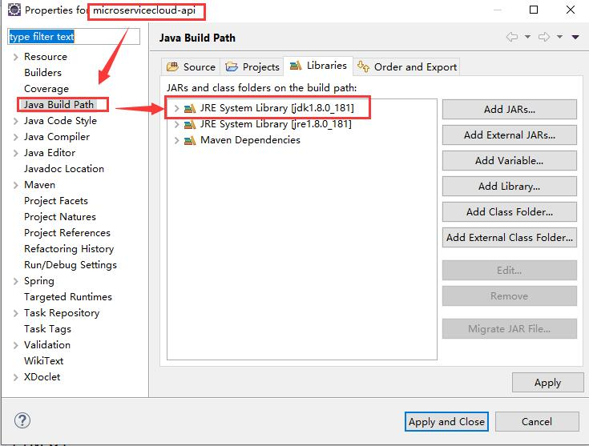

  4. 修改microservicecloud-consumer-dept-feign模块的application.yml文件

     ```yml
     server:
       port: 80
       
     feign:
       hystrix:
         enabled: true  # 加入该配置
       
     eureka:
       client:
         register-with-eureka: false
         service-url:
           defaultZone: http://eureka7001.com:7001/eureka/,http://eureka7002.com:7002/eureka/,http://eureka7003.com:7003/eureka/
           
     ```

  5. 启动microservicecloud-eureka-7001、microservicecloud-eureka-7002、microservicecloud-eureka-7003、microservicecloud-provider-dept-8001、microservicecloud-consumer-dept-feign。

  6. 正常访问测试

     访问：http://localhost/consumer/dept/get/1

  7. 故意关闭微服务microservicecloud-provider-dept-8001，再次访问该链接。

     此时服务端已经down了，但是我们做了服务降级处理，让客户端在服务端不可用时也会获得提示信息而不会挂起耗死服务器。

## 4、服务监控hystrixDashboard

### 1、概述

除了隔离依赖服务的调用以外，Hystrix还提供了**准实时的调用监控（Hystrix Dashboard）**，Hystrix会持续地记录所有通过Hystrix发起的请求的执行信息，并以统计报表和图形的形式展示给用户，包括每秒执行多少请求、多少成功、多少失败等。Netflix通过hystrix-metrics-event-stream项目实现了对以上指标的监控。SpringCloud也提供了Hystrix Dashboard的整合，对监控内容转化成可视化界面。

### 2、操作步骤

1. 创建microservicecloud-consumer-hystrix-dashboard模块

2. 修改pom.xml文件，添加相关依赖

   ```xml
   <project xmlns="http://maven.apache.org/POM/4.0.0"
   	xmlns:xsi="http://www.w3.org/2001/XMLSchema-instance"
   	xsi:schemaLocation="http://maven.apache.org/POM/4.0.0 http://maven.apache.org/xsd/maven-4.0.0.xsd">
   	<modelVersion>4.0.0</modelVersion>
   	<parent>
   		<groupId>com.lyl.springcloud</groupId>
   		<artifactId>microservicecloud</artifactId>
   		<version>0.0.1-SNAPSHOT</version>
   	</parent>
   	<artifactId>microservicecloud-consumer-hystrix-dashboard</artifactId>

   	<dependencies>
   		<!-- 自己定义的api -->
   		<dependency>
   			<groupId>com.lyl.springcloud</groupId>
   			<artifactId>microservicecloud-api</artifactId>
   			<version>${project.version}</version>
   		</dependency>
   		<dependency>
   			<groupId>org.springframework.boot</groupId>
   			<artifactId>spring-boot-starter-web</artifactId>
   		</dependency>
   		<!-- 修改后立即生效，热部署 -->
   		<dependency>
   			<groupId>org.springframework</groupId>
   			<artifactId>springloaded</artifactId>
   		</dependency>
   		<dependency>
   			<groupId>org.springframework.boot</groupId>
   			<artifactId>spring-boot-devtools</artifactId>
   		</dependency>
   		<!-- Ribbon相关 -->
   		<dependency>
   			<groupId>org.springframework.cloud</groupId>
   			<artifactId>spring-cloud-starter-eureka</artifactId>
   		</dependency>
   		<dependency>
   			<groupId>org.springframework.cloud</groupId>
   			<artifactId>spring-cloud-starter-ribbon</artifactId>
   		</dependency>
   		<dependency>
   			<groupId>org.springframework.cloud</groupId>
   			<artifactId>spring-cloud-starter-config</artifactId>
   		</dependency>
   		<!-- feign相关 -->
   		<dependency>
   			<groupId>org.springframework.cloud</groupId>
   			<artifactId>spring-cloud-starter-feign</artifactId>
   		</dependency>
   		<!-- hystrix和 hystrix-dashboard相关 -->
   		<dependency>
   			<groupId>org.springframework.cloud</groupId>
   			<artifactId>spring-cloud-starter-hystrix</artifactId>
   		</dependency>
   		<dependency>
   			<groupId>org.springframework.cloud</groupId>
   			<artifactId>spring-cloud-starter-hystrix-dashboard</artifactId>
   		</dependency>
   	</dependencies>
   </project>
   ```

3. 新建application.yml文件

   ```yml
   server:
     port: 9001
   ```

4. 新建主启动类DeptConsumer_DashBoard_App.java，并加上@EnableHystrixDashboard注解

   ```java
   package com.lyl.springcloud;

   import org.springframework.boot.SpringApplication;
   import org.springframework.boot.autoconfigure.SpringBootApplication;
   import org.springframework.cloud.netflix.hystrix.dashboard.EnableHystrixDashboard;

   @SpringBootApplication
   @EnableHystrixDashboard
   public class DeptConsumer_DashBoard_App {
   	public static void main(String[] args) {
   		SpringApplication.run(DeptConsumer_DashBoard_App.class, args);
   	}
   }

   ```

5. 确保microservicecloud-provider-dept-8001、microservicecloud-provider-dept-8002、microservicecloud-provider-dept-8003中的pom.xml文件都添加了下列注解。即所有的Provider微服务提供类都需要监控依赖配置。

   ```xml
   <!-- actuator监控信息完善 -->
   <dependency>
     <groupId>org.springframework.boot</groupId>
     <artifactId>spring-boot-starter-actuator</artifactId>
   </dependency>
   ```

6. 启动microservicecloud-consumer-hystrix-dashboard，访问http://localhost:9001/hystrix 。

7. 启动3个Eureka集群，启动microservicecloud-provider-dept-hystrix-8001。

8. 访问 http://localhost:8001/dept/get/1 和 http://localhost:8001/hystrix.stream

9. 监控测试

   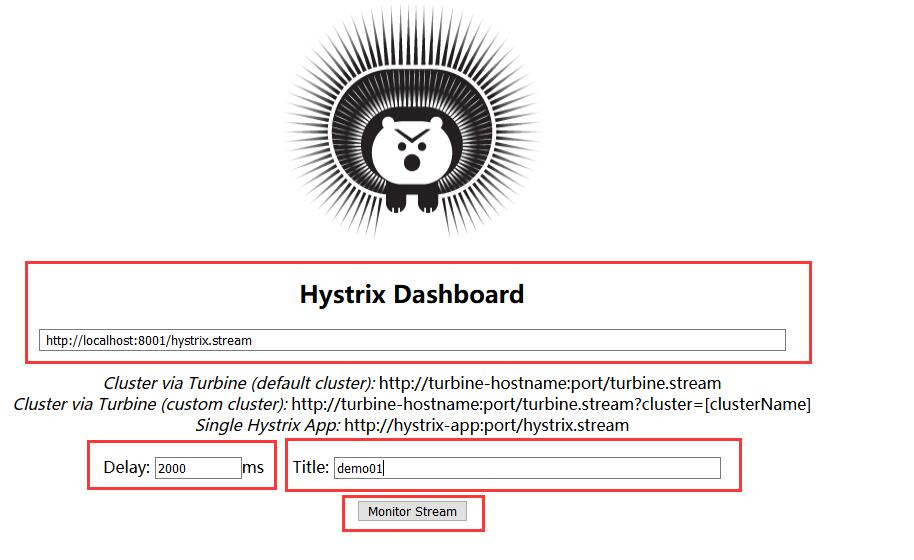

①Delay：该参数用来控制服务器上轮询监控信息的延迟时间，默认为2000毫秒，可以通过配置该属性来降低客户端的网络和CPU消耗。

②Title：该参数对应了头部标题Hystrix Stream之后的内容，默认会使用具体监控实例的URL，可以通过配置该信息来展示更合适的标题。

* 多次刷新http://localhost:8001/dept/get/1，观察监控窗口。

* 如何看？

  * 7色

  * 1圈

    * 实心圆：共有两种含义。它通过颜色的变化代表了实例的健康程度，它的健康度从 绿色<黄色<橙色<红色 递减。
    * 该实心圆除了颜色的变化之外，它的大小也会根据实例的请求流量发生变化，流量越大该实心圆就越大。所以通过该实心圆的展示，就可以在大量的实例中快速的发现**故障实例和高压力实例**。

  * 1线

    * 曲线：用来记录2分钟内流量的相对变化，可以通过它来观察到流量的上升和下降趋势。

  * 整图说明

    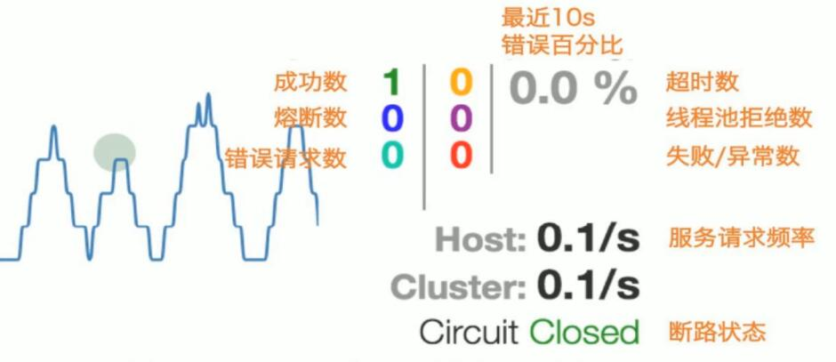

    	

# 九、zuul路由网关

## 1、概述

* 是什么
  * Zuul包含了对请求的路由和过滤两个最主要的功能：其中路由功能负责将外部请求转发到具体的微服务实例上，是实现外部访问统一入口的基础而过滤器功能则负责对请求的处理过程进行干预，是实现请求校验、服务聚合等功能的基础。
  * Zuul和Eureka进行整合，将Zuul自身注册为Eureka服务治理下的应用，同时从Eureka中获得其他微服务的消息，也即以后的访问微服务都是通过Zuul跳转后获得。
  * 注意：Zuul服务最终还是会注册进Eureka。
  * **提供=代理+路由+过滤 三大功能**
* 能干嘛
  * 路由
  * 过滤

## 2、路由基本配置

1. 创建mircoservicecloud-zuul-gateway-9527模块

2. 修改pom.xml文件，添加相关依赖

   ```xml
   <project xmlns="http://maven.apache.org/POM/4.0.0"
   	xmlns:xsi="http://www.w3.org/2001/XMLSchema-instance"
   	xsi:schemaLocation="http://maven.apache.org/POM/4.0.0 http://maven.apache.org/xsd/maven-4.0.0.xsd">
   	<modelVersion>4.0.0</modelVersion>
   	<parent>
   		<groupId>com.lyl.springcloud</groupId>
   		<artifactId>microservicecloud</artifactId>
   		<version>0.0.1-SNAPSHOT</version>
   	</parent>
   	<artifactId>mircoservicecloud-zuul-gateway-9527</artifactId>

   	<dependencies>
   		<!-- zuul路由网关 -->
   		<dependency>
   			<groupId>org.springframework.cloud</groupId>
   			<artifactId>spring-cloud-starter-zuul</artifactId>
   		</dependency>
   		<dependency>
   			<groupId>org.springframework.cloud</groupId>
   			<artifactId>spring-cloud-starter-eureka</artifactId>
   		</dependency>
   		<!-- actuator监控 -->
   		<dependency>
   			<groupId>org.springframework.boot</groupId>
   			<artifactId>spring-boot-starter-actuator</artifactId>
   		</dependency>
   		<!-- hystrix容错 -->
   		<dependency>
   			<groupId>org.springframework.cloud</groupId>
   			<artifactId>spring-cloud-starter-hystrix</artifactId>
   		</dependency>
   		<dependency>
   			<groupId>org.springframework.cloud</groupId>
   			<artifactId>spring-cloud-starter-config</artifactId>
   		</dependency>
   		<!-- 日常标配 -->
   		<dependency>
   			<groupId>com.lyl.springcloud</groupId>
   			<artifactId>microservicecloud-api</artifactId>
   			<version>${project.version}</version>
   		</dependency>
   		<dependency>
   			<groupId>org.springframework.boot</groupId>
   			<artifactId>spring-boot-starter-jetty</artifactId>
   		</dependency>
   		<dependency>
   			<groupId>org.springframework.boot</groupId>
   			<artifactId>spring-boot-starter-web</artifactId>
   		</dependency>
   		<dependency>
   			<groupId>org.springframework.boot</groupId>
   			<artifactId>spring-boot-starter-test</artifactId>
   		</dependency>
   		<!-- 热部署插件 -->
   		<dependency>
   			<groupId>org.springframework</groupId>
   			<artifactId>springloaded</artifactId>
   		</dependency>
   		<dependency>
   			<groupId>org.springframework.boot</groupId>
   			<artifactId>spring-boot-devtools</artifactId>
   		</dependency>
   	</dependencies>
   </project>
   ```

3. 创建application.yml文件，进行相应配置

   ```yml
   server:
     port: 9527
     
   spring:
     application:
       name: microservicecloud-zuul-gateway
       
   eureka:
     client:
       service-url:
         defaultZone: http://eureka7001.com:7001/eureka,http://eureka7002.com:7002/eureka,http://eureka7003.com:7003/eureka
     instance:
       instance-id: gateway-9527.com
       prefer-ip-address: true
       
   info:
     app.name: lyl-microcloud
     company.name: www.baidu.com
     build.artifactId: $project.artifactId$
     build.version: $project.version$        
               
   ```

4. 修改C:\Windows\System32\drivers\etc路径下的hosts文件，添加的内容如下：

   ```xml
   127.0.0.1	myzuul.com
   ```

5. 创建主启动类Zuul_9527_StartSpringCloudApp，并添加@EnableZuulProxy注解

   ```java
   package com.lyl.springcloud;

   import org.springframework.boot.SpringApplication;
   import org.springframework.boot.autoconfigure.SpringBootApplication;
   import org.springframework.cloud.netflix.zuul.EnableZuulProxy;

   @SpringBootApplication
   @EnableZuulProxy
   public class Zuul_9527_StartSpringCloudApp {
   	public static void main(String[] args) {
   		SpringApplication.run(Zuul_9527_StartSpringCloudApp.class, args);
   	}
   }

   ```

6. 启动三个Eureka集群、一个服务提供类microservicecloud-provider-dept-8001、一个路由mircoservicecloud-zuul-gateway-9527，访问 http://eureka7001.com:7001/eureka 。

   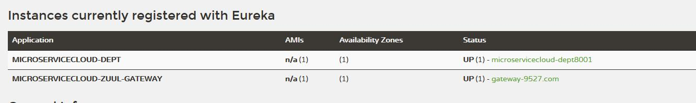

7. 测试

   * 不用路由
     * http://localhost:8001/dept/get/2
   * 启用路由
     * http://myzuul.com:9527/microservicecloud-dept/dept/get/2

## 3、路由访问映射规则

* 代理名称

1. 修改application.yml文件，修改为下列配置：

   ```yml
   server:
     port: 9527
     
   spring:
     application:
       name: microservicecloud-zuul-gateway
       
   eureka:
     client:
       service-url:
         defaultZone: http://eureka7001.com:7001/eureka,http://eureka7002.com:7002/eureka,http://eureka7003.com:7003/eureka
     instance:
       instance-id: gateway-9527.com
       prefer-ip-address: true

   # 路由访问映射规则    
   zuul: # 新增的内容
     routes:
       mydept.serviceId: microservicecloud-dept
       mydept.path: /mydept/**    
       
   info:
     app.name: lyl-microcloud
     company.name: www.baidu.com
     build.artifactId: $project.artifactId$
     build.version: $project.version$        
               
   ```

2. 之前的链接： http://myzuul.com:9527/microservicecloud-dept/dept/get/2

   现在的链接： http://myzuul.com:9527/mydept/dept/get/2

   访问新的链接，也能使用之前的服务。

* 原真实服务名忽略
  * 单个写具体名称，多个使用 * 

1. 修改application.yml文件，修改为下列配置：

   ```yml
   server:
     port: 9527
     
   spring:
     application:
       name: microservicecloud-zuul-gateway
       
   eureka:
     client:
       service-url:
         defaultZone: http://eureka7001.com:7001/eureka,http://eureka7002.com:7002/eureka,http://eureka7003.com:7003/eureka
     instance:
       instance-id: gateway-9527.com
       prefer-ip-address: true

   # 路由访问映射规则    
   zuul: 
   #  ignored-services: microservicecloud-dept  # 单个
     ignored-services: "*"						 # 多个
     routes:
       mydept.serviceId: microservicecloud-dept
       mydept.path: /mydept/**    
       
   info:
     app.name: lyl-microcloud
     company.name: www.baidu.com
     build.artifactId: $project.artifactId$
     build.version: $project.version$        
               
   ```

2. 之前的链接： http://myzuul.com:9527/microservicecloud-dept/dept/get/2

   现在的链接： http://myzuul.com:9527/mydept/dept/get/2

   之前的链接已经无法访问，只有现在的链接能访问。

* 设置统一公共前缀

1. 修改application.yml文件，修改为下列配置：

   ```yml
   server:
     port: 9527
     
   spring:
     application:
       name: microservicecloud-zuul-gateway
       
   eureka:
     client:
       service-url:
         defaultZone: http://eureka7001.com:7001/eureka,http://eureka7002.com:7002/eureka,http://eureka7003.com:7003/eureka
     instance:
       instance-id: gateway-9527.com
       prefer-ip-address: true
       
   # 路由访问映射规则        
   zuul: 
     prefix: /pdsu # 新增的配置
   #  ignored-services: microservicecloud-dept
     ignored-services: "*"
     routes:
       mydept.serviceId: microservicecloud-dept
       mydept.path: /mydept/**    
       
   info:
     app.name: lyl-microcloud
     company.name: www.baidu.com
     build.artifactId: $project.artifactId$
     build.version: $project.version$        
               
   ```

2. 之前的链接都不能访问了，只有 http://myzuul.com:9527/pdsu/mydept/dept/get/2 能访问。

# 十、SpringCloud Config 分布式配置中心

## 1、概述

1. 分布式系统面临的——配置问题

   微服务意味着要将单体应用中的业务拆分成一个个子服务，每个服务的粒度相对较小，因此系统中会出现大量的服务。由于每个服务都需要必要的配置信息才能运行，所以一套集中式的、动态的配置管理设施是必不可少的。SpringCloud提供了ConfigServer来解决这个问题，我们每一个微服务自己带着一个application.yml，上百个配置文件的管理就非常麻烦了。

2. 是什么

   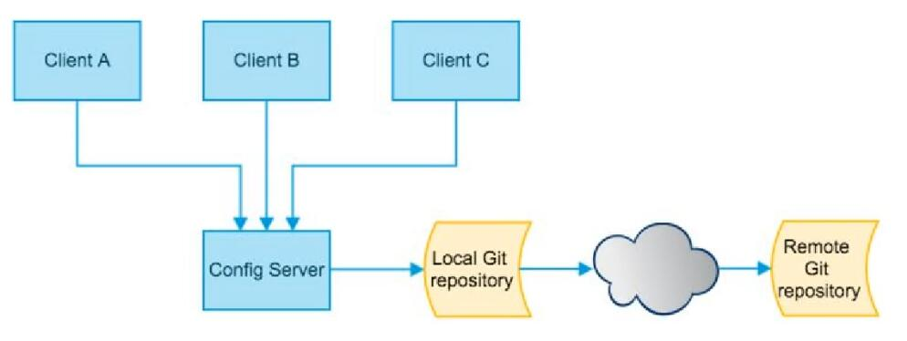

   SpringCloud Config为微服务架构中的微服务提供集中化的外部配置支持，配置服务器为**各个不同微服务应用**的所有环境提供了一个**中心化的外部配置**。

3. 怎么玩

   SpringCloud Config分为**服务端和客户端**两部分。

   服务端也称为**分布式配置中心，它是一个独立的微服务应用**，用来连接配置服务器并为客户端提供获取配置信息，加密/解密信息等访问接口。

   客户端则是通过指定的配置中心来管理应用资源，以及与业务相关的配置内容，并在启动的时候从配置中心获取和加载配置信息配置服务器默认采用git来存储配置信息，这样就有助于对环境配置进行版本管理，并且可以通过git客户端工具来方便的管理和访问配置内容。

4. 能干嘛

   * 集中管理配置文件
   * 不同环境不同配置，动态化的配置更新，分环境部署
   * 运行期间动态调整配置，不再需要在每个服务部署的机器上编写配置文件，服务会向配置中心统一拉取配置自己的信息
   * 当配置发生变动时，服务不需要重启即可感知到配置的变化并应用新的配置
   * 将配置信息以REST接口的形式暴露

5. 与GitHub整合配置

   由于SpringCloud Config默认使用Git来存储配置文件（也有其他方式，比如支持SVN和本地文件），但最推荐的还是Git，而且使用的是http/https访问的形式。

## 2、SpringCloud Config 服务端配置

1. 用自己的GitHub账号在GitHub上新建一个名为microservicecloud-config的新Repository

2. 由上一步获得SSH协议的Git地址

   git@github.com:LYLYMZGL/microservicecloud-config.git

3. 本地硬盘目录下新建Git仓库并clone

   git clone git@github.com:LYLYMZGL/microservicecloud-config.git

4. 在本地Git仓库microservicecloud-config里面新建一个application.yml

   * 内容

     ```yml
     spring: 
       profiles: 
         active: 
         - dev

     spring: 
       profiles: dev    # 开发环境
       application: 
         name: microservicecloud-config-lyl-dev
         
     spring: 
       profiles: test   # 测试环境
       application: 
         name: microservicecloud-config-lyl-test

     # 请保存为UTF-8格式    
       
     ```

   * 保存格式必须为UTF-8

5. 将上一步的yml文件推送到GitHub上

   ```xml
   $ git add application.yml
   $ git commit -m "init file" application.yml
   $ git push origin master
   ```

6. 新建microservicecloud-config-3344模块

7. 修改pom.xml文件

   ```xml
   <project xmlns="http://maven.apache.org/POM/4.0.0"
   	xmlns:xsi="http://www.w3.org/2001/XMLSchema-instance"
   	xsi:schemaLocation="http://maven.apache.org/POM/4.0.0 http://maven.apache.org/xsd/maven-4.0.0.xsd">
   	<modelVersion>4.0.0</modelVersion>
   	<parent>
   		<groupId>com.lyl.springcloud</groupId>
   		<artifactId>microservicecloud</artifactId>
   		<version>0.0.1-SNAPSHOT</version>
   	</parent>
   	<artifactId>microservicecloud-config-3344</artifactId>

   	<dependencies>
   		<!-- springCloud Config -->
   		<dependency>
   			<groupId>org.springframework.cloud</groupId>
   			<artifactId>spring-cloud-config-server</artifactId>
   		</dependency>
   		<!-- 避免Config的Git插件报错：org/eclipse/jgit/api/TransportConfigCallback -->
   		<dependency>
   			<groupId>org.eclipse.jgit</groupId>
   			<artifactId>org.eclipse.jgit</artifactId>
   			<version>4.10.0.201712302008-r</version>
   		</dependency>
   		<!-- 图形化监控 -->
   		<dependency>
   			<groupId>org.springframework.boot</groupId>
   			<artifactId>spring-boot-starter-actuator</artifactId>
   		</dependency>
   		<!-- 熔断 -->
   		<dependency>
   			<groupId>org.springframework.cloud</groupId>
   			<artifactId>spring-cloud-starter-hystrix</artifactId>
   		</dependency>
   		<dependency>
   			<groupId>org.springframework.cloud</groupId>
   			<artifactId>spring-cloud-starter-eureka</artifactId>
   		</dependency>
   		<dependency>
   			<groupId>org.springframework.cloud</groupId>
   			<artifactId>spring-cloud-starter-config</artifactId>
   		</dependency>
   		<dependency>
   			<groupId>org.springframework.boot</groupId>
   			<artifactId>spring-boot-starter-jetty</artifactId>
   		</dependency>
   		<dependency>
   			<groupId>org.springframework.boot</groupId>
   			<artifactId>spring-boot-starter-web</artifactId>
   		</dependency>
   		<dependency>
   			<groupId>org.springframework.boot</groupId>
   			<artifactId>spring-boot-starter-test</artifactId>
   		</dependency>
   		<!-- 热部署插件 -->
   		<dependency>
   			<groupId>org.springframework</groupId>
   			<artifactId>springloaded</artifactId>
   		</dependency>
   		<dependency>
   			<groupId>org.springframework.boot</groupId>
   			<artifactId>spring-boot-devtools</artifactId>
   		</dependency>
   	</dependencies>
   </project>
   ```

8. 新建application.yml文件，并添加以下内容

   ```yml
   server:
     port: 3344
     
   spring:
     application:
       name: microservicecloud-config
     cloud:
       config:
         server:
           git:
             uri: git@github.com:LYLYMZGL/microservicecloud-config.git # GitHub上面的git仓库名字    
             
   ```

9. 创建主启动类Config_3344_StartSpringCloudApp

   ```java
   package com.lyl.springcloud;

   import org.springframework.boot.SpringApplication;
   import org.springframework.boot.autoconfigure.SpringBootApplication;
   import org.springframework.cloud.config.server.EnableConfigServer;

   @SpringBootApplication
   @EnableConfigServer
   public class Config_3344_StartSpringCloudApp {
   	public static void main(String[] args) {
   		SpringApplication.run(Config_3344_StartSpringCloudApp.class, args);
   	}
   }

   ```

10. 修改C:\Windows\System32\drivers\etc路径下的hosts文件，添加的内容如下：

  ```xml
  127.0.0.1	config-3344.com
  ```

11. 测试通过Config微服务是否可以从GitHub上获取配置内容。

    ①启动microservicecloud-config-3344

    ②访问 http://config-3344.com:3344/application-dev.yml 、 http://config-3344.com:3344/application-test.yml 。

12. 配置读取规则

    * /{application}-{profile}.yml
      * http://config-3344.com:3344/application-dev.yml 
      * http://config-3344.com:3344/application-test.yml
    * /{application}/{profile}[/{label}]
      * http://config-3344.com:3344/application/dev/master
    * /{label}/{application}-{profile}.yml
      * http://config-3344.com:3344/master/application-test.yml

13. 成功实现了用SpringCloud Config通过GitHub获取配置信息

## 3、SpringCloud Config 客户端配置与测试

1. 在本地Git仓库microservicecloud-config下新建文件microservicecloud-config-client.yml

2. microservicecloud-config-client.yml中的内容如下：

   ```yml
   spring: 
     profiles: 
       active: 
       - dev
   ---
   server: 
     port: 8201 
   spring: 
     profiles: dev
     application: 
       name: microservicecloud-config-client
   eureka: 
     client: 
       service-url: 
         defaultZone: http://eureka-dev.com:7001/eureka/
   ---
   server: 
     port: 8202
   spring: 
     profiles: test
     application: 
       name: microservicecloud-config-client
   eureka:
     client: 
       service-url:
         defaultZone: http://eureka-test.com:7001/eureka/
   ```

3. 将上一步提交到GitHub中

   ```xml
   $ git add microservicecloud-config-client.yml
   $ git commit -m "test config" microservicecloud-config-client.yml
   $ git push origin master
   ```

4. 新建microservicecloud-config-client-3355模块

5. 修改pom.xml文件

   ```xml
   <project xmlns="http://maven.apache.org/POM/4.0.0"
   	xmlns:xsi="http://www.w3.org/2001/XMLSchema-instance"
   	xsi:schemaLocation="http://maven.apache.org/POM/4.0.0 http://maven.apache.org/xsd/maven-4.0.0.xsd">
   	<modelVersion>4.0.0</modelVersion>
   	<parent>
   		<groupId>com.lyl.springcloud</groupId>
   		<artifactId>microservicecloud</artifactId>
   		<version>0.0.1-SNAPSHOT</version>
   	</parent>
   	<artifactId>microservicecloud-config-client-3355</artifactId>

   	<dependencies>
   		<!-- SpringCloud Config客户端 -->
   		<dependency>
   			<groupId>org.springframework.cloud</groupId>
   			<artifactId>spring-cloud-starter-config</artifactId>
   		</dependency>
   		<dependency>
   			<groupId>org.springframework.boot</groupId>
   			<artifactId>spring-boot-starter-actuator</artifactId>
   		</dependency>
   		<dependency>
   			<groupId>org.springframework.cloud</groupId>
   			<artifactId>spring-cloud-starter-hystrix</artifactId>
   		</dependency>
   		<dependency>
   			<groupId>org.springframework.cloud</groupId>
   			<artifactId>spring-cloud-starter-eureka</artifactId>
   		</dependency>
   		<dependency>
   			<groupId>org.springframework.cloud</groupId>
   			<artifactId>spring-cloud-starter-config</artifactId>
   		</dependency>
   		<dependency>
   			<groupId>org.springframework.boot</groupId>
   			<artifactId>spring-boot-starter-jetty</artifactId>
   		</dependency>
   		<dependency>
   			<groupId>org.springframework.boot</groupId>
   			<artifactId>spring-boot-starter-web</artifactId>
   		</dependency>
   		<dependency>
   			<groupId>org.springframework.boot</groupId>
   			<artifactId>spring-boot-starter-test</artifactId>
   		</dependency>
   		<dependency>
   			<groupId>org.springframework</groupId>
   			<artifactId>springloaded</artifactId>
   		</dependency>
   		<dependency>
   			<groupId>org.springframework.boot</groupId>
   			<artifactId>spring-boot-devtools</artifactId>
   		</dependency>
   	</dependencies>
   </project>
   ```

6. 新建bootstrap.yml文件

   * bootstrap.yml是什么？
     * application.yml是用户级的资源配置项
     * bootstrap.yml是系统级的，**优先级更高**
     * SpringCloud会创建一个“Bootstrap Context”，作为Spring应用的“Application Context”的**父上下文**。初始化的时候，“Bootstrap Context”负责从外部源加载配置属性并解析配置。这两个上下文共享一个从外部获取的“Environment”。“Bootstrap”属性有高优先级，默认情况下，它们不会被本地配置覆盖。“Bootstrap Context”和“Application Context”有着不同的约定，所以新增了一个“bootstrap.yml”文件，保证“Bootstrap Context”和“Application Context”配置的分离。

   ```yml
   spring:
     cloud:
       config:
         name: microservicecloud-config-client # 需要从GitHub上读取的资源名称，注意没有yml后缀名
         profile: dev # 本次访问的配置项
         label: master
         uri: http://config-3344.com:3344  # 本微服务启动后先去找3344号服务，通过SpringCloudConfig获取GitHub的服务地址
         
   ```

7. 新建application.yml文件

   ```yml
   spring:
     application:
       name: microservicecloud-config-client
   ```

8. 修改C:\Windows\System32\drivers\etc路径下的hosts文件，添加的内容如下：

   ```xml
   127.0.0.1	client-config.com
   ```

9. 创建ConfigClientRest类

   ```java
   package com.lyl.springcloud.rest;

   import org.springframework.beans.factory.annotation.Value;
   import org.springframework.web.bind.annotation.RequestMapping;
   import org.springframework.web.bind.annotation.RestController;

   @RestController
   public class ConfigClientRest {
   	@Value("${spring.application.name}")
   	private String applicationName;
   	
   	@Value("${eureka.client.service-url.defaultZone}")
   	private String eurekaServers;
   	
   	@Value("${server.port}")
   	private String port;
   	
   	@RequestMapping("/config")
   	public String getConfig() {
   		String str="applicationName:"+applicationName+"\t eurekaServers:"+eurekaServers+"\t port:"+port;
   		System.out.println("************str:"+str);
   		return "applicationName:"+applicationName+"\t eurekaServers:"+eurekaServers+"\t port:"+port;
   	}
   }

   ```

10. 创建主启动类ConfigClient_3355_StartSpringCloudApp

  ```java
  package com.lyl.springcloud;

  import org.springframework.boot.SpringApplication;
  import org.springframework.boot.autoconfigure.SpringBootApplication;

  @SpringBootApplication
  public class ConfigClient_3355_StartSpringCloudApp {
  	public static void main(String[] args) {
  		SpringApplication.run(ConfigClient_3355_StartSpringCloudApp.class, args);
  	}
  }

  ```

11. 启动Config配置中心microservicecloud-config-3344微服务并自测

    * http://config-3344.com:3344/application-test.yml

12. 启动microservicecloud-config-client-3355作为Client准备访问

13. bootstrap.yml里面的profile值是什么，决定从GitHub上读取到什么

    * 如果profile=dev
      * dev默认在GitHub上对应的端口就是8201
      * http://config-3344.com:8201/config
    * 如果profile=test
      * test默认在GitHub上对应的端口就是8202
      * http://config-3344.com:8202/config

14. 成功实现了客户端3355访问SpringCloud Config3344通过GitHub获取配置信息


## 4、SpringCloud Config 配置实战

1. Git配置文件本地配置

   ①在Git本地仓库microservicecloud-config中创建microservicecloud-config-eureka-client.yml

   ```yml
   spring: 
     profiles: 
       active: 
       - dev
   ---
   server:
     port: 7001 # 注册中心占用7001端口，冒号后面必须要有空格

   spring: 
     profiles: dev
     application: 
       name: microservicecloud-config-eureka-client

   eureka: 
     instance: 
       hostname: eureka7001.com # 冒号后面必须要有空格
     client: 
       register-with-eureka: false # 当前的eureka-server自己不注册进服务列表中
       fetch-registry: false # 不通过eureka获取注册信息
       service-url: 
         defaultZone: http://eureka7001.com:7001/eureka/
   ---
   server: 
     port: 7001 # 注册中心占用7001端口，冒号后面必须要有空格

   spring:
     profiles: test
     application: 
       name: microservicecloud-config-eureka-client
       
   eureka: 
     instance:
       hostaname: eureka7001.com # 冒号后面必须要有空格
     client:
       register-with-eureka: false #  当前的eureka-server自己不注册进服务列表中
       fetch-registry: false # 不通过eureka获取注册信息
       service-url: 
         defaultZone: http://eureka7001.com:7001/eureka/
   ```

   ②在Git本地仓库microservicecloud-config中创建microservicecloud-config-dept-client.yml

   ```yml
   spring: 
     profiles: 
       active: 
       - dev
   ---
   server: 
     port: 8001
   spring: 
     profiles: dev
     application:
       name: microservicecloud-config-dept-client
     datasource:
       type: com.alibaba.druid.pool.DruidDataSource
       driver-class-name: org.gjt.mm.mysql.Driver
       url: jdbc:mysql://localhost:3306/cloudDB01
       username: root
       password: root
       dbcp2:
         min-idle: 5
         initial-size: 5
         max-total: 5
         max-wait-millis: 200
   mybatis:
     config-location: classpath:mybatis/mybatis.cfg.xml  # mybatis配置文件所在路径
     type-aliases-package: com.lyl.springcloud.entity    # 所有entity别名类所在包
     mapper-locations:
     - classpath:mybatis/mapper/**/*.xml                 # mapper映射文件

   eureka:
     client: # 客户端注册进Eureka服务列表内
       service-url:
         defaultZone: http://eureka7001.com:7001/eureka
     instance: 
       instance-id: dept-8001.com # 自定义服务名称信息
       prefer-ip-address: true    # 访问路径可以显示IP地址

   info:
     app.name: lyl-microservicecloud-springcloudconfig01
     company.name: www.baidu.com
     build.artifactId: $project.artifactId$
     build.version: $project.version$
   ---  
   ```

   ③将这两个文件提交到GitHub

   ```xml
   git add .
   git commit -m "two new file"
   git push origin master
   ```

2. Config版的Eureka服务端

   ①创建microservicecloud-config-eureka-client-7001模块

   ②修改pom.xml文件

   ```xml
   <project xmlns="http://maven.apache.org/POM/4.0.0"
   	xmlns:xsi="http://www.w3.org/2001/XMLSchema-instance"
   	xsi:schemaLocation="http://maven.apache.org/POM/4.0.0 http://maven.apache.org/xsd/maven-4.0.0.xsd">
   	<modelVersion>4.0.0</modelVersion>
   	<parent>
   		<groupId>com.lyl.springcloud</groupId>
   		<artifactId>microservicecloud</artifactId>
   		<version>0.0.1-SNAPSHOT</version>
   	</parent>
   	<artifactId>microservicecloud-config-eureka-client-7001</artifactId>

   	<dependencies>
   		<!-- SpringCloudConfig配置 -->
   		<dependency>
   			<groupId>org.springframework.cloud</groupId>
   			<artifactId>spring-cloud-starter-config</artifactId>
   		</dependency>
   		<dependency>
   			<groupId>org.springframework.cloud</groupId>
   			<artifactId>spring-cloud-starter-eureka-server</artifactId>
   		</dependency>
   		<!-- 热部署插件 -->
   		<dependency>
   			<groupId>org.springframework</groupId>
   			<artifactId>springloaded</artifactId>
   		</dependency>
   		<dependency>
   			<groupId>org.springframework.boot</groupId>
   			<artifactId>spring-boot-devtools</artifactId>
   		</dependency>
   	</dependencies>
   </project>
   ```

   ③创建bootstrap.yml文件

   ```yml
   spring:
     cloud:
       config:
         name: microservicecloud-config-eureka-client # 需要从GitHub上读取的资源名称，注意没有yml后缀
         profile: dev
         label: master
         uri: http://config-3344.com:3344 # SpringCloudConfig获取的服务地址
   ```

   ④创建application.yml文件

   ```yml
   spring:
     application:
       name: microservicecloud-config-eureka-client
   ```

   ⑤创建主启动类Config_Git_EurekaServerApplication

   ```java
   package com.lyl.springcloud;

   import org.springframework.boot.SpringApplication;
   import org.springframework.boot.autoconfigure.SpringBootApplication;
   import org.springframework.cloud.netflix.eureka.server.EnableEurekaServer;

   @SpringBootApplication
   @EnableEurekaServer // EurekaServer服务器端启动类，接受其他微服务注册进来
   public class Config_Git_EurekaServerApplication {
   	public static void main(String[] args) {
   		SpringApplication.run(Config_Git_EurekaServerApplication.class, args);
   	}
   }

   ```

   ⑥测试

   * 先启动microservicecloud-config-3344微服务，保证Config总配置是没问题的。
   * 再启动microservicecloud-config-eureka-client-7001微服务
   * 访问 http://eureka7001.com:7001/ ，出现Eureka主页表示启动成功。

3. Config版的dept微服务

   ①创建microservicecloud-config-dept-client-8001模块

   ②修改pom.xml文件

   ```xml
   <project xmlns="http://maven.apache.org/POM/4.0.0"
   	xmlns:xsi="http://www.w3.org/2001/XMLSchema-instance"
   	xsi:schemaLocation="http://maven.apache.org/POM/4.0.0 http://maven.apache.org/xsd/maven-4.0.0.xsd">
   	<modelVersion>4.0.0</modelVersion>
   	<parent>
   		<groupId>com.lyl.springcloud</groupId>
   		<artifactId>microservicecloud</artifactId>
   		<version>0.0.1-SNAPSHOT</version>
   	</parent>
   	<artifactId>microservicecloud-config-dept-client-8001</artifactId>

   	<dependencies>
   		<!-- SpringCloudConfig配置 -->
   		<dependency>
   			<groupId>org.springframework.cloud</groupId>
   			<artifactId>spring-cloud-starter-config</artifactId>
   		</dependency>
   		<dependency>
   			<groupId>org.springframework.boot</groupId>
   			<artifactId>spring-boot-starter-actuator</artifactId>
   		</dependency>
   		<dependency>
   			<groupId>org.springframework.cloud</groupId>
   			<artifactId>spring-cloud-starter-eureka</artifactId>
   		</dependency>
   		<dependency>
   			<groupId>com.lyl.springcloud</groupId>
   			<artifactId>microservicecloud-api</artifactId>
   			<version>${project.version}</version>
   		</dependency>
   		<dependency>
   			<groupId>junit</groupId>
   			<artifactId>junit</artifactId>
   		</dependency>
   		<dependency>
   			<groupId>mysql</groupId>
   			<artifactId>mysql-connector-java</artifactId>
   		</dependency>
   		<dependency>
   			<groupId>com.alibaba</groupId>
   			<artifactId>druid</artifactId>
   		</dependency>
   		<dependency>
   			<groupId>ch.qos.logback</groupId>
   			<artifactId>logback-core</artifactId>
   		</dependency>
   		<dependency>
   			<groupId>org.mybatis.spring.boot</groupId>
   			<artifactId>mybatis-spring-boot-starter</artifactId>
   		</dependency>
   		<dependency>
   			<groupId>org.springframework.boot</groupId>
   			<artifactId>spring-boot-starter-jetty</artifactId>
   		</dependency>
   		<dependency>
   			<groupId>org.springframework.boot</groupId>
   			<artifactId>spring-boot-starter-web</artifactId>
   		</dependency>
   		<dependency>
   			<groupId>org.springframework.boot</groupId>
   			<artifactId>spring-boot-starter-test</artifactId>
   		</dependency>
   		<dependency>
   			<groupId>org.springframework</groupId>
   			<artifactId>springloaded</artifactId>
   		</dependency>
   		<dependency>
   			<groupId>org.springframework.boot</groupId>
   			<artifactId>spring-boot-devtools</artifactId>
   		</dependency>
   	</dependencies>
   </project>
   ```

   ③新建bootstrap.yml文件

   ```yml
   spring:
     cloud:
       config:
         name: microservicecloud-config-dept-client # 需要从GitHub上读取的资源名称，注意后缀没有yml
         # profile配置是什么就取什么配置
   #      profile: dev
         profile: test
         label: master
         uri: http://config-3344.com:3344 #SpringCloudConfig获取的服务地址
   ```

   ④新建application.yml文件

   ```yml
   spring:
     application:
       name: microservicecloud-config-dept-client
   ```

   ⑤创建主启动类DeptProvider8001_App

   ```java
   package com.lyl.springcloud;

   import org.springframework.boot.SpringApplication;
   import org.springframework.boot.autoconfigure.SpringBootApplication;
   import org.springframework.cloud.client.discovery.EnableDiscoveryClient;
   import org.springframework.cloud.netflix.eureka.EnableEurekaClient;

   @SpringBootApplication
   @EnableEurekaClient //本服务启动后会自动注册进Eureka服务中
   @EnableDiscoveryClient //服务发现
   public class DeptProvider8001_App {
   	public static void main(String[] args) {
   		SpringApplication.run(DeptProvider8001_App.class, args);
   	}
   }

   ```

   ⑥测试

   * test配置默认访问
     * http://localhost:8001/dept/list
     * 访问的是clouddb02库
   * dev 配置访问
     * http://localhost:8001/dept/list
     * 访问的是clouddb01库

   ​

   ​

