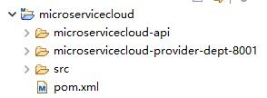

# 一、面试题

1. 什么是微服务？
2. 微服务之间是如何独立通讯的？
3. SpringCloud与Dubbo有哪些区别？
4. SpringBoot与SpringCloud，请你谈谈对他们的理解？
5. 什么是服务熔断？什么是服务降级？
6. 微服务的优缺点分别是什么？说下你在项目开发中遇到的坑。
7. 你所知道的微服务技术栈有哪些？请例举一二。
8. eureka和zookeeper都可以提供服务注册与发现的功能，请说说两个的区别？

# 二、微服务概述

## 1、是什么？

* 官方解释：通常而言，微服务架构是一种架构模式或者说是一种架构风格，**它提倡将单一应用程序划分成一组小的服务**，每个服务运行在其独立的进程中，服务之间互相协调、互相配合，为用户提供最终价值。服务之间采用轻量级的通信机制互相沟通（通常是基于HTTP的RESTful API）。每个服务都围绕着具体业务进行构建，并且能够被独立地部署到生产环境、类生产环境等。另外，应尽量避免统一的、集中式的服务管理机制，对具体的一个服务而言，应根据业务上下文，选择合适的语言、工具对其进行构建，可以有一个非常轻量级的集中式管理来协调这些服务，可以使用不同的语言来编写服务，也可以使用不同的数据存储。
* 技术维度理解：微服务化的核心就是将传统的一站式应用，根据业务拆分成一个个的服务，彻底地去耦合，每一个微服务提供单个业务功能的服务，一个服务做一件事，从技术角度看就是一种小而独立的处理过程，类似于进程概念，能够自行单独启动或销毁，甚至拥有自己独立的数据库。

## 2、微服务与微服务架构

* 微服务

  强调的是服务的大小，它关注的是某一个点，是具体解决某一个问题/提供落地对应服务的一个服务应用。狭义的看，可以看作Eclipse里面的一个个微服务工程/或者Module。

* 微服务架构

  微服务架构是一种架构模式，它提倡将单一应用程序划分成一组小的服务，服务之间互相协调、互相配合，为用户提供最终价值。每个服务运行在其独立的进程中，服务与服务间采用轻量级的通信机制互相协作（通常是基于HTTP的RESTful API）。每个服务都围绕着具体业务进行构建，并且能够被独立的部署到生产环境、类生产环境等。另外，**应尽量避免统一的、集中式的服务管理机制**，对具体的一个服务而言，应根据上下文，选择合适的语言、工具对其进行构建。

## 3、微服务优缺点

* 优点

  每个服务租购内聚，足够小，代码容易理解这样能聚焦一个指定的业务功能或业务需求。

  开发简单、开发效率提高，一个服务可能就是专一的只干一件事。

  微服务能够被小团队单独开发，这个小团队是2到5个人的开发人员组成。

  微服务是松耦合的，是由功能意义的服务，无论是在开发阶段或部署阶段都是独立的。

  微服务能使用不同的语言开发。

  易于和第三方集成，微服务允许容易且灵活的方式集成自动部署，通过持续集成工具，如Jenkins,Hudson,bamboo。

  微服务易于被一个开发人员理解，修改和维护，这样小团队能够更关注自己的工作成果。无需通过合作才能体现价值。

  微服务允许你融合最新技术。

  微服务只是业务逻辑的代码，不会和HTML、CSS或其他界面组件混合。

  每个微服务都有自己的存储能力，可以有自己的数据库，也可以有统一的数据库。

* 缺点

  开发人员要处理分布式系统的复杂性

  多服务运维难度，随着服务的增加，运维的压力也在增大

  系统部署依赖

  服务间通信成本

  数据一致性

  系统集成测试

  性能监控.....

## 4、微服务技术栈有哪些？

|        微服务条目         |                   落地技术                   |
| :------------------: | :--------------------------------------: |
|         服务开发         |       SpringBoot、Spring、SpringMVC        |
|       服务配置与管理        |            Archaius、Diamond等             |
|       服务注册与发现        |            Eureka、Zookeeper等             |
|         服务调用         |              Rest、RPC、gRPC               |
|        服务熔断器         |              Hystrix、Envoy等              |
|         负载均衡         |              Ribbon、Nginx等               |
| 服务接口调用(客户端调用服务的简化工具) |                  Feign等                  |
|         消息队列         |         Kafka、RabbitMQ、ActiveMQ等         |
|       服务配置中心管理       |         SpringCloudConfig、Chef等          |
|     服务路由（API网关）      |                  Zuul等                   |
|         服务监控         |     Zabbix、Nagios、Metrics、Spectator等     |
|        全链路追踪         |           Zipkin、Brave、Dapper等           |
|         服务部署         |       Docker、OpenStack、Kubernetes等       |
|       数据流操作开发包       | SpringCloud Stream（封装与Redis、Rabbit、Kafka等发送接收消息） |
|        事件消息总线        |             SpringCloud Bus              |

## 5、为什么选择SpringCloud作为微服务架构？

1. 选型依据
   * 整体解决方案和框架成熟度
   * 社区热度
   * 可维护性
   * 学习曲线
2. 当前各大IT公司用的微服务架构有哪些？
   * 阿里Dubbo/HSF
   * 京东JSF
   * 新浪微博Motan
   * 当当网DubboX
3. 各微服务框架对比

# 三、SpringCloud入门概述

## 1、是什么？

1. 官网说明

   - SpringCloud，基于SpringBoot提供了一套微服务解决方案，包括服务注册与发现、配置中心、全链路监控、服务网关、负载均衡、熔断器等组件，除了基于NetFlix的开源组件做高度抽象封装之外，还有一些选型中立的开源组件。
   - SpringCloud利用SpringBoot的开发便利性巧妙地简化了分布式系统基础设施的开发，SpringCloud为开发人员提供了快速构建分布式系统的一些工具，**包括配置管理、服务发现、断路器、路由、微代理、事件总线、全局锁、决策竞选、分布式会话**等等，它们都可以用SpringBoot的开发风格做到一键启动和部署。
   - SpringCloud并没有重复制造轮子，它只是将目前各家公司开发的比较成熟、经得起实际考验的服务框架组合起来，通过SpringBoot风格进行封装屏蔽掉了复杂的配置和实现原理，最终给开发者留下了一套简单易懂、易部署和易维护的分布式系统开发工具包。

2. SpringCloud=分布式微服务架构下的一站式解决方案，是各个微服务架构落地技术的集合体，俗称微服务全家桶。

3. SpringCloud和SpringBoot是什么关系？

   * SpringBoot专注于快速方便的开发单个个体微服务。
   * SpringCloud是关注全局的微服务协调整理治理框架，它将SpringBoot开发的一个个单体微服务整合并管理起来，为各个微服务之间提供，配置管理、服务发现、断路器、路由、微代理、事件总线、全局锁、决策竞选、分布式会话等等集成服务。
   * SpringBoot可以离开SpringCloud独立使用开发项目，但是SpringCloud离不开SpringBoot，属于依赖的关系。
   * SpringBoot专注于快速、方便的开发单个微服务个体，SpringCloud关注全局的服务治理框架。

4. Dubbo是怎么到SpringCloud的？哪些优缺点让你去技术选型？

   * 目前成熟的互联网架构（分布式+服务治理Dubbo）

   * SpringCloud VS Dubbo

     * 活跃度

       * https://github.com/dubbo
       * https://github.com/spring-cloud

     * 对比结果

       |        | Dubbo         | Spring Cloud                 |
       | ------ | ------------- | ---------------------------- |
       | 服务注册中心 | Zookeeper     | Spring Cloud Netflix Eureka  |
       | 服务调用方式 | RPC           | REST API                     |
       | 服务监控   | Dubbo-monitor | Spring Boot Admin            |
       | 断路器    | 不完善           | Spring Cloud Netflix Hystrix |
       | 服务网关   | 无             | Sprinig Cloud Netflix Zuul   |
       | 分布式配置  | 无             | Spring Cloud Config          |
       | 服务跟踪   | 无             | Spring Cloud Sleuth          |
       | 消息总线   | 无             | Spring Cloud Bus             |
       | 数据流    | 无             | Spring Cloud Stream          |
       | 批量任务   | 无             | Spring Cloud Task            |

       **最大区别：SpringCloud抛弃了Dubbo的RPC通信，采用的是基于HTTP的REST方式。**

       严格来说，这两种方式各有优劣。虽然一定程度上来说，后者牺牲了服务调用的性能，但也避免了上面提到的原生RPC带来的问题。而且REST相比RPC更加灵活，服务提供方和调用方的依赖只依靠一纸契约，不存在代码级别的强依赖，这在强调快速演化的微服务环境下，显得更加合适。

   * 总结SpringCloud与Dubbo

## 2、能干嘛？

1. Distributed/versioned configuration（分布式/版本控制配置）
2. Service registration and discovery（服务注册与发现）
3. Routing（路由）
4. Service-to-service calls（服务到服务的调用）
5. Load balancing（负载均衡配置）
6. Circuit Breakers（断路器）
7. Distributed messaging（分布式消息管理）

## 3、去哪下

1. 官网：https://spring.io/projects/spring-cloud
2. 参考书
   * https://www.springcloud.cc/spring-cloud-netflix.html
   * 本次开发API说明
     * https://www.springcloud.cc/spring-cloud-dalston.html
   * SpringCloud中国社区：http://springcloud.cn/
   * SpringCloud中文网：https://www.springcloud.cc/

## 4、怎么玩

1. 服务的注册与发现（Eureka）
2. 服务消费者（rest+Ribbon）
3. 服务消费者（Feign）
4. 断路器（Hystrix）
5. 断路器监控（Hystrix Dashboard）
6. 路由网关（Zuul）
7. 分布式配置中心（SpringCloud Config）
8. 消息总线（SpringCloud Bus）
9. 服务链路追踪（SpringCloud Sleuth）

# 四、Rest微服务构建案例工程

## 1、创建microservicecloud父工程（maven项目，打包方式pom）

项目架构：



①pom.xml：

```xml
<project xmlns="http://maven.apache.org/POM/4.0.0"
	xmlns:xsi="http://www.w3.org/2001/XMLSchema-instance"
	xsi:schemaLocation="http://maven.apache.org/POM/4.0.0 http://maven.apache.org/xsd/maven-4.0.0.xsd">
	<modelVersion>4.0.0</modelVersion>
	<groupId>com.lyl.springcloud</groupId>
	<artifactId>microservicecloud</artifactId>
	<version>0.0.1-SNAPSHOT</version>
	<packaging>pom</packaging>

	<properties>
		<project.build.sourceEncoding>UTF-8</project.build.sourceEncoding>
		<maven.compiler.source>1.8</maven.compiler.source>
		<maven.compiler.target>1.8</maven.compiler.target>
		<junit.version>4.12</junit.version>
		<log4j.version>1.2.17</log4j.version>
		<lombok.version>1.16.18</lombok.version>
	</properties>

	<dependencyManagement>
		<dependencies>
			<dependency>
				<groupId>org.springframework.cloud</groupId>
				<artifactId>spring-cloud-dependencies</artifactId>
				<version>Dalston.SR1</version>
				<type>pom</type>
				<scope>import</scope>
			</dependency>
			<dependency>
				<groupId>org.springframework.boot</groupId>
				<artifactId>spring-boot-dependencies</artifactId>
				<version>1.5.9.RELEASE</version>
				<type>pom</type>
				<scope>import</scope>
			</dependency>
			<!-- 必须为该版本的jar包，否则会导致jar包和数据库版本不匹配 -->
			<dependency>
				<groupId>mysql</groupId>
				<artifactId>mysql-connector-java</artifactId>
				<version>5.1.46</version>
			</dependency>
			<dependency>
				<groupId>com.alibaba</groupId>
				<artifactId>druid</artifactId>
				<version>1.0.31</version>
			</dependency>
			<dependency>
				<groupId>org.mybatis.spring.boot</groupId>
				<artifactId>mybatis-spring-boot-starter</artifactId>
				<version>1.3.0</version>
			</dependency>
			<dependency>
				<groupId>ch.qos.logback</groupId>
				<artifactId>logback-core</artifactId>
				<version>1.2.3</version>
			</dependency>
			<dependency>
				<groupId>junit</groupId>
				<artifactId>junit</artifactId>
				<version>${junit.version}</version>
				<scope>test</scope>
			</dependency>
			<dependency>
				<groupId>log4j</groupId>
				<artifactId>log4j</artifactId>
				<version>${log4j.version}</version>
			</dependency>
		</dependencies>
	</dependencyManagement>

  	<!--
	<build>
		<finalName>microservicecloud</finalName>
		<resources>
			<resource>
				<directory>src/main/resources</directory>
				<filtering>true</filtering>
			</resource>
		</resources>
		<plugins>
			<plugin>
				<groupId>org.apache.maven.plugins</groupId>
				<artifactId>maven-resources-plugin</artifactId>
				<configuration>
					<delimiters>
						<delimit>$</delimit>
					</delimiters>
				</configuration>
			</plugin>
		</plugins>
	</build>
	-->
	<modules>
		<module>microservicecloud-api</module>
		<module>microservicecloud-provider-dept-8001</module>
	</modules>
</project>
```

## 2、在父工程下创建一个maven module-->microservicecloud-api（打包方式jar）

项目架构：


①创建entity

```java
package com.lyl.springcloud.entity;

import java.io.Serializable;

import lombok.Data;
import lombok.NoArgsConstructor;
import lombok.experimental.Accessors;

@NoArgsConstructor  //无参构造函数
@Data				//getter、setter方法
@Accessors(chain=true)//链式风格访问
public class Dept implements Serializable{
	private Long deptno;//主键
	private String dname;//部门名称
	private String db_source;//来自哪个数据库，因为微服务架构可以一个服务对应一个数据库，同一个信息被存储到不同的数据库
	public Dept(String dname) {
		super();
		this.dname = dname;
	}
	
}
```

②pom.xml

```xml
<project xmlns="http://maven.apache.org/POM/4.0.0"
	xmlns:xsi="http://www.w3.org/2001/XMLSchema-instance"
	xsi:schemaLocation="http://maven.apache.org/POM/4.0.0 http://maven.apache.org/xsd/maven-4.0.0.xsd">
	<modelVersion>4.0.0</modelVersion>
	<parent>
		<groupId>com.lyl.springcloud</groupId>
		<artifactId>microservicecloud</artifactId>
		<version>0.0.1-SNAPSHOT</version>
	</parent>
	<artifactId>microservicecloud-api</artifactId>

	<dependencies><!-- 当前Module需要用到的jar包，按自己需求添加，如果父类已经包含了，可以不用写版本号 -->
		<dependency>
			<groupId>org.projectlombok</groupId>
			<artifactId>lombok</artifactId>
		</dependency>
		<dependency>
			<groupId>org.springframework.cloud</groupId>
			<artifactId>spring-cloud-starter-feign</artifactId>
		</dependency>
	</dependencies>
</project>
```

③在microservicecloud-api模块下，点击run as-->maven install

##  3、在microservicecloud父工程中创建名称为mircoservicecloud-provider-dept-8001的module(打包方式jar)

项目架构：


①pom.xml

```xml
<project xmlns="http://maven.apache.org/POM/4.0.0"
	xmlns:xsi="http://www.w3.org/2001/XMLSchema-instance"
	xsi:schemaLocation="http://maven.apache.org/POM/4.0.0 http://maven.apache.org/xsd/maven-4.0.0.xsd">
	<modelVersion>4.0.0</modelVersion>
	<parent>
		<groupId>com.lyl.springcloud</groupId>
		<artifactId>microservicecloud</artifactId>
		<version>0.0.1-SNAPSHOT</version>
	</parent>
	<artifactId>microservicecloud-provider-dept-8001</artifactId>

	<dependencies>
		<!-- 引入自己定义的api通用包，可以使用Dept部门Entity -->
		<dependency>
            <groupId>com.lyl.springcloud</groupId>
            <artifactId>microservicecloud-api</artifactId>
            <version>${project.version}</version>
        </dependency>
		<!-- actuator监控信息完善 -->
      	<!--
		<dependency>
			<groupId>org.springframework.boot</groupId>
			<artifactId>spring-boot-starter-actuator</artifactId>
		</dependency>
		-->
		<!-- 将微服务provider侧注册进eureka -->
		<!--
		<dependency>
			<groupId>org.springframework.cloud</groupId>
			<artifactId>spring-cloud-starter-eureka</artifactId>
		</dependency>
		<dependency>
			<groupId>org.springframework.cloud</groupId>
			<artifactId>spring-cloud-starter-config</artifactId>
		</dependency>
		-->
		<dependency>
			<groupId>junit</groupId>
			<artifactId>junit</artifactId>
		</dependency>
		<dependency>
			<groupId>mysql</groupId>
			<artifactId>mysql-connector-java</artifactId>
		</dependency>
		<dependency>
			<groupId>com.alibaba</groupId>
			<artifactId>druid</artifactId>
		</dependency>
		<dependency>
			<groupId>ch.qos.logback</groupId>
			<artifactId>logback-core</artifactId>
		</dependency>
		<dependency>
			<groupId>org.mybatis.spring.boot</groupId>
			<artifactId>mybatis-spring-boot-starter</artifactId>
		</dependency>
		<dependency>
			<groupId>org.springframework.boot</groupId>
			<artifactId>spring-boot-starter-jetty</artifactId>
		</dependency>
		<dependency>
			<groupId>org.springframework.boot</groupId>
			<artifactId>spring-boot-starter-web</artifactId>
		</dependency>
		<dependency>
			<groupId>org.springframework.boot</groupId>
			<artifactId>spring-boot-starter-test</artifactId>
		</dependency>
		<!-- 修改后立即生效，热部署 -->
		<dependency>
			<groupId>org.springframework</groupId>
			<artifactId>springloaded</artifactId>
		</dependency>
		<dependency>
			<groupId>org.springframework.boot</groupId>
			<artifactId>spring-boot-devtools</artifactId>
		</dependency>
	</dependencies>
</project>
```

②application.yml

```yml
server:
  port: 8001
  
mybatis:
  config-location: classpath:mybatis/mybatis.cfg.xml  # mybatis配置文件所在路径
  type-aliases-package: com.lyl.springcloud.entity    # 所有entity别名类所在包
  mapper-locations:
  - classpath:mybatis/mapper/**/*.xml                 # mapper映射文件
  
spring:
  application:
    name: microservicecloud-dept
  datasource:
    type: com.alibaba.druid.pool.DruidDataSource      # 当前数据源操作类型
    driver-class-name: org.gjt.mm.mysql.Driver        # mysql驱动包
    url: jdbc:mysql://localhost:3306/cloudDB01?characterEncoding=UTF-8&&useSSL=false        # 数据库名称
    username: root
    password: root
    dbcp2:
      min-idle: 5                                     # 数据库连接池的最小维持连接数
      initial-size: 5                                 # 初始化连接数
      max-total: 5                                    # 最大连接数
      max-wait-millis: 200                            # 等待连接获取的最大超时时间    
```

③创建cloudDB01数据库

```sql
DROP DATABASE IF EXISTS cloudDB01;
CREATE DATABASE cloudDB01 CHARACTER SET UTF8;
USE cloudDB01;
CREATE TABLE dept
(
	deptno BIGINT NOT NULL PRIMARY KEY AUTO_INCREMENT,
	dname VARCHAR(60),
	db_source VARCHAR(60)
);

INSERT INTO dept(dname,db_source) VALUES('开发部',DATABASE());
INSERT INTO dept(dname,db_source) VALUES('人事部',DATABASE());
INSERT INTO dept(dname,db_source) VALUES('财务部',DATABASE());
INSERT INTO dept(dname,db_source) VALUES('市场部',DATABASE());
INSERT INTO dept(dname,db_source) VALUES('运维部',DATABASE());

```

④创建mybatis.cfg.xml

```xml
<?xml version="1.0" encoding="UTF-8" ?>
<!DOCTYPE configuration
  PUBLIC "-//mybatis.org//DTD Config 3.0//EN"
  "http://mybatis.org/dtd/mybatis-3-config.dtd">

<configuration>

    <settings>
        <setting name="cacheEnabled" value="true" /><!-- 二级缓存开启 -->
    </settings>

</configuration>
```

⑤创建mapper接口

DeptMapper.java

```java
package com.lyl.springcloud.mapper;

import java.util.List;

import org.apache.ibatis.annotations.Mapper;

import com.lyl.springcloud.entity.Dept;

@Mapper
public interface DeptMapper {
	public boolean addDept(Dept dept);
	
	public Dept findById(Long id);
	
	public List<Dept> findAll();
}

```

⑥创建mapper映射文件

DeptMapper.xml

```xml
<?xml version="1.0" encoding="UTF-8" ?>
<!DOCTYPE mapper PUBLIC "-//mybatis.org//DTD Mapper 3.0//EN"
"http://mybatis.org/dtd/mybatis-3-mapper.dtd">

<mapper namespace="com.lyl.springcloud.mapper.DeptMapper">
    <select id="findById" resultType="com.lyl.springcloud.entity.Dept" parameterType="Long">
        select deptno,dname,db_source from dept where deptno=#{deptno};
    </select>
    <select id="findAll" resultType="com.lyl.springcloud.entity.Dept">
        select deptno,dname,db_source from dept;
    </select>
    <insert id="addDept" parameterType="com.lyl.springcloud.entity.Dept">
        insert into dept(dname,db_source) values(#{dname},DATABASE());
    </insert>
</mapper>
```

⑦创建service接口

DeptService.java

```java
package com.lyl.springcloud.service;

import java.util.List;

import com.lyl.springcloud.entity.Dept;

public interface DeptService {
	public boolean add(Dept dept);
	
	public Dept get(Long id);
	
	public List<Dept> list();
}

```

⑧创建service实现类

DeptServiceImpl.java

```java
package com.lyl.springcloud.service.impl;

import java.util.List;

import org.springframework.beans.factory.annotation.Autowired;
import org.springframework.stereotype.Service;

import com.lyl.springcloud.entity.Dept;
import com.lyl.springcloud.mapper.DeptMapper;
import com.lyl.springcloud.service.DeptService;

@Service
public class DeptServiceImpl implements DeptService {
	@Autowired
	private DeptMapper deptMapper;

	@Override
	public boolean add(Dept dept) {
		return deptMapper.addDept(dept);
	}

	@Override
	public Dept get(Long id) {
		return deptMapper.findById(id);
	}

	@Override
	public List<Dept> list() {
		return deptMapper.findAll();
	}

}
```

⑨创建Controller类

DeptController.java

```java
package com.lyl.springcloud.controller;

import java.util.List;

import org.springframework.beans.factory.annotation.Autowired;
import org.springframework.web.bind.annotation.GetMapping;
import org.springframework.web.bind.annotation.PathVariable;
import org.springframework.web.bind.annotation.PostMapping;
import org.springframework.web.bind.annotation.RequestBody;
import org.springframework.web.bind.annotation.RestController;

import com.lyl.springcloud.entity.Dept;
import com.lyl.springcloud.service.DeptService;

@RestController
public class DeptController {
	@Autowired
	private DeptService deptService;
	
	@PostMapping(value="/dept/add")
	public boolean add(@RequestBody Dept dept) {
		return deptService.add(dept);
	}
	
	@GetMapping(value="/dept/get/{id}")
	public Dept get(@PathVariable("id") Long id) {
		return deptService.get(id);
	}
	
	@GetMapping(value="/dept/list")
	public List<Dept> list(){
		return deptService.list();
	}
}

```

⑩创建SpringBoot主类

DeptProvider8001_App.java

```java
package com.lyl.springcloud;

import org.springframework.boot.SpringApplication;
import org.springframework.boot.autoconfigure.SpringBootApplication;

@SpringBootApplication
public class DeptProvider8001_App {
	public static void main(String[] args) {
		SpringApplication.run(DeptProvider8001_App.class, args);
	}
}

```

⑪运行SpringBoot项目


使用浏览器访问：http://localhost:8001/dept/get/1

## 4、在父工程下创建名称为microservicecloud-consumer-dept-80的module(打包方式jar)

项目架构：


①pom.xml

```xml
<project xmlns="http://maven.apache.org/POM/4.0.0"
	xmlns:xsi="http://www.w3.org/2001/XMLSchema-instance"
	xsi:schemaLocation="http://maven.apache.org/POM/4.0.0 http://maven.apache.org/xsd/maven-4.0.0.xsd">
	<modelVersion>4.0.0</modelVersion>
	<parent>
		<groupId>com.lyl.springcloud</groupId>
		<artifactId>microservicecloud</artifactId>
		<version>0.0.1-SNAPSHOT</version>
	</parent>
	<artifactId>microservicecloud-consumer-dept-80</artifactId>
	<description>部门微服务消费者</description>

	<dependencies>
		<dependency><!-- 自己定义的api -->
			<groupId>com.lyl.springcloud</groupId>
			<artifactId>microservicecloud-api</artifactId>
			<version>${project.version}</version>
		</dependency>
		<!-- Ribbon相关 -->
		<dependency>
			<groupId>org.springframework.cloud</groupId>
			<artifactId>spring-cloud-starter-eureka</artifactId>
		</dependency>
		<dependency>
			<groupId>org.springframework.cloud</groupId>
			<artifactId>spring-cloud-starter-ribbon</artifactId>
		</dependency>
		<dependency>
			<groupId>org.springframework.cloud</groupId>
			<artifactId>spring-cloud-starter-config</artifactId>
		</dependency>
		<dependency>
			<groupId>org.springframework.boot</groupId>
			<artifactId>spring-boot-starter-web</artifactId>
		</dependency>
		<!-- 修改后立即生效，热部署 -->
		<dependency>
			<groupId>org.springframework</groupId>
			<artifactId>springloaded</artifactId>
		</dependency>
		<dependency>
			<groupId>org.springframework.boot</groupId>
			<artifactId>spring-boot-devtools</artifactId>
		</dependency>
	</dependencies>

</project>
```

②application.yml

```yml
server:
  port: 80
```

③书写Spring配置类

ConfigBean.java

```java
package com.lyl.springcloud.cfgbeans;

import org.springframework.context.annotation.Bean;
import org.springframework.context.annotation.Configuration;
import org.springframework.web.client.RestTemplate;

@Configuration
public class ConfigBean {//Spring配置类
	@Bean
	public RestTemplate getRestTemplate() {
		return new RestTemplate();
	}
}

```

* RestTemplate：提供了多种便捷访问远程http服务的方法，是一种简单便捷的访问Restful服务模板类，是Spring提供的用于访问Rest服务的客户端模板工具集。
* 使用RestTemplate访问Restful接口非常的简单，（url,resultMap,ResponseBean.class）这三个参数分别代表Rest请求地址、请求参数、HTTP响应转换成被转换成的对象类型。

④书写Controller

DeptController_Consumer.java

```java
package com.lyl.springcloud.controller;

import java.util.List;

import org.springframework.beans.factory.annotation.Autowired;
import org.springframework.web.bind.annotation.GetMapping;
import org.springframework.web.bind.annotation.PathVariable;
import org.springframework.web.bind.annotation.RestController;
import org.springframework.web.client.RestTemplate;

import com.lyl.springcloud.entity.Dept;

@RestController
public class DeptController_Consumer {
	private static final String REST_URL_PREFIX="http://localhost:8001";
	
	@Autowired
	private RestTemplate restTemplate;
	
	@GetMapping(value="/consumer/dept/add")
	public boolean add(Dept dept) {
		return restTemplate.postForObject(REST_URL_PREFIX+"/dept/add", dept, Boolean.class);
	}
	
	@GetMapping(value="/consumer/dept/get/{id}")
	public Dept get(@PathVariable("id") Long id) {
		return restTemplate.getForObject(REST_URL_PREFIX+"/dept/get/"+id, Dept.class);
	}
	
	@GetMapping(value="/consumer/dept/list")
	public List<Dept> list(){
		return restTemplate.getForObject(REST_URL_PREFIX+"/dept/list", List.class);
	}
}

```

⑤书写SpringBoot主类

DeptConsumer80_App.java

```java
package com.lyl.springcloud;

import org.springframework.boot.SpringApplication;
import org.springframework.boot.autoconfigure.SpringBootApplication;

@SpringBootApplication
public class DeptConsumer80_App {
	public static void main(String[] args) {
		SpringApplication.run(DeptConsumer80_App.class, args);
	}
}

```

⑥先启动microservicecloud-provider-dept-8001模块，在启动microservicecloud-consumer-dept-80模块。

访问以下链接：

* http://localhost/consumer/dept/get/1
* http://localhost/consumer/dept/add?dname=bigData2019
* http://localhost/consumer/dept/list

# 五、Eureka服务注册与发现

## 1、是什么？

Eureka是NetFlix的一个子模块，也是核心模块之一。Eureka是一个基于REST的服务，用于定位服务，以实现云端中间层服务发现和故障转移。服务注册与发现对于微服务架构来说是非常重要的，有了服务发现与注册，**只需要使用服务的标识符，就可以访问到服务**，而不需要修改服务调用的配置文件了。**功能类似于dubbo的注册中心，比如Zookeeper。**

* Netflix在设计Eureka时遵守AP原则

## 2、原理

1. Eureka的基本架构

   SpringCloud封装了Netflix公司开发的Eureka模块来**实现服务注册和发现**。

   Eureka采用了C-S的设计模式。Eureka Server作为服务注册功能的服务器，它是服务注册中心。

   而系统中的其他微服务，使用Eureka的客户端连接到Eureka Server并维持心跳连接。这样系统的维护人员就可以通过Eureka Server来监控系统中各个微服务是否正常执行。SpringCloud的一些其他模块（比如Zuul）就可以通过Eureka Server来发现系统中的其他微服务，并执行相关的逻辑。

   ​							**SpringCloud与Dubbo对比**

   

   

   **Eureka包含两个组件：Eureka Server和Eureka Client**

   * Eureka Server提供服务注册服务：各个节点启动后，会在Eureka Server中进行注册，这样Eureka Server中的服务注册表中将会存储所有可用服务节点的信息，服务节点的信息可以在界面中直观的看到。
   * Eureka Client是一个Java客户端，用于简化Eureka Server的交互，客户端同时也具备一个内置的、使用轮询（round-robin）负载算法的负载均衡器。在应用启动后，将会向Eureka Server发送心跳（默认周期为30秒）。如果Eureka Server在多个心跳周期内没有接收到某个节点的心跳，Eureka Server将会从服务注册表中把这个服务节点移除（默认90秒）。

2. 三大角色

   * Eureka Server提供服务注册和发现
   * Service Provider服务提供方将自身服务注册到Eureka，从而使服务消费方能够找到
   * Service Consumer服务消费方从Eureka获取注册服务列表，从而能够消费服务

## 3、构建步骤

### 1、创建Eureka Server服务注册中心模块microservicecloud-eureka-7001(在父工程下创建，打包方式jar)

1. 在pom.xml文件中引入Eureka Server的依赖

   ```xml
   <project xmlns="http://maven.apache.org/POM/4.0.0"
   	xmlns:xsi="http://www.w3.org/2001/XMLSchema-instance"
   	xsi:schemaLocation="http://maven.apache.org/POM/4.0.0 http://maven.apache.org/xsd/maven-4.0.0.xsd">
   	<modelVersion>4.0.0</modelVersion>
   	<parent>
   		<groupId>com.lyl.springcloud</groupId>
   		<artifactId>microservicecloud</artifactId>
   		<version>0.0.1-SNAPSHOT</version>
   	</parent>
   	<artifactId>microservicecloud-eureka-7001</artifactId>

   	<dependencies>
   		<!--eureka-server服务端 -->
   		<dependency>
   			<groupId>org.springframework.cloud</groupId>
   			<artifactId>spring-cloud-starter-eureka-server</artifactId>
   		</dependency>
   		<!-- 修改后立即生效，热部署 -->
   		<dependency>
   			<groupId>org.springframework</groupId>
   			<artifactId>springloaded</artifactId>
   		</dependency>
   		<dependency>
   			<groupId>org.springframework.boot</groupId>
   			<artifactId>spring-boot-devtools</artifactId>
   		</dependency>
   	</dependencies>
   </project>
   ```

2. 在application.yml中进行相关配置

   ```yml
   server:
     port: 7001
     
   eureka:
     instance:
       hostname: localhost   # Eureka服务端的实例名称
     client:
       register-with-eureka: false   # false表示不向注册中心注册自己
       fetch-registry: false         # false表示自己就是注册中心，职责就是维护服务实例，并不需要去检索服务
       service-url:
         defaultZone: http://${eureka.instance.hostname}:${server.port}/eureka/ # 设置与Eureka Server交互的地址查询服务和注册服务都需要依赖这个地址    
         
   ```

3. 书写EurekaServer主启动类

   EurekaServer7001_App.java

   ```java
   package com.lyl.springcloud;

   import org.springframework.boot.SpringApplication;
   import org.springframework.boot.autoconfigure.SpringBootApplication;
   import org.springframework.cloud.netflix.eureka.server.EnableEurekaServer;

   @SpringBootApplication
   @EnableEurekaServer	//EurekaServer服务器端启动类，接受其他微服务注册进来
   public class EurekaServer7001_App {
   	public static void main(String[] args) {
   		SpringApplication.run(EurekaServer7001_App.class, args);
   	}
   }

   ```

4. 测试

   访问http://localhost:7001，若出现相应的画面代表配置成功。

### 2、将已有的部门微服务microservicecloud-provider-dept-8001注册到Eureka服务中心

1. 修改模块的pom文件，增加下面的依赖

   ```xml
   <!-- 将微服务provider侧注册进eureka -->
   <dependency>
     <groupId>org.springframework.cloud</groupId>
     <artifactId>spring-cloud-starter-eureka</artifactId>
   </dependency>
   <dependency>
     <groupId>org.springframework.cloud</groupId>
     <artifactId>spring-cloud-starter-config</artifactId>
   </dependency>
   ```

2. 修改模块的application.yml文件，增加下列配置

   ```yml
   eureka:
     client: # 客户端注册进Eureka服务列表内
       service-url:
         defaultZone: http://localhost:7001/eureka      
   ```

3. 修改模块的主启动类DeptProvider8001_App.java，增加@EnableEurekaClient注解

   ```java
   package com.lyl.springcloud;

   import org.springframework.boot.SpringApplication;
   import org.springframework.boot.autoconfigure.SpringBootApplication;
   import org.springframework.cloud.netflix.eureka.EnableEurekaClient;

   @SpringBootApplication
   @EnableEurekaClient //本服务启动后会自动注册进Eureka服务中
   public class DeptProvider8001_App {
   	public static void main(String[] args) {
   		SpringApplication.run(DeptProvider8001_App.class, args);
   	}
   }

   ```

4. 测试

   先启动EurekaServer，在启动EurekaClient。最后访问http://locahost:7001

   

### 3、actuator与注册信息完善

1. 主机名称:服务名称修改

   * 修改microservicecloud-provider-dept-8001模块的application.yml文件，添加内容如下：

     ```yml
     eureka:
       client: # 客户端注册进Eureka服务列表内
         service-url:
           defaultZone: http://localhost:7001/eureka     
       instance: 
         instance-id: microservicecloud-dept8001 # 自定义服务名称信息
     ```

     

2. 访问信息有IP信息提示

   * 修改microservicecloud-provider-dept-8001模块的application.yml文件，添加内容如下：

     ```yml
     eureka:
       client: # 客户端注册进Eureka服务列表内
         service-url:
           defaultZone: http://localhost:7001/eureka     
       instance: 
         instance-id: microservicecloud-dept8001 # 自定义服务名称信息
         prefer-ip-address: true    # 访问路径可以显示IP地址
     ```

     

3. 微服务info内容详细信息

   ①修改microservicecloud-provider-dept-8001模块的pom.xml文件，添加的内容如下：

   ```xml
   <!-- actuator监控信息完善 -->
   <dependency>
     <groupId>org.springframework.boot</groupId>
     <artifactId>spring-boot-starter-actuator</artifactId>
   </dependency>
   ```

   ②修改父工程的pom.xml，添加的内容如下：

   ```xml
   <build>
     <finalName>microservicecloud</finalName>
     <resources>
       <resource>
         <directory>src/main/resources</directory>
         <filtering>true</filtering>
       </resource>
     </resources>
     <plugins>
       <plugin>
         <groupId>org.apache.maven.plugins</groupId>
         <artifactId>maven-resources-plugin</artifactId>
         <configuration>
           <delimiters>
             <delimit>$</delimit>
           </delimiters>
         </configuration>
       </plugin>
     </plugins>
   </build>
   ```

   ③修改microservicecloud-provider-dept-8001模块的application.yml文件，添加的内容如下：

   ```yml
   info:
     app.name: lyl-microservicecloud
     company.name: www.baidu.com
     build.artifactId: $project.artifactId$
     build.version: $project.version$ 
   ```

   ④点击status中的链接访问 IP:端口号/info ，显示的就是上一步设置的JSON串。

   

### 4、Eureka自我保护

1. 故障现象

   


2. 导致这个现象的原因：某时刻某一个微服务不可用了，Eureka不会立刻清理，依旧会对该微服务的信息进行保存。

3. 什么是自我保护模式？

   默认情况下，如果Eureka Server在一定时间内没有接收到某个微服务实例的心跳，Eureka Server将会注销该实例（默认90秒）。但是当网络分区故障发生时，微服务与Eureka Server之间无法正常通信，以上行为可能变得非常危险了——因为微服务本身其实是健康的，**此时不应该注销这个微服务**。Eureka通过“自我保护模式”来解决这个问题——当Eureka Server节点在短时间内丢失过多客户端时（可能发生了网络分区故障），那么这个节点就会进入自我保护模式。一旦进入该模式，Eureka Server就会保护服务注册表中的信息，不再删除服务注册表中的数据（也就是不会注销任何微服务）。当网络故障恢复后，该Eureka Server节点会自动退出自我保护模式。

   **在自我保护模式中，Eureka Server会保护服务注册表中的信息，不在注销任务服务实例。当它收到的心跳数重新恢复到阀值以上时，该Eureka Server节点就会自动退出自我保护模式。它的设计哲学就是宁可保留错误的服务注册信息，也不盲目注销任何可能健康的服务实例。一句话讲解：好死不如赖活着。**

   综上，自我保护模式是一种应对网络异常的安全保护措施。它的架构哲学是宁可同时保留所有微服务（健康的微服务和不健康的微服务都会保留），也不盲目注销任何健康的微服务。使用自我保护模式，可以让Eureka集群更加的健壮、稳定。

   在SpringCloud中，可以使用eureka.server.enable-self-preservation=false禁用自我保护模式。

### 5、服务发现Discovery

对于注册进Eureka里面的微服务，可以通过服务发现来获得该服务的信息

#### 1、microservicecloud-provider-dept-8001

1. 修改microservicecloud-provider-dept-8001模块的DeptController.java

   ```java
   package com.lyl.springcloud.controller;

   import java.util.List;

   import org.springframework.beans.factory.annotation.Autowired;
   import org.springframework.cloud.client.ServiceInstance;
   import org.springframework.cloud.client.discovery.DiscoveryClient;
   import org.springframework.web.bind.annotation.GetMapping;
   import org.springframework.web.bind.annotation.PathVariable;
   import org.springframework.web.bind.annotation.PostMapping;
   import org.springframework.web.bind.annotation.RequestBody;
   import org.springframework.web.bind.annotation.RestController;

   import com.lyl.springcloud.entity.Dept;
   import com.lyl.springcloud.service.DeptService;

   @RestController
   public class DeptController {
   	@Autowired
   	private DeptService deptService;

   	@Autowired
   	private DiscoveryClient discoveryClient;

   	@PostMapping(value = "/dept/add")
   	public boolean add(@RequestBody Dept dept) {
   		return deptService.add(dept);
   	}

   	@GetMapping(value = "/dept/get/{id}")
   	public Dept get(@PathVariable("id") Long id) {
   		return deptService.get(id);
   	}

   	@GetMapping(value = "/dept/list")
   	public List<Dept> list() {
   		return deptService.list();
   	}

     	//服务发现
   	@GetMapping(value = "/dept/discovery")
   	public Object discovery() {
   		List<String> list = discoveryClient.getServices();
   		System.out.println("**********" + list);
   		List<ServiceInstance> instances = discoveryClient.getInstances("MICROSERVICECLOUD-DEPT");
   		for (ServiceInstance element : instances) {
   			System.out.println(element.getServiceId() + "\t" + element.getHost() + "\t" + element.getPort() + "\t"
   					+ element.getUri());
   		}
   		return this.discoveryClient;
   	}
   }

   ```

   1. 修改microservicecloud-provider-dept-8001模块的主启动类DeptProvider8001_App.java，增加@EnableDiscoveryClient注解

      ```java
      package com.lyl.springcloud;

      import org.springframework.boot.SpringApplication;
      import org.springframework.boot.autoconfigure.SpringBootApplication;
      import org.springframework.cloud.client.discovery.EnableDiscoveryClient;
      import org.springframework.cloud.netflix.eureka.EnableEurekaClient;

      @SpringBootApplication
      @EnableEurekaClient //本服务启动后会自动注册进Eureka服务中
      @EnableDiscoveryClient //服务发现
      public class DeptProvider8001_App {
      	public static void main(String[] args) {
      		SpringApplication.run(DeptProvider8001_App.class, args);
      	}
      }

      ```

   2. 测试

      启动Eureka server和microservicecloud-provider-dept-8001，访问：http://localhost:8001/dept/discovery

#### 2、microservicecloud-consumer-dept-80

1. 修改microservicecloud-consumer-dept-80模块的DeptController_Consumer.java

   ```java
   package com.lyl.springcloud.controller;

   import java.util.List;

   import org.springframework.beans.factory.annotation.Autowired;
   import org.springframework.web.bind.annotation.GetMapping;
   import org.springframework.web.bind.annotation.PathVariable;
   import org.springframework.web.bind.annotation.RequestMapping;
   import org.springframework.web.bind.annotation.RestController;
   import org.springframework.web.client.RestTemplate;

   import com.lyl.springcloud.entity.Dept;

   @RestController
   public class DeptController_Consumer {
   	private static final String REST_URL_PREFIX="http://localhost:8001";
   	
   	@Autowired
   	private RestTemplate restTemplate;
   	
   	@GetMapping(value="/consumer/dept/add")
   	public boolean add(Dept dept) {
   		return restTemplate.postForObject(REST_URL_PREFIX+"/dept/add", dept, Boolean.class);
   	}
   	
   	@GetMapping(value="/consumer/dept/get/{id}")
   	public Dept get(@PathVariable("id") Long id) {
   		return restTemplate.getForObject(REST_URL_PREFIX+"/dept/get/"+id, Dept.class);
   	}
   	
   	@GetMapping(value="/consumer/dept/list")
   	public List<Dept> list(){
   		return restTemplate.getForObject(REST_URL_PREFIX+"/dept/list", List.class);
   	}
   	
   	//测试@EnableDiscoveryClient,消费者可以调用服务发现
   	@RequestMapping(value="/consumer/dept/discovery")
   	public Object discovery() {
   		return restTemplate.getForObject(REST_URL_PREFIX+"/dept/discovery", Object.class);
   	}
   }

   ```

2. 测试

   启动Eureka server和microservicecloud-provider-dept-8001、microservicecloud-consumer-dept-80，访问：http://localhost/consumer/dept/discovery

## 4、集群配置


## 5、作为服务注册中心，Eureka比Zookeeper好在哪里？


